# Hupyy Temporal - System Architecture

**Version:** 1.7.5
**Last Updated:** November 4, 2025
**Document Type:** Technical Architecture for Investors

---

## Executive Summary

Hupyy Temporal is an AI-powered formal verification platform that transforms natural language queries into mathematical proofs using Satisfiability Modulo Theories (SMT) solvers. The system combines cutting-edge AI (Claude API) with formal methods (SMT-LIB, cvc5 solver) to provide rigorous, mathematically-sound verification of complex temporal, logical, and data constraints.

**Current State:** Production-ready web application with UI testbench
**Target State:** Enterprise SaaS platform with RESTful API
**Key Differentiator:** Only platform combining LLM-based natural language understanding with formal SMT verification

---

## System Architecture Overview

### High-Level Architecture

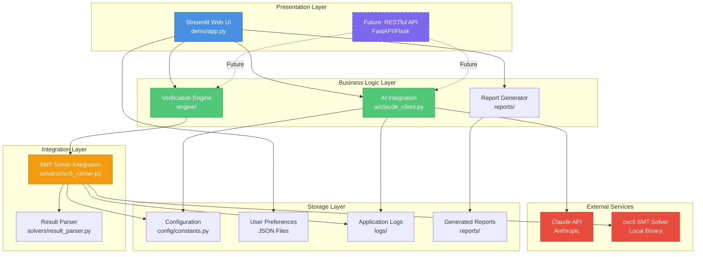

### Component Architecture

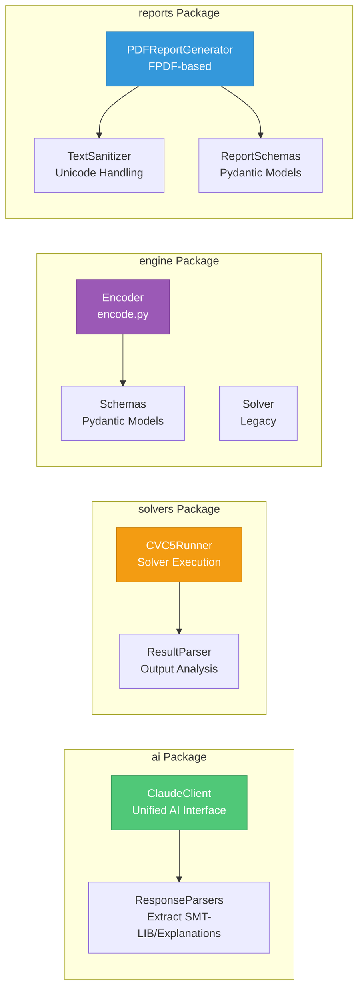

---

## Data Flow Architecture

### End-to-End Verification Flow

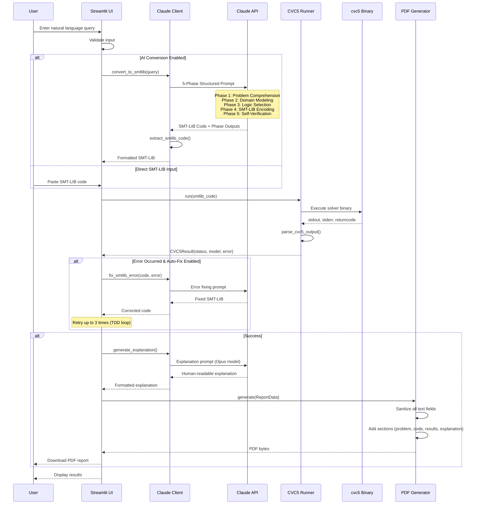

### 5-Phase SMT-LIB Generation

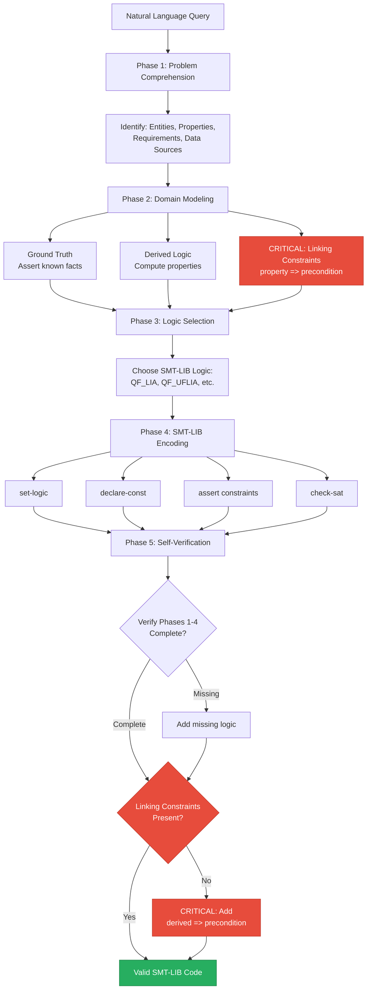

### TDD Loop (Auto-Error Correction)

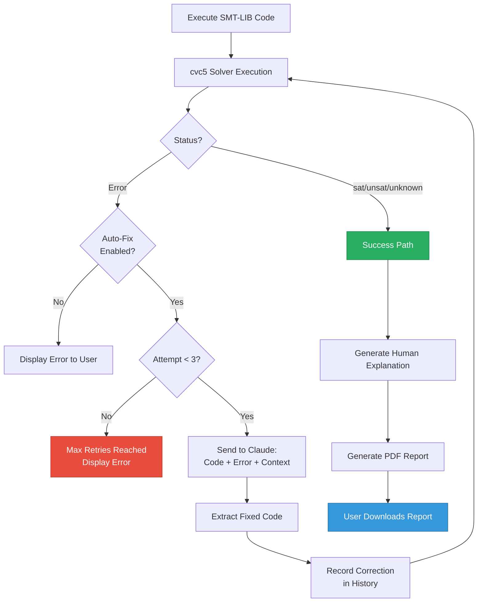

---

## Technology Stack

### Core Technologies

| Layer | Technology | Version | Purpose |
|-------|-----------|---------|---------|
| **Frontend** | Streamlit | 1.x | Rapid web UI prototyping |
| **AI Backend** | Claude API | Latest | Natural language → SMT-LIB conversion |
| **Verification** | cvc5 SMT Solver | Latest | Formal constraint solving |
| **Language** | Python | 3.12+ | Primary development language |
| **Reports** | FPDF | 2.x | PDF generation |
| **Schemas** | Pydantic | 2.x | Type-safe data validation |
| **Testing** | pytest, Playwright | Latest | Unit, integration, E2E tests |

### External Dependencies

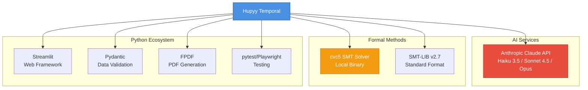

### Why These Technologies?

**Streamlit:**
- Rapid prototyping and iteration
- Python-native (no JS required)
- Easy to replace with FastAPI for production SaaS

**Claude API:**
- State-of-the-art reasoning capabilities
- Best-in-class for formal reasoning tasks
- Multiple models (Haiku, Sonnet, Opus) for cost/quality trade-offs

**cvc5 SMT Solver:**
- Industry-leading SMT solver
- Open-source (BSD license)
- Active development and community
- Supports all major SMT-LIB logics

**Pydantic:**
- Runtime type validation
- Automatic API schema generation
- Perfect for future REST API

---

## Component Details

### 1. Presentation Layer (demo/app.py)

**Purpose:** Web-based UI for user interaction
**Lines of Code:** ~1,635 lines
**Key Features:**
- Natural language query input
- Direct SMT-LIB code input
- Model selection (Haiku/Sonnet/Opus)
- User preferences persistence
- Real-time result display
- PDF report download

**Architecture Pattern:** Monolithic Streamlit app (transitioning to modular)

**User Preferences:**
```python
{
    "model": "sonnet",              # AI model selection
    "use_claude_conversion": false, # Enable AI conversion
    "auto_fix_errors": true        # Enable TDD loop
}
```

### 2. AI Integration Layer (ai/)

**ClaudeClient (ai/claude_client.py):**
- Unified interface for all Claude API operations
- Consolidates 11+ duplicate subprocess calls
- Type-safe with custom exception hierarchy
- Configurable timeouts and models

**Key Methods:**
```python
class ClaudeClient:
    def invoke(prompt, model, timeout) -> str
    def convert_to_smtlib(text) -> str
    def fix_smtlib_error(code, error) -> str
    def generate_explanation(...) -> str
```

**ResponseParsers (ai/response_parsers.py):**
- Extract SMT-LIB code from markdown blocks
- Two-pass extraction with proof content detection
- Handles preambles and edge cases

### 3. Solver Integration Layer (solvers/)

**CVC5Runner (solvers/cvc5_runner.py):**
- Unified cvc5 execution with consistent timeouts
- Type-safe CVC5Result dataclass
- Temp file management
- Environment setup (DYLD_LIBRARY_PATH, LD_LIBRARY_PATH)

**CVC5Result:**
```python
@dataclass
class CVC5Result:
    stdout: str
    stderr: str
    wall_time_ms: int
    status: str  # "sat", "unsat", "unknown"
    model: Optional[str]
    error: Optional[str]
    has_error: bool
```

**ResultParser (solvers/result_parser.py):**
- Parse cvc5 output into structured data
- Distinguish real errors from informational stderr
- Extract satisfying models

### 4. Verification Engine (engine/)

**Encoder (engine/encode.py):**
- Temporal constraint encoding
- Allen's Interval Algebra relations
- QF_LIA logic generation

**Schemas (engine/schemas.py):**
```python
class Event(BaseModel):
    id: str
    label: Optional[str]
    timeVar: str

class Constraint(BaseModel):
    relation: Literal["before", "meets", "overlaps", "during", "ge_delta", "geq"]
    A: str
    B: str
    delta: Optional[int]

class Query(BaseModel):
    type: Literal["before", "after", "equals"]
    A: str
    B: str

class Problem(BaseModel):
    events: List[Event]
    constraints: List[Constraint]
    query: Query
```

### 5. Report Generation (reports/)

**PDFReportGenerator (reports/pdf_generator.py):**
- SOLID-compliant PDF generation
- Comprehensive sanitization (Unicode → ASCII)
- Multi-section reports with optional components

**Report Sections:**
1. Header (title, metadata)
2. Problem Statement
3. Phase Analysis (optional)
4. Generated SMT-LIB Code
5. Verification Results
6. Human-Readable Explanation (optional)
7. Auto-Correction History (optional)
8. Technical Details Appendix

**TextSanitizer (reports/sanitizers.py):**
- Unicode → ASCII conversion for PDF compatibility
- Context-specific sanitization
- Truncation limits per section

### 6. Configuration (config/)

**Constants (config/constants.py):**
- Centralized timeout configuration
- Model selection
- File paths
- Retry limits
- Truncation limits

**Key Constants:**
```python
TIMEOUT_AI_CONVERSION = 300      # 5 minutes for 5-phase processing
TIMEOUT_AI_ERROR_FIXING = 180    # 3 minutes for phase-aware correction
TIMEOUT_AI_EXPLANATION = 180     # 3 minutes for complex queries
TIMEOUT_CVC5_EXEC = 120          # 2 minutes for solver execution
MAX_TDD_LOOP_ATTEMPTS = 10       # Auto-correction retry limit
```

---

## SaaS Vision: Current vs. Future

### Current Architecture (v1.7.5)

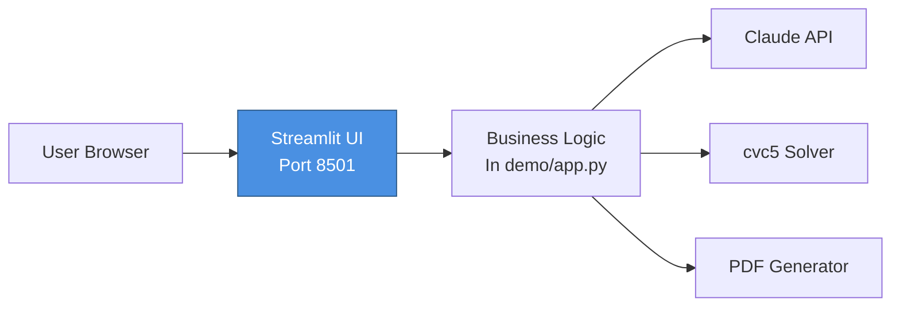

**Characteristics:**
- Monolithic Streamlit application
- Single-user sessions
- Local file storage
- Direct API calls embedded in UI code

### Target SaaS Architecture

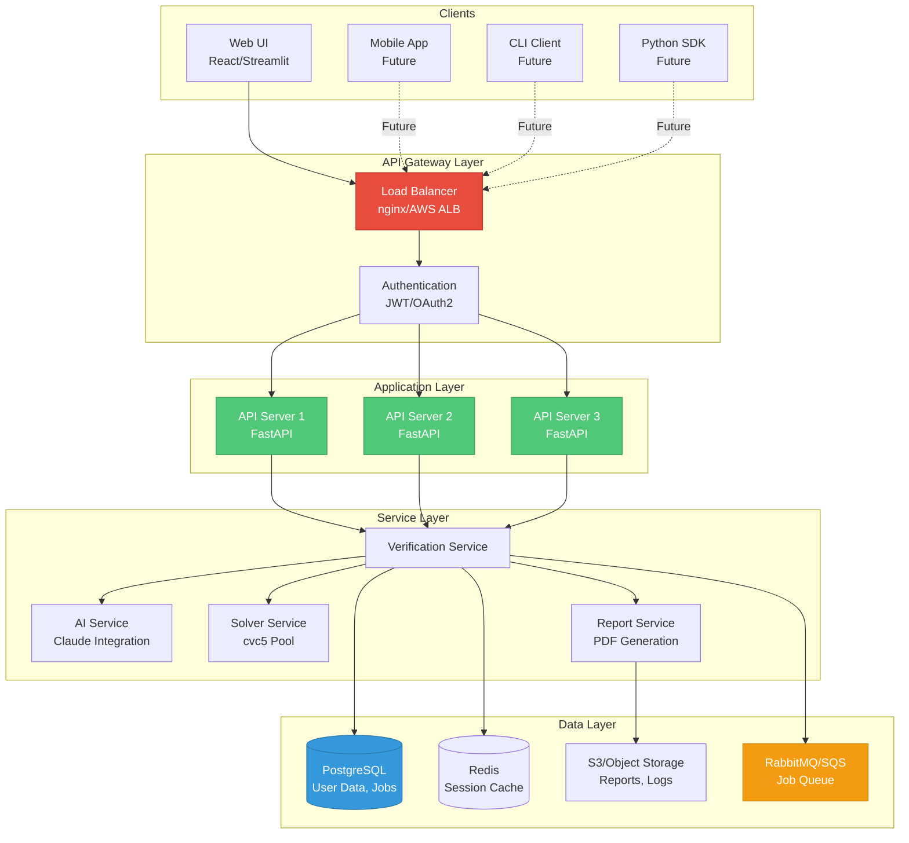

### RESTful API Design

**Proposed Endpoints:**

```
POST   /api/v1/verify
    Body: { "query": "...", "mode": "nl|smtlib", "model": "haiku|sonnet|opus" }
    Response: { "job_id": "...", "status": "queued" }

GET    /api/v1/jobs/{job_id}
    Response: { "status": "pending|running|completed|failed", "result": {...} }

GET    /api/v1/jobs/{job_id}/report
    Response: PDF binary (Content-Type: application/pdf)

POST   /api/v1/verify/sync
    Body: { "query": "...", "timeout": 60 }
    Response: { "status": "sat|unsat|unknown", "model": {...}, "explanation": "..." }

GET    /api/v1/models
    Response: { "models": ["haiku", "sonnet", "opus"], "default": "sonnet" }

POST   /api/v1/validate
    Body: { "smtlib_code": "..." }
    Response: { "valid": true|false, "errors": [...] }
```

### Migration Path

**Phase 1: API Extraction (Q1 2026)**
- Extract business logic from demo/app.py
- Create FastAPI service layer
- Maintain Streamlit UI as first client

**Phase 2: Database Integration (Q2 2026)**
- Add PostgreSQL for job persistence
- Implement user authentication
- Add job queue for async processing

**Phase 3: Multi-tenancy (Q3 2026)**
- Implement tenant isolation
- Add usage metering and billing
- Deploy on cloud infrastructure (AWS/GCP)

**Phase 4: Advanced Features (Q4 2026)**
- React-based web UI
- Mobile applications
- Python SDK for programmatic access

---

## Scalability & Performance

### Current Performance Metrics

| Operation | Time | Bottleneck |
|-----------|------|------------|
| AI Conversion (5-phase) | 30-180s | Claude API latency |
| cvc5 Solver Execution | 0.1-60s | Problem complexity |
| PDF Generation | 0.5-2s | fpdf library |
| Explanation Generation | 20-120s | Claude API (Opus model) |

### Scaling Strategy

**Horizontal Scaling:**
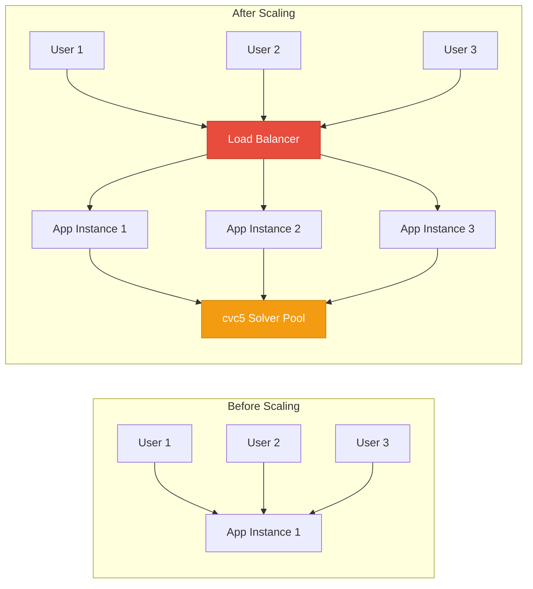

**Caching Strategy:**
- Cache SMT-LIB conversions (NL query → code)
- Cache solver results for identical problems
- Cache explanations for common patterns
- TTL: 24 hours for active queries

**Async Processing:**
- Job queue for long-running verifications
- Webhook notifications on completion
- Batch processing for multiple queries

**Rate Limiting:**
- Per-user quotas (queries/hour)
- Model-specific limits (Opus more restrictive)
- Graceful degradation (queue vs. reject)

---

## Security & Reliability

### Security Measures

**Input Validation:**
- Pydantic schema validation for all inputs
- SMT-LIB syntax validation before execution
- Timeout enforcement on all external calls
- Sandboxed cvc5 execution (temp files, no network)

**Data Protection:**
- User preferences stored locally (current)
- Future: Encrypted database storage
- HTTPS for all API communication
- JWT-based authentication (future)

**Dependency Security:**
- Regular security audits (pip-audit)
- Pinned dependency versions
- Automated CVE scanning (GitHub Dependabot)

### Reliability Measures

**Error Handling:**
- Custom exception hierarchy
- Comprehensive logging (timestamps, context)
- TDD loop for auto-recovery
- User-friendly error messages

**Monitoring:**
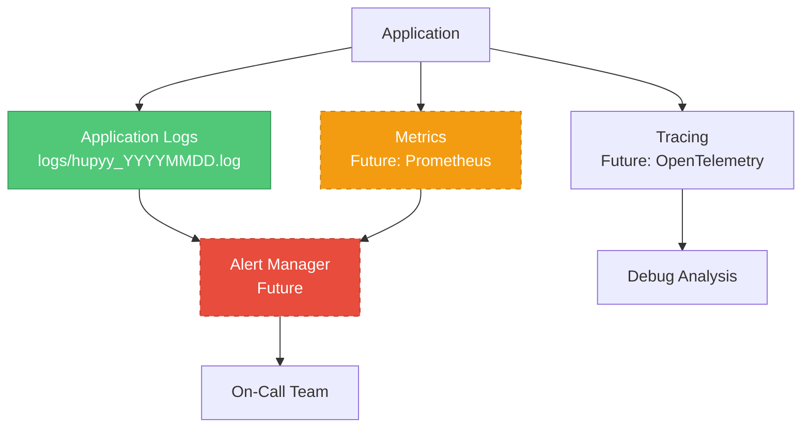

**Logging Levels:**
- DEBUG: Detailed execution traces
- INFO: User actions, API calls
- WARNING: Recoverable errors, TDD loop retries
- ERROR: Unrecoverable failures

**Current Log Example:**
```
2025-11-04 13:20:15 [INFO] [demo.app:1250] User submitted query (247 chars)
2025-11-04 13:20:15 [INFO] [ai.claude_client:103] Invoking Claude CLI: model=sonnet, timeout=300s
2025-11-04 13:21:42 [INFO] [ai.claude_client:120] Claude CLI succeeded: 3521 chars returned
2025-11-04 13:21:42 [INFO] [solvers.cvc5_runner:175] Running cvc5: /tmp/tmp_abc123.smt2
2025-11-04 13:21:43 [INFO] [solvers.result_parser:45] Parsed result: status=unsat, has_error=False
```

---

## Development Practices

### Code Quality

**SOLID Principles:**
- Single Responsibility: Each class has one job
- Open/Closed: Extensible without modification
- Liskov Substitution: Subtypes are substitutable
- Interface Segregation: Focused interfaces
- Dependency Inversion: Depend on abstractions

**Type Safety:**
- Pydantic models for all data structures
- Type hints throughout codebase
- mypy static analysis (enabled)
- No 'any' types

**Testing Strategy:**

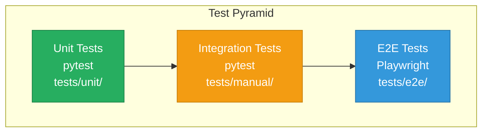

**Test Coverage:**
- Unit tests: 60+ tests for core components
- Integration tests: TDD loop, end-to-end flows
- E2E tests: Full UI workflows with Playwright
- Manual tests: Complex verification scenarios

**Continuous Integration:**
- Git Flow: feature branches → develop → main
- Automated testing on PR (future)
- Semantic versioning (v1.7.5)
- GitHub Releases with detailed notes

### Documentation Standards

**Code Documentation:**
- Docstrings for all public functions/classes
- Type hints for all parameters/returns
- Inline comments for complex logic
- README files in each module

**Architecture Documentation:**
- This document (ARCHITECTURE.md)
- Prompt engineering analysis (PROMPT_ENGINEERING_ANALYSIS.md)
- Sprint reports (docs/sprints/)
- UI/UX documentation (docs/ui-ux/)

**Release Documentation:**
- Detailed release notes for each version
- Migration guides for breaking changes
- Test verification reports
- PDF examples in reports/

---

## Deployment Architecture

### Current Deployment (Local Development)

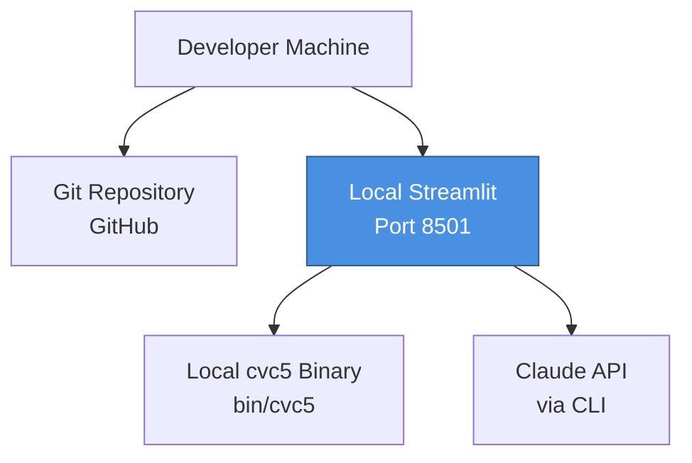

### Target Production Deployment (AWS Example)

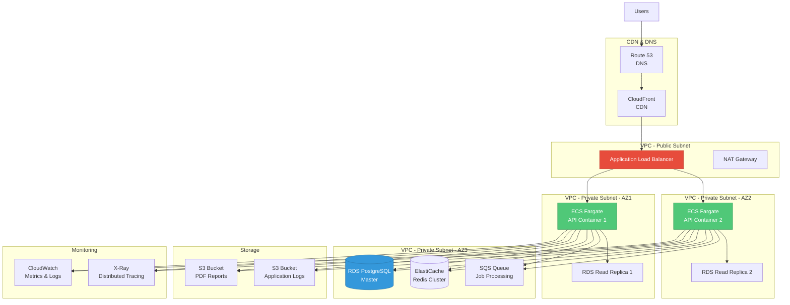

**Infrastructure as Code:**
- Terraform for infrastructure provisioning
- Docker for containerization
- GitHub Actions for CI/CD
- Helm charts for Kubernetes (alternative)

---

## Roadmap & Future Enhancements

### Short-Term (Q1 2026)

**API Development:**
- Extract business logic into FastAPI
- Define RESTful endpoints
- Implement async job processing
- Add OpenAPI/Swagger documentation

**Testing & Quality:**
- Increase unit test coverage to 80%
- Add performance benchmarks
- Implement load testing (Locust)
- Add integration test suite

### Medium-Term (Q2-Q3 2026)

**Multi-Tenancy:**
- User authentication (JWT)
- Organization/team support
- Usage metering and billing
- Admin dashboard

**Advanced Features:**
- Batch verification API
- Webhook notifications
- Custom solver configurations
- Multi-solver support (Z3, MathSAT)

**UI/UX:**
- React-based web UI
- Visualization of verification results
- Interactive proof exploration
- Shared verification links

### Long-Term (Q4 2026+)

**Platform Expansion:**
- Mobile applications (iOS, Android)
- VS Code extension
- Python SDK for programmatic access
- Integration marketplace (Zapier, Make)

**Enterprise Features:**
- On-premise deployment option
- SSO integration (SAML, OAuth)
- Audit logging and compliance
- SLA guarantees (99.9% uptime)

**AI Enhancements:**
- Fine-tuned models for domain-specific verification
- Multi-modal input (diagrams, tables)
- Automated test case generation
- Proof optimization suggestions

---

## Business Model & Pricing Strategy

### Target Customer Segments

1. **Enterprise Compliance:** Organizations needing formal verification of policies, access control, temporal constraints
2. **Academic Research:** Universities and research labs using formal methods
3. **Software Verification:** Teams verifying system properties, protocol correctness
4. **Blockchain/Crypto:** Smart contract verification and formal proofs

### Pricing Tiers (Proposed)

| Tier | Price | Queries/Month | Models | Support |
|------|-------|---------------|--------|---------|
| Free | $0 | 100 | Haiku only | Community |
| Pro | $99/mo | 1,000 | All models | Email |
| Team | $499/mo | 10,000 | All models | Priority |
| Enterprise | Custom | Unlimited | Custom | Dedicated |

### Unit Economics

**Cost Structure:**
- Claude API: $0.01-$0.15 per query (model-dependent)
- Compute: $0.001-$0.01 per query (cvc5 execution)
- Storage: $0.001 per report
- Infrastructure: ~$500/month (base)

**Target Margins:**
- Gross margin: 70-80%
- CAC payback: 6 months
- LTV/CAC ratio: 3:1

---

## Competitive Advantage

### Unique Value Propositions

1. **AI + Formal Methods Convergence:** Only platform combining LLM natural language understanding with rigorous SMT verification
2. **5-Phase Structured Approach:** Proprietary prompt engineering for reliable SMT-LIB generation
3. **TDD Loop:** Automatic error recovery increases success rate
4. **Multi-Domain:** Not limited to one verification domain (temporal, data, mathematical, graph theory)
5. **Developer-Friendly:** Simple API, comprehensive documentation, multiple client options

### Barriers to Entry

**Technical Moats:**
- 18+ months of prompt engineering refinement
- Domain expertise in both AI and formal methods
- Production-tested error handling and edge cases
- Comprehensive test suite and quality assurance

**Network Effects:**
- Shared verification templates
- Community-contributed examples
- Integration ecosystem

**Data Moat:**
- Query patterns and optimization data
- Error correction patterns
- Fine-tuning datasets (future)

---

## Risk Analysis & Mitigation

### Technical Risks

| Risk | Impact | Probability | Mitigation |
|------|--------|-------------|------------|
| Claude API changes | High | Medium | Abstract API, support multiple providers |
| cvc5 solver bugs | Medium | Low | Multi-solver support, extensive testing |
| Prompt drift | Medium | Medium | Version control prompts, regression testing |
| Scaling bottlenecks | High | Medium | Async processing, caching, horizontal scaling |

### Business Risks

| Risk | Impact | Probability | Mitigation |
|------|--------|-------------|------------|
| Competitor entry | High | Medium | Build moat quickly, focus on UX |
| AI cost inflation | Medium | High | Support cheaper models, optimize prompts |
| Market adoption | High | Medium | Free tier, education, partnerships |
| Compliance requirements | Medium | Low | SOC 2, GDPR compliance from start |

### Operational Risks

| Risk | Impact | Probability | Mitigation |
|------|--------|-------------|------------|
| Key person dependency | High | Medium | Documentation, knowledge sharing |
| Infrastructure outages | High | Low | Multi-region deployment, DR plan |
| Security breach | Critical | Low | Pen testing, security audits, bug bounty |

---

## Team & Expertise Required

### Current Team (Solo Developer)

**Skills Demonstrated:**
- AI/ML: Prompt engineering, Claude API integration
- Formal Methods: SMT-LIB, cvc5, constraint solving
- Software Engineering: Python, testing, architecture
- Product: UI/UX, documentation, release management

### Recommended Team Expansion

**Phase 1 (2-3 people):**
- **Backend Engineer:** FastAPI, PostgreSQL, async processing
- **DevOps Engineer:** AWS/GCP, Terraform, monitoring

**Phase 2 (5-7 people):**
- **Frontend Engineer:** React, TypeScript, UI/UX
- **AI/ML Engineer:** Fine-tuning, prompt optimization
- **Sales Engineer:** Customer onboarding, demos
- **Product Manager:** Roadmap, customer feedback

**Phase 3 (10-15 people):**
- **Engineering Team:** 4-5 engineers (backend, frontend, ML)
- **Operations:** 2-3 (DevOps, SRE, security)
- **Go-to-Market:** 3-4 (sales, marketing, customer success)
- **Leadership:** CTO, VP Product

---

## Financial Projections (3-Year)

### Revenue Projections

| Metric | Year 1 | Year 2 | Year 3 |
|--------|--------|--------|--------|
| Free users | 1,000 | 5,000 | 20,000 |
| Pro subscribers | 50 | 300 | 1,200 |
| Team subscribers | 10 | 100 | 500 |
| Enterprise customers | 2 | 10 | 30 |
| **MRR** | **$6K** | **$70K** | **$350K** |
| **ARR** | **$72K** | **$840K** | **$4.2M** |

### Cost Projections

| Category | Year 1 | Year 2 | Year 3 |
|----------|--------|--------|--------|
| Salaries | $200K | $600K | $1.2M |
| AI/Compute | $20K | $100K | $300K |
| Infrastructure | $10K | $50K | $150K |
| Sales/Marketing | $30K | $150K | $400K |
| **Total Costs** | **$260K** | **$900K** | **$2.05M** |
| **Gross Margin** | -260% | 7% | 51% |

### Funding Requirements

**Seed Round (Year 1):** $500K
- 18 months runway
- Team expansion (2-3 people)
- Product-market fit validation

**Series A (Year 2):** $3M
- Scale go-to-market
- Engineering team expansion
- Multi-region deployment

---

## Conclusion

Hupyy Temporal represents a unique convergence of AI and formal methods, addressing a critical gap in the market for accessible, reliable formal verification. The current architecture demonstrates technical feasibility with a production-ready testbench, while the roadmap to a scalable SaaS platform is clear and achievable.

**Key Strengths:**
- Proven technology stack
- Proprietary 5-phase prompt engineering
- SOLID architecture ready for scaling
- Clear path to SaaS transformation
- Strong competitive moats

**Investment Opportunity:**
- Large addressable market (compliance, verification, academia)
- High gross margins (70-80%)
- Defensible technical moat
- Experienced solo founder with full-stack capabilities
- Clear 3-year path to $4M ARR

**Next Steps:**
1. Validate product-market fit with pilot customers
2. Extract API layer (Q1 2026)
3. Raise seed funding ($500K)
4. Hire 2-3 key team members
5. Launch public beta with free tier

---

**Document Metadata:**
- **Version:** 1.0
- **Author:** Hupyy Temporal Team
- **Last Updated:** November 4, 2025
- **Status:** Living Document
- **Next Review:** December 1, 2025

**Related Documents:**
- [Prompt Engineering Analysis](PROMPT_ENGINEERING_ANALYSIS.md)
- [Prompt Conciseness Analysis](PROMPT_CONCISENESS_ANALYSIS.md)
- [Test Documentation](../RUN_TESTS.md)
- [Sprint Reports](sprints/)

---

*Generated for investor and stakeholder review. For technical implementation details, see individual module documentation.*
