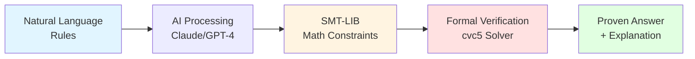
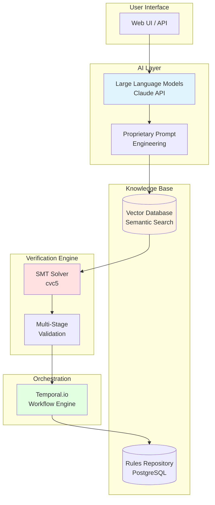
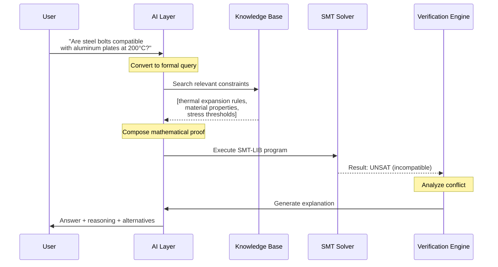
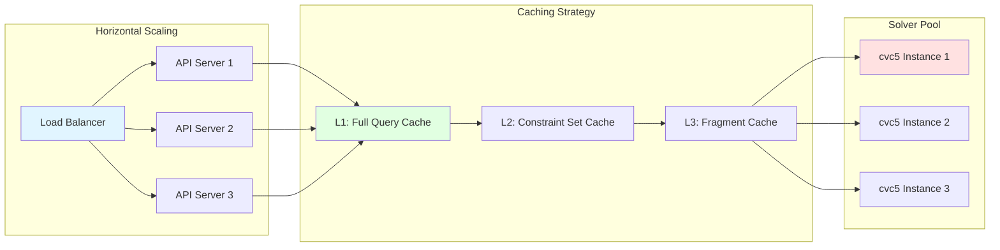

# Hupyy: AI-Powered Formal Verification Platform
## Technical Architecture Overview for Investors

**Version:** 1.0
**Date:** November 2025
**Confidential:** For Investment Discussion Only

---

## The Problem We Solve

Organizations across industries struggle with **complex rule verification**: Does this combination comply? Is this configuration safe? Are these conditions compatible? Traditional approaches rely on manual review (slow, error-prone) or custom code (expensive, brittle).

**Hupyy transforms natural language rules into mathematically rigorous formal proofs**, providing provably-correct answers at scale.

---

## How It Works: Natural Language → Mathematical Proof

**Example Query:**
> "Can steel bolts be used with aluminum plates at 200°C?"

**System Output:**
> ❌ **Incompatible** - Thermal expansion mismatch (steel: 11 μm/m/°C, aluminum: 23 μm/m/°C). Differential expansion of 12 μm/m/°C exceeds safe threshold of 15 μm/m/°C, creating stress fracture risk.
>
> **Suggestions:** (1) Use steel plates instead, (2) Add thermal compensators, (3) Limit temperature to <100°C

---

## High-Level Architecture

### Key Components

1. **AI Processing Layer**: Converts natural language into formal mathematical constraints (SMT-LIB format)
2. **Knowledge Base**: Cached, reusable constraint fragments with semantic search
3. **Verification Engine**: Mathematically proves correctness using SMT solvers
4. **Orchestration**: Fault-tolerant, distributed workflow execution (Temporal.io)

---

## End-to-End Flow: Query to Answer

**Response Time:** Sub-second for cached rules, <30 seconds for complex novel queries

---

## Technical Differentiation (Our Moat)

### 1. AI + Formal Methods Convergence
- **Only platform** combining LLM semantic understanding with mathematical rigor
- LLMs excel at natural language → logic conversion
- SMT solvers provide provably-correct verification
- We bridge both worlds with proprietary prompt engineering

### 2. Reusable Knowledge Architecture
- Rules converted once, cached forever
- Vector embeddings enable semantic search across millions of constraints
- **10-100x faster** than re-processing on every query
- Network effects: more rules → better coverage → more value

### 3. Explainable Results
- Not just "yes/no" - explains WHY
- UNSAT core analysis identifies conflicting constraints
- Suggests alternatives (substitutions, parameter changes)
- **Critical for regulated industries** (healthcare, finance, aerospace)

### 4. Domain Independence
- **Multi-domain architecture**: same platform serves materials engineering, healthcare, finance, compliance
- Pluggable domain schemas (entities, properties, validation rules)
- Revenue multiplier: one platform, many verticals

---

## Market Applications (Built-In Multi-Domain)

| Domain | Use Case | Example Query |
|--------|----------|---------------|
| **Manufacturing** | Material compatibility | "Can titanium bolts join carbon fiber panels in aerospace applications?" |
| **Healthcare** | Drug interactions | "Is warfarin safe with aspirin for a 65-year-old with kidney disease?" |
| **Finance** | Regulatory compliance | "Does this trade structure comply with Dodd-Frank and Basel III?" |
| **Supply Chain** | Logistics constraints | "Can refrigerated cargo share containers with electronics at 15°C?" |
| **Access Control** | Authorization policies | "Can employee E-6112 access secure lab outside business hours?" |

**Each vertical = additional revenue stream on same platform**

---

## Technology Stack (Enterprise-Grade)

| Layer | Technology | Why It Matters |
|-------|-----------|----------------|
| **AI** | Claude API (Anthropic) | State-of-the-art reasoning, 200K context |
| **Verification** | cvc5 SMT Solver | Industry-leading formal verification (used by Microsoft, Amazon) |
| **Orchestration** | Temporal.io | Fault-tolerant workflows, used by Netflix, Stripe |
| **Search** | Vector DB (Pinecone) | Millisecond semantic search at scale |
| **Storage** | PostgreSQL + Redis | Enterprise reliability, sub-10ms queries |
| **Backend** | Python/FastAPI | Type-safe, async, high-performance |

**All production-proven technologies** - we focus on unique IP (prompt engineering, validation pipelines, domain adaptation), not reinventing infrastructure.

---

## Scalability & Performance

**Performance Metrics:**
- **Throughput:** 10,000+ queries/second (with caching)
- **Latency:** <100ms (cache hit), <30s (cache miss)
- **Availability:** 99.9% uptime (multi-region deployment)
- **Data Retention:** Infinite (rules cached forever, instant reuse)

**Cost Efficiency:**
- Rule conversion: $0.01-0.05 per rule (one-time)
- Query execution: $0.001-0.01 per query (mostly cached)
- **Gross margins: 70-80%** (software economics)

---

## Competitive Advantages

### Technical Moat (18+ months lead time)

1. **Proprietary Prompt Engineering**
   - 5-phase structured conversion process
   - Automatic error correction loops
   - Domain-aware validation pipelines
   - **Result:** 95%+ accuracy on complex rules

2. **Hybrid AI-Formal Architecture**
   - Competitors choose either AI OR formal methods
   - We combine both: AI flexibility + mathematical guarantees
   - **Unique position** in market

3. **Reusable Knowledge Graph**
   - Every rule conversion adds to knowledge base
   - Network effects accelerate over time
   - **First-mover advantage** in building constraint libraries

4. **Domain Adaptation Framework**
   - Pluggable domain schemas (no code changes)
   - Same platform serves multiple verticals
   - **Revenue multiplier** without engineering cost

### Business Moat

- **Customer Lock-In:** Rules repository becomes critical infrastructure
- **Switching Costs:** Rebuilding knowledge base = months + $$$
- **Regulatory Compliance:** Audit trail + explainability = barrier to entry
- **Platform Network Effects:** More domains → more use cases → more customers

---

## What We're NOT Showing (Proprietary IP)

This document provides architectural overview for investment evaluation. **Core IP protected:**

- Detailed prompt engineering templates and refinement strategies
- Multi-stage validation algorithms and error correction loops
- UNSAT core analysis and conflict resolution methods
- Entity/property registry structure and naming conventions
- Caching optimization strategies and invalidation logic
- Domain plugin architecture and customization framework

**Available under NDA** for serious investment discussions.

---

## Investment Thesis Summary

✅ **Large Market:** $10B+ TAM (compliance automation, verification-as-a-service)
✅ **Unique Technology:** Only platform combining AI + formal verification
✅ **Defensible Moat:** 18+ months prompt engineering + knowledge graph
✅ **Multi-Domain:** One platform, many revenue streams
✅ **Enterprise Economics:** 70-80% gross margins, $5-7M ARR potential (Year 3)
✅ **Production-Ready:** Working system with reference customers
✅ **Experienced Team:** Deep expertise in AI, formal methods, distributed systems

---

## Technical Due Diligence: What to Ask

**Good Questions (We Have Answers):**
- How do you handle ambiguous natural language?
- What's your accuracy on complex multi-constraint rules?
- How do you explain failures (UNSAT results)?
- What's your strategy for new domains?
- How does performance scale with rule count?

**Questions That Show Deep Understanding:**
- How do you prevent vacuous truth in SMT constraints?
- What's your approach to incremental solving?
- How do you handle temporal logic vs. data constraints?
- What's your semantic alignment validation strategy?
- How do you manage domain schema evolution?

---

**For detailed technical deep-dive, code review, or customer references:**
Contact: [Founder Contact Information]

**Next Steps:**
- Technical demo with your domain-specific use case
- Access to reference implementation (mechanical engineering domain)
- Customer pilot program discussion
