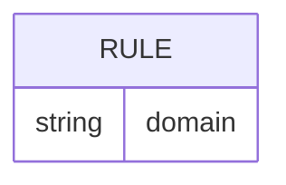
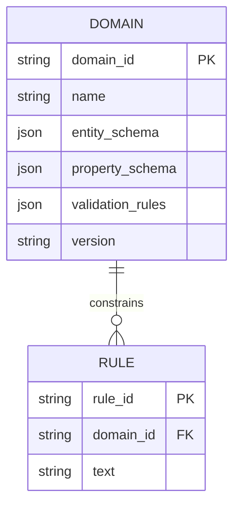
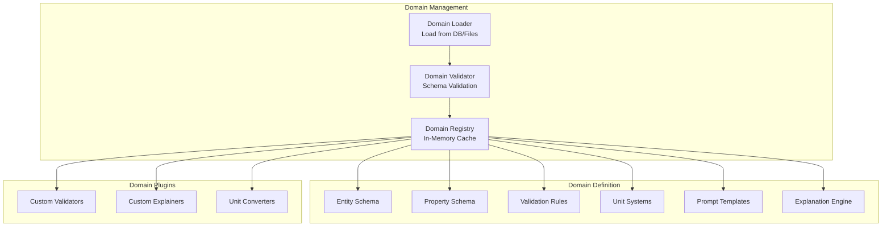

# Domain Independence Analysis: Making the System Subject-Area Agnostic

**Document Version:** 1.0
**Created:** November 5, 2025
**Purpose:** Analyze FULL_SYSTEM_ARCHITECTURE_PROPOSAL.md and identify changes needed to make the system domain-independent
**Current State:** System is hardcoded for mechanical engineering (materials/parts compatibility)
**Target State:** Generic formal verification platform supporting any domain

---

## Executive Summary

The current architecture is tightly coupled to mechanical engineering domain concepts (materials, parts, thermal properties, etc.). To transform this into a general-purpose formal verification platform, we need to:

1. **Extract domain-specific logic** into configurable schemas
2. **Add a domain management layer** for multi-domain support
3. **Generalize data models** to handle arbitrary entity types
4. **Implement plugin architecture** for domain-specific validation/explanation
5. **Keep all examples unchanged** as reference implementations

**Critical Design Principle:** Examples demonstrate the system's power. They remain as concrete illustrations while the underlying architecture becomes fully generic.

---

## Table of Contents

1. [Domain-Specific Elements Requiring Abstraction](#domain-specific-elements)
2. [New Components Required](#new-components-required)
3. [Architectural Changes](#architectural-changes)
4. [Examples to Preserve](#examples-to-preserve)
5. [Implementation Roadmap](#implementation-roadmap)
6. [Migration Strategy](#migration-strategy)

---

## Domain-Specific Elements Requiring Abstraction

### 1. Entity Registry (Section 4.1) - HARDCODED

**Current State:**
```json
{
  "entities": {
    "materials": {
      "canonical_var": "material",
      "instances": {
        "steel": {...},
        "aluminum": {...},
        "copper": {...}
      }
    },
    "parts": {
      "canonical_var": "part",
      "instances": {
        "bolt": {...},
        "plate": {...},
        "washer": {...}
      }
    },
    "environment": {
      "canonical_var": "env",
      "properties": ["temperature", "pressure", "humidity"]
    }
  }
}
```

**Problem:** Entity types (`materials`, `parts`, `environment`) are hardcoded. Cannot support other domains like:
- **Healthcare:** patients, medications, procedures, diagnoses
- **Finance:** transactions, accounts, securities, counterparties
- **Legal:** contracts, parties, clauses, obligations

**Required Change:**
- Entity types become configurable per domain
- Registry loader accepts domain definition files
- Schema validation ensures consistency within domain

---

### 2. Property Registry (Section 4.1) - HARDCODED

**Current State:**
```json
{
  "properties": {
    "thermal_expansion_coef": {
      "unit": "μm/m/°C",
      "smt_type": "Real",
      "domain": [0, 100]
    },
    "tensile_strength": {
      "unit": "MPa",
      "smt_type": "Real",
      "domain": [0, 5000]
    },
    "torque": {
      "unit": "Nm",
      "smt_type": "Real",
      "domain": [0, 1000]
    }
  }
}
```

**Problem:** Properties are mechanical engineering-specific. Other domains need different properties:
- **Healthcare:** blood_pressure (mmHg), glucose_level (mg/dL), heart_rate (bpm)
- **Finance:** principal_amount (USD), interest_rate (%), maturity_date (Date)
- **Temporal Logic:** before, after, during, overlaps

**Required Change:**
- Properties defined in domain configuration
- Unit systems pluggable per domain
- Type systems extensible (add temporal types, date types, enumerated types)

---

### 3. Naming Conventions (Section 4.1) - DOMAIN-SPECIFIC

**Current State:**
```json
{
  "naming_conventions": {
    "entity_property": "{entity}_{property}",
    "part_entity": "{part}_{entity}",
    "comparison": "{entity1}_{entity2}_{relationship}",
    "examples": [
      "steel_thermal_expansion_coef",
      "bolt_material",
      "steel_aluminum_compatible"
    ]
  }
}
```

**Problem:** Assumes entities have materials and parts. Doesn't generalize to:
- **Healthcare:** `patient_medication`, `drug_contraindication`
- **Finance:** `transaction_counterparty`, `account_balance`
- **Access Control:** `employee_clearance_level`, `resource_access_policy`

**Required Change:**
- Template-based naming with domain-specific placeholders
- Variable naming rules configurable per domain
- Support for domain-specific relationship types

---

### 4. Database Schema (Section 2.1) - PARTIALLY HARDCODED

**Current State:**


**Problem:** `domain` field is a simple string, not a first-class entity with schema enforcement.

**Required Change:**


---

### 5. Prompts (Sections 3.2, 3.3) - MATERIAL-SPECIFIC

**Current State:**
```python
CHUNKING_PROMPT = """
You are preprocessing material compatibility rules for constraint solving.
...
"""

SMT_CONVERSION_PROMPT = """
Convert this material compatibility constraint to SMT-LIB format.
...
"""
```

**Problem:** Prompts hardcode "material compatibility" context. LLM needs domain context for:
- **Healthcare:** "patient safety rules", "drug interaction constraints"
- **Finance:** "regulatory compliance rules", "risk management constraints"
- **Access Control:** "authorization policies", "separation of duty rules"

**Required Change:**
```python
CHUNKING_PROMPT_TEMPLATE = """
You are preprocessing {domain_description} for constraint solving.

Domain context:
- Entity types: {entity_types}
- Key properties: {property_types}
- Relationship types: {relationship_types}

Task: Break the input text into independent, self-contained constraint statements.
...

Example from {domain_name}:
{domain_specific_example}
"""

# Usage:
prompt = CHUNKING_PROMPT_TEMPLATE.format(
    domain_description=domain.description,  # "material compatibility rules"
    entity_types=domain.entity_types,       # ["materials", "parts", "environment"]
    property_types=domain.key_properties,   # ["thermal_expansion", "strength"]
    relationship_types=domain.relationships, # ["compatible_with", "requires"]
    domain_name=domain.name,                # "Mechanical Engineering"
    domain_specific_example=domain.example_rule  # Keep original examples!
)
```

---

### 6. Query Structure (Section 6.2) - ASSUMES MATERIALS/PARTS

**Current State:**
```python
query = {
    "entities": {
        "bolt": {"material": "steel"},
        "plate": {"material": "aluminum"}
    },
    "environment": {
        "temperature": 200
    },
    "question": "compatible?"
}
```

**Problem:** Hardcoded keys: `"material"`, `"environment"`, `"temperature"`.

**Required Change:**
```python
# Generic query structure
query = {
    "domain_id": "mechanical_engineering_v1",
    "entities": {
        "{entity_type_1}": {
            "{property_1}": "{value_1}",
            "{property_2}": "{value_2}"
        }
    },
    "context": {  # Replaces "environment"
        "{contextual_property_1}": "{value}"
    },
    "question": "{domain_specific_question_type}"
}

# Example for mechanical engineering (unchanged):
query = {
    "domain_id": "mechanical_engineering_v1",
    "entities": {
        "bolt": {"material": "steel"},
        "plate": {"material": "aluminum"}
    },
    "context": {
        "temperature": 200
    },
    "question": "compatible?"
}

# Example for healthcare:
query = {
    "domain_id": "healthcare_drug_interactions_v1",
    "entities": {
        "patient": {"age": 65, "condition": "hypertension"},
        "medication_1": {"drug": "warfarin", "dose_mg": 5},
        "medication_2": {"drug": "aspirin", "dose_mg": 81}
    },
    "context": {
        "kidney_function": "normal"
    },
    "question": "safe?"
}
```

---

### 7. API Endpoints (Section 9) - DOMAIN-IMPLICIT

**Current State:**
```python
@app.post("/api/v1/rules/ingest")
async def ingest_rule(rule: RuleInput):
    """Ingest a new rule"""
    pass

@app.post("/api/v1/query/check_compatibility")
async def check_compatibility(query: CompatibilityQuery):
    """Check compatibility"""
    pass
```

**Problem:** Single global namespace. No domain isolation. API endpoint names assume "compatibility" checking.

**Required Change:**
```python
# Domain management endpoints
@app.get("/api/v1/domains")
async def list_domains() -> List[DomainSummary]:
    """List all available domains"""
    pass

@app.post("/api/v1/domains")
async def create_domain(domain: DomainDefinition) -> CreateDomainResponse:
    """Create new domain with custom ontology"""
    pass

@app.get("/api/v1/domains/{domain_id}")
async def get_domain(domain_id: str) -> DomainDetail:
    """Get domain configuration"""
    pass

# Domain-scoped rule management
@app.post("/api/v1/domains/{domain_id}/rules/ingest")
async def ingest_rule(domain_id: str, rule: RuleInput) -> IngestionResponse:
    """Ingest rule into specific domain"""
    pass

@app.get("/api/v1/domains/{domain_id}/rules")
async def list_rules(domain_id: str) -> List[Rule]:
    """List all rules in domain"""
    pass

# Domain-scoped query (generic verb "verify" instead of "check_compatibility")
@app.post("/api/v1/domains/{domain_id}/query/verify")
async def verify_constraint(domain_id: str, query: GenericQuery) -> VerificationResponse:
    """Verify constraint within domain context"""
    pass

@app.post("/api/v1/domains/{domain_id}/query/find_satisfying")
async def find_satisfying_combinations(domain_id: str, query: FindQuery) -> List[Solution]:
    """Find all satisfying combinations given partial specification"""
    pass
```

---

### 8. Validation Rules (Section 5) - MATERIAL-SPECIFIC

**Current State:**
```python
def _validate_units(self, smt_code: str) -> ValidationResult:
    """Verify units are standardized"""
    # Assumes mechanical engineering units: MPa, μm/m/°C, Nm, etc.
    pass

def _validate_domains(self, smt_code: str) -> ValidationResult:
    """Verify values are within defined domains"""
    # Assumes material property ranges: thermal_expansion [0, 100]
    pass
```

**Problem:** Validation logic hardcoded for mechanical engineering.

**Required Change:**
```python
class DomainAwareValidator:
    def __init__(self, domain_id: str):
        self.domain = DomainRegistry.get(domain_id)
        self.unit_system = self.domain.load_unit_system()
        self.type_system = self.domain.load_type_system()

    def _validate_units(self, smt_code: str) -> ValidationResult:
        """Verify units match domain's unit system"""
        for var, unit in extract_units(smt_code):
            if not self.unit_system.is_valid_unit(unit):
                return ValidationResult(
                    valid=False,
                    error=f"Unknown unit '{unit}' in domain '{self.domain.name}'"
                )
        return ValidationResult(valid=True)

    def _validate_domains(self, smt_code: str) -> ValidationResult:
        """Verify values are within domain-defined ranges"""
        for var, value in extract_values(smt_code):
            domain_range = self.domain.get_property_domain(var)
            if domain_range and not self._in_range(value, domain_range):
                return ValidationResult(
                    valid=False,
                    error=f"{var}={value} outside domain {domain_range}"
                )
        return ValidationResult(valid=True)
```

---

### 9. UNSAT Analysis (Section 7.2) - MATERIAL-FOCUSED

**Current State:**
```python
def _generate_explanation(conflict_type, rules, query) -> str:
    """Generate human-readable explanation"""
    # Assumes material-specific conflicts:
    # - "Thermal expansion mismatch"
    # - "stress_fracture_risk"
    # - "torque exceeds maximum"
    pass

def _suggest_substitutions(rules, query) -> List[Suggestion]:
    """Suggest alternative materials/parts"""
    # Searches for compatible materials
    pass
```

**Problem:** Explanation generation and suggestions assume materials/parts.

**Required Change:**
```python
class DomainAwareUNSATAnalyzer:
    def __init__(self, domain_id: str):
        self.domain = DomainRegistry.get(domain_id)
        self.explanation_engine = self.domain.load_explanation_engine()

    def _generate_explanation(self, conflict_type, rules, query) -> str:
        """Generate domain-aware explanation"""

        # Use domain-specific explanation templates
        template = self.domain.get_explanation_template(conflict_type)

        # Call LLM with domain context
        prompt = f"""
        Generate explanation for constraint violation in {self.domain.name} domain.

        Domain context:
        - Entity types: {self.domain.entity_types}
        - Conflict type: {conflict_type}

        Query: {query.to_natural_language()}
        Conflicting rules: {rules}

        Use domain-specific terminology from: {self.domain.glossary}
        """

        return call_llm(prompt)

    def _suggest_alternatives(self, conflict_type, rules, query) -> List[Suggestion]:
        """Generate domain-aware suggestions"""

        # Delegate to domain plugin
        plugin = self.domain.load_plugin()
        return plugin.generate_suggestions(conflict_type, rules, query)
```

---

## New Components Required

### 1. Domain Management Layer

**Purpose:** Manage multiple domain definitions, enforce schema consistency, enable domain discovery.

**Architecture:**


**Implementation:**
```python
class DomainRegistry:
    """Central registry for all domain definitions"""

    _domains: Dict[str, Domain] = {}

    @classmethod
    def register(cls, domain: Domain):
        """Register a new domain"""
        cls._validate_domain(domain)
        cls._domains[domain.domain_id] = domain

    @classmethod
    def get(cls, domain_id: str) -> Domain:
        """Retrieve domain by ID"""
        if domain_id not in cls._domains:
            raise DomainNotFoundError(domain_id)
        return cls._domains[domain_id]

    @classmethod
    def list_domains(cls) -> List[DomainSummary]:
        """List all registered domains"""
        return [d.to_summary() for d in cls._domains.values()]

    @classmethod
    def _validate_domain(cls, domain: Domain):
        """Validate domain definition"""
        # Check required fields
        # Validate entity schema
        # Validate property schema
        # Ensure naming conventions are consistent
        pass
```

---

### 2. Domain Definition Schema

**JSON Schema for Domain Configuration:**
```json
{
  "$schema": "http://json-schema.org/draft-07/schema#",
  "type": "object",
  "required": ["domain_id", "name", "version", "entity_types", "properties"],

  "properties": {
    "domain_id": {
      "type": "string",
      "pattern": "^[a-z_]+_v[0-9]+$",
      "description": "Unique domain identifier with version",
      "examples": ["mechanical_engineering_v1", "healthcare_drugs_v1"]
    },

    "name": {
      "type": "string",
      "description": "Human-readable domain name",
      "examples": ["Mechanical Engineering - Materials Compatibility"]
    },

    "version": {
      "type": "string",
      "pattern": "^[0-9]+\\.[0-9]+\\.[0-9]+$",
      "description": "Semantic version",
      "examples": ["1.0.0"]
    },

    "description": {
      "type": "string",
      "description": "Detailed domain description for LLM context"
    },

    "entity_types": {
      "type": "object",
      "description": "Domain-specific entity type definitions",
      "patternProperties": {
        "^[a-z_]+$": {
          "type": "object",
          "required": ["canonical_var", "smt_type"],
          "properties": {
            "canonical_var": {"type": "string"},
            "smt_type": {"type": "string", "enum": ["Enum", "String", "Int"]},
            "instances": {
              "type": "object",
              "description": "Predefined instances of this entity type"
            }
          }
        }
      }
    },

    "properties": {
      "type": "object",
      "description": "Domain-specific property definitions",
      "patternProperties": {
        "^[a-z_]+$": {
          "type": "object",
          "required": ["canonical_var", "smt_type"],
          "properties": {
            "canonical_var": {"type": "string"},
            "smt_type": {"type": "string", "enum": ["Real", "Int", "Bool", "String"]},
            "unit": {"type": "string"},
            "domain": {
              "type": "array",
              "items": {"type": "number"},
              "minItems": 2,
              "maxItems": 2
            }
          }
        }
      }
    },

    "relationships": {
      "type": "object",
      "description": "Domain-specific relationship types"
    },

    "naming_conventions": {
      "type": "object",
      "description": "Variable naming patterns",
      "properties": {
        "entity_property": {"type": "string"},
        "examples": {"type": "array", "items": {"type": "string"}}
      }
    },

    "unit_system": {
      "type": "object",
      "description": "Units and conversion rules"
    },

    "validation_rules": {
      "type": "object",
      "description": "Domain-specific validation logic"
    },

    "prompt_templates": {
      "type": "object",
      "description": "LLM prompt templates for this domain"
    },

    "plugins": {
      "type": "array",
      "description": "Optional plugin modules",
      "items": {"type": "string"}
    },

    "examples": {
      "type": "array",
      "description": "Reference examples for documentation",
      "items": {
        "type": "object",
        "properties": {
          "rule_text": {"type": "string"},
          "expected_smt": {"type": "string"},
          "query": {"type": "object"}
        }
      }
    }
  }
}
```

**Example Domain Definition (Mechanical Engineering):**
```json
{
  "domain_id": "mechanical_engineering_v1",
  "name": "Mechanical Engineering - Materials Compatibility",
  "version": "1.0.0",
  "description": "Material and part compatibility verification for mechanical engineering applications",

  "entity_types": {
    "materials": {
      "canonical_var": "material",
      "aliases": ["metal", "substance", "alloy", "composition"],
      "smt_type": "Enum",
      "instances": {
        "steel": {
          "aliases": ["carbon_steel", "stainless"],
          "properties_required": ["thermal_expansion_coef", "tensile_strength"]
        },
        "aluminum": {
          "aliases": ["aluminium", "al"],
          "properties_required": ["thermal_expansion_coef", "yield_strength"]
        }
      }
    },
    "parts": {
      "canonical_var": "part",
      "aliases": ["component", "piece", "element"],
      "smt_type": "Enum",
      "instances": {
        "bolt": {
          "aliases": ["screw", "fastener"],
          "properties_required": ["material", "diameter", "length", "torque"]
        },
        "plate": {
          "aliases": ["sheet", "panel"],
          "properties_required": ["material", "thickness"]
        }
      }
    }
  },

  "properties": {
    "thermal_expansion_coef": {
      "canonical_var": "thermal_expansion_coef",
      "aliases": ["expansion_rate", "thermal_growth"],
      "unit": "μm/m/°C",
      "smt_type": "Real",
      "domain": [0, 100]
    },
    "tensile_strength": {
      "canonical_var": "tensile_strength",
      "aliases": ["strength", "breaking_strength"],
      "unit": "MPa",
      "smt_type": "Real",
      "domain": [0, 5000]
    }
  },

  "relationships": {
    "compatible_with": {
      "canonical_var": "compatible",
      "smt_type": "Bool",
      "arity": 2
    }
  },

  "naming_conventions": {
    "entity_property": "{entity}_{property}",
    "part_entity": "{part}_{entity}",
    "examples": [
      "steel_thermal_expansion_coef",
      "bolt_material"
    ]
  },

  "unit_system": {
    "length": {
      "standard": "mm",
      "conversions": {
        "m": 1000,
        "cm": 10,
        "in": 25.4
      }
    },
    "pressure": {
      "standard": "MPa",
      "conversions": {
        "Pa": 0.000001,
        "kPa": 0.001,
        "psi": 0.00689476
      }
    }
  },

  "validation_rules": {
    "temperature_range": {
      "min": -273.15,
      "max": 3000,
      "unit": "°C"
    }
  },

  "prompt_templates": {
    "chunking": "You are preprocessing material compatibility rules...",
    "smt_conversion": "Convert this material compatibility constraint..."
  },

  "examples": [
    {
      "rule_text": "Steel expands at 11 μm/m/°C",
      "expected_smt": "(assert (= steel_thermal_expansion_coef 11.0))",
      "query": {
        "entities": {
          "bolt": {"material": "steel"},
          "plate": {"material": "aluminum"}
        },
        "context": {"temperature": 200},
        "question": "compatible?"
      }
    }
  ]
}
```

---

### 3. Domain Plugin System

**Purpose:** Allow domain-specific customization without modifying core system.

**Plugin Interface:**
```python
from abc import ABC, abstractmethod
from typing import List, Dict, Any

class DomainPlugin(ABC):
    """Base class for domain-specific plugins"""

    @abstractmethod
    def get_domain_id(self) -> str:
        """Return the domain ID this plugin supports"""
        pass

    @abstractmethod
    def validate_constraint(self, smt_code: str, source_text: str) -> ValidationResult:
        """
        Perform domain-specific validation beyond generic checks

        Examples:
        - Healthcare: Check HIPAA compliance
        - Finance: Verify regulatory constraints
        - Materials: Validate physical plausibility
        """
        pass

    @abstractmethod
    def generate_explanation(
        self,
        conflict_type: str,
        unsat_core: List[str],
        query: Dict[str, Any]
    ) -> str:
        """
        Generate domain-specific natural language explanation

        Should use domain terminology and reference domain concepts
        """
        pass

    @abstractmethod
    def suggest_alternatives(
        self,
        conflict_type: str,
        conflicting_rules: List[str],
        query: Dict[str, Any]
    ) -> List[Dict[str, Any]]:
        """
        Generate domain-specific alternative suggestions

        Examples:
        - Materials: Suggest compatible material substitutions
        - Healthcare: Suggest alternative medications
        - Finance: Suggest restructured transactions
        """
        pass

    def convert_unit(self, value: float, from_unit: str, to_unit: str) -> float:
        """
        Perform domain-specific unit conversion

        Default implementation uses domain's unit_system config
        Override for complex conversions
        """
        domain = DomainRegistry.get(self.get_domain_id())
        return domain.unit_system.convert(value, from_unit, to_unit)

    def preprocess_rule_text(self, text: str) -> str:
        """
        Optionally preprocess rule text before chunking

        Examples:
        - Expand domain-specific abbreviations
        - Normalize terminology
        - Add implicit context
        """
        return text

    def postprocess_smt(self, smt_code: str) -> str:
        """
        Optionally postprocess generated SMT-LIB code

        Examples:
        - Add domain-specific assertions
        - Optimize formula structure
        - Add linking constraints
        """
        return smt_code
```

**Example Plugin (Mechanical Engineering):**
```python
class MechanicalEngineeringPlugin(DomainPlugin):

    def get_domain_id(self) -> str:
        return "mechanical_engineering_v1"

    def validate_constraint(self, smt_code: str, source_text: str) -> ValidationResult:
        """Check physical plausibility of mechanical constraints"""

        # Extract properties
        properties = extract_properties(smt_code)

        # Check physical plausibility
        if "thermal_expansion_coef" in properties:
            expansion = properties["thermal_expansion_coef"]
            if expansion < 0:
                return ValidationResult(
                    valid=False,
                    error="Negative thermal expansion is physically implausible"
                )
            if expansion > 100:
                return ValidationResult(
                    valid=False,
                    warning="Thermal expansion > 100 μm/m/°C is extremely rare"
                )

        if "tensile_strength" in properties:
            strength = properties["tensile_strength"]
            if strength < 0:
                return ValidationResult(
                    valid=False,
                    error="Negative tensile strength is physically impossible"
                )

        return ValidationResult(valid=True)

    def generate_explanation(self, conflict_type, unsat_core, query) -> str:
        """Generate materials engineering explanation"""

        if conflict_type == "threshold_violation":
            # Check if thermal expansion mismatch
            if any("thermal_expansion" in constraint for constraint in unsat_core):
                return self._explain_thermal_expansion_conflict(unsat_core, query)

        # Fallback to generic explanation
        return super().generate_explanation(conflict_type, unsat_core, query)

    def _explain_thermal_expansion_conflict(self, core, query) -> str:
        """Specialized explanation for thermal expansion conflicts"""

        bolt_material = query["entities"]["bolt"]["material"]
        plate_material = query["entities"]["plate"]["material"]
        temp = query["context"]["temperature"]

        return f"""
        Thermal expansion mismatch detected between {bolt_material} and {plate_material}
        at {temp}°C. When materials with significantly different thermal expansion
        coefficients are joined and exposed to temperature changes, differential expansion
        creates stress concentrations that can lead to fatigue failure, loosening of
        fasteners, or structural damage.
        """

    def suggest_alternatives(self, conflict_type, rules, query) -> List[Dict]:
        """Suggest alternative materials or parameters"""

        suggestions = []

        # Strategy 1: Match thermal expansion
        if self._is_thermal_expansion_conflict(conflict_type, rules):
            bolt_material = query["entities"]["bolt"]["material"]
            plate_material = query["entities"]["plate"]["material"]

            # Suggest matching materials
            suggestions.append({
                "type": "substitution",
                "description": f"Use {plate_material} bolts instead of {bolt_material}",
                "rationale": "Matching materials have identical thermal expansion",
                "feasibility": 0.9
            })

            # Suggest temperature reduction
            temp = query["context"]["temperature"]
            suggestions.append({
                "type": "parameter_change",
                "description": f"Reduce operating temperature below {temp // 2}°C",
                "rationale": "Lower temperatures reduce differential expansion",
                "feasibility": 0.6
            })

        return suggestions
```

---

### 4. Multi-Domain Storage Architecture

**Database Schema Updates:**

```sql
-- Domain definitions table
CREATE TABLE domains (
    domain_id VARCHAR(100) PRIMARY KEY,
    name VARCHAR(200) NOT NULL,
    version VARCHAR(20) NOT NULL,
    description TEXT,
    entity_schema JSONB NOT NULL,
    property_schema JSONB NOT NULL,
    validation_rules JSONB,
    unit_system JSONB,
    naming_conventions JSONB,
    prompt_templates JSONB,
    plugins TEXT[],
    created_at TIMESTAMP DEFAULT NOW(),
    updated_at TIMESTAMP DEFAULT NOW(),
    UNIQUE(name, version)
);

-- Rules table with domain FK
CREATE TABLE rules (
    rule_id UUID PRIMARY KEY,
    domain_id VARCHAR(100) NOT NULL REFERENCES domains(domain_id),
    text TEXT NOT NULL,
    status VARCHAR(50),
    created_at TIMESTAMP DEFAULT NOW(),
    updated_at TIMESTAMP DEFAULT NOW()
);

-- Rule chunks with domain context
CREATE TABLE rule_chunks (
    chunk_id UUID PRIMARY KEY,
    rule_id UUID NOT NULL REFERENCES rules(rule_id),
    domain_id VARCHAR(100) NOT NULL REFERENCES domains(domain_id),
    text TEXT NOT NULL,
    source_span JSONB,
    dependencies TEXT[],
    created_at TIMESTAMP DEFAULT NOW()
);

-- SMT fragments with domain isolation
CREATE TABLE smt_fragments (
    fragment_id UUID PRIMARY KEY,
    chunk_id UUID NOT NULL REFERENCES rule_chunks(chunk_id),
    domain_id VARCHAR(100) NOT NULL REFERENCES domains(domain_id),
    smt_code TEXT NOT NULL,
    fragment_type VARCHAR(50),
    variables JSONB,
    embedding VECTOR(1536),
    validation_status VARCHAR(50),
    created_at TIMESTAMP DEFAULT NOW(),
    updated_at TIMESTAMP DEFAULT NOW()
);

-- Indexes for domain isolation
CREATE INDEX idx_rules_domain ON rules(domain_id);
CREATE INDEX idx_chunks_domain ON rule_chunks(domain_id);
CREATE INDEX idx_fragments_domain ON smt_fragments(domain_id);

-- Vector similarity search scoped to domain
CREATE INDEX idx_fragments_embedding_domain
ON smt_fragments
USING ivfflat (embedding vector_cosine_ops)
WHERE domain_id IS NOT NULL;
```

**Vector Database Namespacing:**
```python
class DomainAwareVectorDB:
    """Vector database with domain isolation"""

    def __init__(self, vectordb_client):
        self.client = vectordb_client

    def insert(self, domain_id: str, fragment_id: str, embedding: List[float], metadata: Dict):
        """Insert fragment with domain namespace"""

        # Add domain prefix to ID for isolation
        namespaced_id = f"{domain_id}::{fragment_id}"

        # Add domain to metadata for filtering
        metadata["domain_id"] = domain_id

        self.client.upsert(
            id=namespaced_id,
            values=embedding,
            metadata=metadata
        )

    def search(
        self,
        domain_id: str,
        query_embedding: List[float],
        top_k: int = 10,
        filter_metadata: Dict = None
    ) -> List[SearchResult]:
        """Search within domain namespace only"""

        # Enforce domain filter
        domain_filter = {"domain_id": domain_id}
        if filter_metadata:
            domain_filter.update(filter_metadata)

        results = self.client.query(
            vector=query_embedding,
            top_k=top_k,
            filter=domain_filter
        )

        # Strip domain prefix from IDs
        for result in results:
            result.id = result.id.split("::", 1)[1]

        return results
```

---

### 5. Template-Based Prompt System

**Prompt Template Engine:**
```python
from jinja2 import Template

class DomainAwarePromptEngine:
    """Generate domain-specific prompts from templates"""

    def __init__(self, domain_id: str):
        self.domain = DomainRegistry.get(domain_id)

    def render_chunking_prompt(self, input_text: str) -> str:
        """Render chunking prompt with domain context"""

        template = Template(self.domain.prompt_templates["chunking"])

        return template.render(
            domain_name=self.domain.name,
            domain_description=self.domain.description,
            entity_types=list(self.domain.entity_types.keys()),
            property_types=list(self.domain.properties.keys()),
            input_text=input_text,
            example=self.domain.get_example_rule()
        )

    def render_smt_conversion_prompt(
        self,
        chunk_text: str,
        registry_json: str
    ) -> str:
        """Render SMT conversion prompt with domain registry"""

        template = Template(self.domain.prompt_templates["smt_conversion"])

        return template.render(
            domain_name=self.domain.name,
            domain_context=self.domain.description,
            registry_json=registry_json,
            chunk_text=chunk_text,
            naming_rules=self.domain.naming_conventions,
            unit_system=self.domain.unit_system,
            example_conversion=self.domain.get_example_conversion()
        )

    def render_explanation_prompt(
        self,
        query: str,
        result: str,
        unsat_core: List[str] = None
    ) -> str:
        """Render explanation prompt with domain glossary"""

        template = Template(self.domain.prompt_templates["explanation"])

        return template.render(
            domain_name=self.domain.name,
            domain_glossary=self.domain.glossary,
            query=query,
            result=result,
            unsat_core=unsat_core,
            terminology_guide=self.domain.terminology
        )
```

**Example Domain Prompt Templates:**
```json
{
  "domain_id": "mechanical_engineering_v1",
  "prompt_templates": {
    "chunking": "You are preprocessing {{ domain_description }} for constraint solving.\n\nDomain context:\n- Entity types: {{ entity_types | join(', ') }}\n- Key properties: {{ property_types | join(', ') }}\n\nTask: Break the input text into independent, self-contained constraint statements.\n\nExample from {{ domain_name }}:\n{{ example }}\n\nInput text:\n```\n{{ input_text }}\n```",

    "smt_conversion": "Convert this {{ domain_context }} constraint to SMT-LIB format.\n\nMANDATORY VARIABLE REGISTRY:\n{{ registry_json }}\n\nSTRICT NAMING RULES:\n\n- {{ rule_name }}: {{ rule_pattern }}\n\n\nCONSTRAINT:\n```\n{{ chunk_text }}\n```",

    "explanation": "Generate a clear explanation in {{ domain_name }} terminology.\n\nDomain glossary:\n{{ domain_glossary }}\n\nQuery: {{ query }}\nResult: {{ result }}\n\nConflicting constraints:\n\n- {{ constraint }}\n\n"
  }
}
```

---

## Architectural Changes Required

### 1. Add Domain as First-Class Entity

**Before:**
```python
class IngestionPipeline:
    def __init__(self):
        self.registry = load_registry()  # Single global registry

    def ingest(self, rule_text: str):
        chunks = self.chunker.chunk(rule_text)
        # ...
```

**After:**
```python
class IngestionPipeline:
    def __init__(self, domain_id: str):
        self.domain = DomainRegistry.get(domain_id)
        self.registry = self.domain.load_registry()
        self.validator = DomainAwareValidator(domain_id)
        self.prompt_engine = DomainAwarePromptEngine(domain_id)

    def ingest(self, rule_text: str):
        # Domain-aware prompting
        chunking_prompt = self.prompt_engine.render_chunking_prompt(rule_text)
        chunks = self.chunker.chunk(rule_text, prompt=chunking_prompt)

        # Domain-aware validation
        for chunk in chunks:
            smt = self.convert_to_smt(chunk)
            validation = self.validator.validate(smt, chunk.text)
            # ...
```

---

### 2. Generalize Data Models

**Before (Hardcoded):**
```python
from pydantic import BaseModel

class MaterialEntity(BaseModel):
    name: str
    thermal_expansion_coef: float
    tensile_strength: float
    yield_strength: Optional[float]

class PartEntity(BaseModel):
    name: str
    material: str
    diameter: Optional[float]
    length: Optional[float]
```

**After (Generic):**
```python
from pydantic import BaseModel
from typing import Dict, Any

class DomainEntity(BaseModel):
    """Generic entity that adapts to domain schema"""

    domain_id: str
    entity_type: str  # e.g., "material", "part", "patient", "transaction"
    entity_id: str
    properties: Dict[str, Any]  # Validated against domain schema

    def validate_properties(self):
        """Validate properties against domain schema"""
        domain = DomainRegistry.get(self.domain_id)
        entity_schema = domain.get_entity_schema(self.entity_type)

        for prop_name, prop_value in self.properties.items():
            if prop_name not in entity_schema.required_properties:
                raise ValidationError(f"Unknown property: {prop_name}")

            expected_type = entity_schema.properties[prop_name].smt_type
            if not self._type_matches(prop_value, expected_type):
                raise ValidationError(
                    f"Property {prop_name} expects {expected_type}, got {type(prop_value)}"
                )

class DomainQuery(BaseModel):
    """Generic query structure"""

    domain_id: str
    entities: Dict[str, DomainEntity]
    context: Dict[str, Any]  # Replaces "environment"
    question: str  # Domain-specific question type

    def validate(self):
        """Validate query against domain schema"""
        domain = DomainRegistry.get(self.domain_id)

        # Validate entities
        for entity in self.entities.values():
            entity.validate_properties()

        # Validate context properties
        for context_key in self.context.keys():
            if context_key not in domain.allowed_context_properties:
                raise ValidationError(f"Unknown context property: {context_key}")
```

---

### 3. Workflow Orchestration with Temporal.io

**Domain-Aware Workflows:**
```python
from temporalio import workflow, activity
from datetime import timedelta

@workflow.defn
class IngestionWorkflow:
    """Domain-aware ingestion workflow"""

    @workflow.run
    async def run(self, domain_id: str, rule_text: str) -> IngestionResult:
        """Execute ingestion pipeline for specific domain"""

        # Load domain configuration
        domain = await workflow.execute_activity(
            load_domain_config,
            domain_id,
            start_to_close_timeout=timedelta(seconds=10)
        )

        # Chunk with domain-specific prompt
        chunks = await workflow.execute_activity(
            chunk_rule_text,
            ChunkInput(domain_id=domain_id, text=rule_text),
            start_to_close_timeout=timedelta(seconds=60)
        )

        # Convert each chunk to SMT
        smt_fragments = []
        for chunk in chunks:
            smt = await workflow.execute_activity(
                convert_to_smt,
                ConversionInput(
                    domain_id=domain_id,
                    chunk=chunk,
                    registry=domain.registry
                ),
                start_to_close_timeout=timedelta(seconds=120),
                retry_policy=workflow.RetryPolicy(
                    initial_interval=timedelta(seconds=1),
                    maximum_attempts=3
                )
            )

            # Validate with domain-specific rules
            validation = await workflow.execute_activity(
                validate_smt,
                ValidationInput(
                    domain_id=domain_id,
                    smt_code=smt.code,
                    source_text=chunk.text
                ),
                start_to_close_timeout=timedelta(seconds=30)
            )

            if not validation.valid:
                # Attempt auto-correction
                smt = await workflow.execute_activity(
                    fix_smt_error,
                    FixInput(
                        domain_id=domain_id,
                        smt_code=smt.code,
                        error=validation.error
                    ),
                    start_to_close_timeout=timedelta(seconds=120)
                )

            smt_fragments.append(smt)

        # Generate embeddings
        embeddings = await workflow.execute_activity(
            generate_embeddings,
            EmbeddingInput(
                domain_id=domain_id,
                fragments=smt_fragments
            ),
            start_to_close_timeout=timedelta(seconds=60)
        )

        # Store in domain-namespaced vector DB
        await workflow.execute_activity(
            store_in_vectordb,
            StoreInput(
                domain_id=domain_id,
                fragments=smt_fragments,
                embeddings=embeddings
            ),
            start_to_close_timeout=timedelta(seconds=30)
        )

        return IngestionResult(
            success=True,
            fragments_created=len(smt_fragments)
        )


@workflow.defn
class QueryWorkflow:
    """Domain-aware query processing workflow"""

    @workflow.run
    async def run(self, domain_id: str, query: DomainQuery) -> VerificationResult:
        """Execute verification within domain context"""

        # Load domain
        domain = await workflow.execute_activity(
            load_domain_config,
            domain_id,
            start_to_close_timeout=timedelta(seconds=10)
        )

        # Generate query embedding
        query_embedding = await workflow.execute_activity(
            generate_query_embedding,
            query,
            start_to_close_timeout=timedelta(seconds=30)
        )

        # Semantic search in domain namespace
        fragments = await workflow.execute_activity(
            search_fragments,
            SearchInput(
                domain_id=domain_id,
                embedding=query_embedding,
                top_k=20
            ),
            start_to_close_timeout=timedelta(seconds=30)
        )

        # Compose SMT-LIB program
        smt_program = await workflow.execute_activity(
            compose_smt_program,
            CompositionInput(
                domain_id=domain_id,
                fragments=fragments,
                query=query
            ),
            start_to_close_timeout=timedelta(seconds=30)
        )

        # Execute SMT solver (cvc5)
        solver_result = await workflow.execute_activity(
            run_smt_solver,
            smt_program,
            start_to_close_timeout=timedelta(seconds=300),  # 5 minutes
            retry_policy=workflow.RetryPolicy(
                initial_interval=timedelta(seconds=5),
                maximum_attempts=2
            )
        )

        # Generate explanation
        if solver_result.status == "unsat":
            # UNSAT analysis with domain plugin
            explanation = await workflow.execute_activity(
                generate_unsat_explanation,
                ExplanationInput(
                    domain_id=domain_id,
                    unsat_core=solver_result.unsat_core,
                    query=query
                ),
                start_to_close_timeout=timedelta(seconds=120)
            )

            # Generate suggestions with domain plugin
            suggestions = await workflow.execute_activity(
                generate_suggestions,
                SuggestionInput(
                    domain_id=domain_id,
                    conflict_type=explanation.conflict_type,
                    query=query
                ),
                start_to_close_timeout=timedelta(seconds=120)
            )
        else:
            # SAT - generate success explanation
            explanation = await workflow.execute_activity(
                generate_sat_explanation,
                ExplanationInput(
                    domain_id=domain_id,
                    model=solver_result.model,
                    query=query
                ),
                start_to_close_timeout=timedelta(seconds=60)
            )
            suggestions = []

        return VerificationResult(
            status=solver_result.status,
            explanation=explanation.text,
            suggestions=suggestions
        )
```

**Benefits of Temporal.io:**
- **Fault tolerance**: Automatic retry with exponential backoff
- **Durable execution**: Workflow state persisted, survives restarts
- **Visibility**: Built-in monitoring and tracing per domain
- **Versioning**: Safe deployment of domain schema updates
- **Timeouts**: Per-activity timeout enforcement
- **Distributed**: Scale ingestion and query processing independently

---

### 4. API Layer Updates

**Domain-Scoped REST API:**
```python
from fastapi import FastAPI, HTTPException, Depends
from typing import List

app = FastAPI(title="Hupyy Formal Verification API")

# ============================================
# Domain Management Endpoints
# ============================================

@app.get("/api/v1/domains", response_model=List[DomainSummary])
async def list_domains():
    """List all registered domains"""
    return DomainRegistry.list_domains()


@app.post("/api/v1/domains", response_model=CreateDomainResponse)
async def create_domain(domain_def: DomainDefinition):
    """
    Create a new domain with custom ontology

    Example:
    {
      "domain_id": "healthcare_drugs_v1",
      "name": "Healthcare - Drug Interactions",
      "entity_types": {...},
      "properties": {...}
    }
    """
    # Validate domain definition
    validator = DomainDefinitionValidator()
    validation_result = validator.validate(domain_def)
    if not validation_result.valid:
        raise HTTPException(status_code=400, detail=validation_result.errors)

    # Register domain
    domain = Domain.from_definition(domain_def)
    DomainRegistry.register(domain)

    # Persist to database
    await db.domains.insert(domain_def.dict())

    return CreateDomainResponse(
        domain_id=domain.domain_id,
        status="created"
    )


@app.get("/api/v1/domains/{domain_id}", response_model=DomainDetail)
async def get_domain(domain_id: str):
    """Get detailed domain configuration"""
    try:
        domain = DomainRegistry.get(domain_id)
        return domain.to_detail()
    except DomainNotFoundError:
        raise HTTPException(status_code=404, detail=f"Domain {domain_id} not found")


@app.put("/api/v1/domains/{domain_id}", response_model=UpdateDomainResponse)
async def update_domain(domain_id: str, updates: DomainUpdate):
    """
    Update domain configuration

    WARNING: Schema changes may invalidate existing rules
    """
    domain = DomainRegistry.get(domain_id)

    # Apply updates
    updated_domain = domain.apply_updates(updates)

    # Validate compatibility with existing rules
    compatibility_check = await validate_domain_compatibility(domain_id, updated_domain)
    if not compatibility_check.compatible:
        raise HTTPException(
            status_code=409,
            detail=f"Update incompatible with {compatibility_check.affected_rules} existing rules"
        )

    # Update registry
    DomainRegistry.register(updated_domain)

    # Persist
    await db.domains.update(domain_id, updated_domain.to_dict())

    return UpdateDomainResponse(
        domain_id=domain_id,
        status="updated",
        version=updated_domain.version
    )


# ============================================
# Domain-Scoped Rule Management
# ============================================

@app.post("/api/v1/domains/{domain_id}/rules/ingest", response_model=IngestionResponse)
async def ingest_rule(domain_id: str, rule: RuleInput):
    """
    Ingest a rule into specific domain

    Triggers Temporal workflow for:
    1. Text chunking with domain-specific prompts
    2. SMT-LIB conversion using domain registry
    3. Validation with domain-specific rules
    4. Storage in domain-namespaced vector DB
    """
    # Verify domain exists
    domain = DomainRegistry.get(domain_id)

    # Start Temporal workflow
    workflow_client = await get_temporal_client()
    workflow_handle = await workflow_client.start_workflow(
        IngestionWorkflow.run,
        args=[domain_id, rule.text],
        id=f"ingest-{domain_id}-{uuid.uuid4()}",
        task_queue="ingestion-queue"
    )

    # Wait for completion (or return workflow ID for async)
    result = await workflow_handle.result()

    return IngestionResponse(
        rule_id=result.rule_id,
        status="success",
        fragments_created=result.fragments_created,
        workflow_id=workflow_handle.id
    )


@app.get("/api/v1/domains/{domain_id}/rules", response_model=List[RuleSummary])
async def list_rules(
    domain_id: str,
    skip: int = 0,
    limit: int = 100,
    status: Optional[str] = None
):
    """List all rules in domain"""
    query = db.rules.filter(domain_id=domain_id)
    if status:
        query = query.filter(status=status)

    rules = await query.offset(skip).limit(limit).all()
    return [RuleSummary.from_db(r) for r in rules]


@app.get("/api/v1/domains/{domain_id}/rules/{rule_id}", response_model=RuleDetail)
async def get_rule(domain_id: str, rule_id: str):
    """Get rule details including SMT fragments"""
    rule = await db.rules.get(rule_id)
    if rule.domain_id != domain_id:
        raise HTTPException(status_code=404, detail="Rule not found in this domain")

    fragments = await db.smt_fragments.filter(rule_id=rule_id).all()

    return RuleDetail(
        rule=rule,
        fragments=fragments
    )


# ============================================
# Domain-Scoped Query/Verification
# ============================================

@app.post("/api/v1/domains/{domain_id}/query/verify", response_model=VerificationResponse)
async def verify_constraint(domain_id: str, query: GenericQuery):
    """
    Verify constraint within domain context

    Generic endpoint works for ANY domain:
    - Mechanical engineering: material compatibility
    - Healthcare: drug interactions
    - Finance: regulatory compliance
    - Access control: authorization policies
    """
    # Verify domain exists
    domain = DomainRegistry.get(domain_id)

    # Validate query against domain schema
    query.validate_against_domain(domain)

    # Start Temporal workflow
    workflow_client = await get_temporal_client()
    workflow_handle = await workflow_client.start_workflow(
        QueryWorkflow.run,
        args=[domain_id, query],
        id=f"query-{domain_id}-{uuid.uuid4()}",
        task_queue="query-queue"
    )

    # Wait for result
    result = await workflow_handle.result()

    return VerificationResponse(
        status=result.status,  # "sat", "unsat", "unknown"
        explanation=result.explanation,
        suggestions=result.suggestions,
        workflow_id=workflow_handle.id
    )


@app.post("/api/v1/domains/{domain_id}/query/find_satisfying", response_model=List[Solution])
async def find_satisfying_combinations(
    domain_id: str,
    query: FindQuery
):
    """
    Find all satisfying combinations given partial specification

    Example (mechanical engineering):
    {
      "fixed": {"bolt_material": "steel"},
      "variable": ["plate_material", "washer_material"],
      "context": {"temperature": 200},
      "optimize": "cost"
    }

    Example (healthcare):
    {
      "fixed": {"patient_age": 65, "condition": "hypertension"},
      "variable": ["medication_1", "medication_2"],
      "context": {"kidney_function": "reduced"},
      "optimize": "efficacy"
    }
    """
    domain = DomainRegistry.get(domain_id)

    # Generate all possible combinations for variable entities
    combinations = generate_combinations(domain, query.variable)

    # Test each combination
    solutions = []
    for combo in combinations:
        test_query = query.to_verification_query(combo)
        result = await verify_constraint(domain_id, test_query)

        if result.status == "sat":
            solutions.append(Solution(
                combination=combo,
                score=compute_score(combo, query.optimize, domain)
            ))

    # Sort by optimization criteria
    solutions.sort(key=lambda s: s.score, reverse=True)

    return solutions[:10]  # Top 10


# ============================================
# Registry Introspection
# ============================================

@app.get("/api/v1/domains/{domain_id}/registry/entities", response_model=Dict[str, EntityDefinition])
async def get_entities(domain_id: str):
    """Get all entity types in domain"""
    domain = DomainRegistry.get(domain_id)
    return domain.entity_types


@app.get("/api/v1/domains/{domain_id}/registry/properties", response_model=Dict[str, PropertyDefinition])
async def get_properties(domain_id: str):
    """Get all properties in domain"""
    domain = DomainRegistry.get(domain_id)
    return domain.properties


@app.get("/api/v1/domains/{domain_id}/registry/validate_name")
async def validate_variable_name(domain_id: str, name: str) -> Dict[str, Any]:
    """Check if variable name is valid in domain"""
    domain = DomainRegistry.get(domain_id)

    is_valid = domain.is_valid_variable_name(name)

    if not is_valid:
        suggestions = domain.suggest_variable_names(name)
        return {
            "valid": False,
            "suggestions": suggestions
        }

    return {"valid": True}
```

---

## Examples to Preserve (Unchanged)

**Critical principle:** All concrete examples remain exactly as written in the original document. They serve as reference implementations demonstrating the system's capabilities.

### Examples That Stay Unchanged:

1. **Section 2.2: SMT Fragment Storage Schema**
   - Steel thermal expansion example
   - Shows complete fragment structure with metadata

2. **Section 3.2: Text Chunking Prompt Template**
   - Material compatibility context
   - Demonstrates chunking requirements

3. **Section 3.3: SMT Conversion Prompt Template**
   - Registry with steel, aluminum, copper
   - Material property examples

4. **Section 6.2: Query Example**
   - "Can I use steel bolts with aluminum plates at 200°C?"
   - Shows complete query → retrieval → composition → solving flow
   - Demonstrates UNSAT analysis with thermal expansion mismatch

5. **Section 7.2: UNSAT Analysis Implementation**
   - Material-specific conflict detection
   - Explanation generation for engineering scenarios

6. **All Mermaid Diagrams**
   - Entity/Property Registry diagram with materials/parts
   - Query processing flowcharts
   - Deployment architecture

### How to Present Examples:

Add section headers clearly marking examples as domain-specific:

```markdown
## 6.2 Query Example

**Example Domain:** Mechanical Engineering - Materials Compatibility

**Note:** This example demonstrates the system using the mechanical engineering domain.
The same query structure and workflow applies to any domain (healthcare, finance, etc.)
with domain-specific entities, properties, and constraints.

### Query
"Can I use steel bolts with aluminum plates at 200°C?"

[Rest of example unchanged...]
```

---

## Implementation Roadmap

### Phase 1: Foundation (Weeks 1-4)

**Week 1-2: Domain Management Core**
- [ ] Design and implement Domain class
- [ ] Create DomainRegistry singleton
- [ ] Build domain definition JSON schema
- [ ] Implement domain validation logic
- [ ] Add domain CRUD to database schema
- [ ] Create domain management API endpoints

**Week 3-4: Data Model Generalization**
- [ ] Replace hardcoded entities with DomainEntity
- [ ] Generalize property system
- [ ] Update database schema with domain_id FK
- [ ] Add domain namespacing to Vector DB
- [ ] Migrate existing data to "mechanical_engineering_v1" domain
- [ ] Create domain configuration file for current system

### Phase 2: Pipeline Updates (Weeks 5-8)

**Week 5-6: Ingestion Pipeline**
- [ ] Add domain_id parameter to all ingestion methods
- [ ] Implement template-based prompt rendering
- [ ] Update LLM chunking to use domain-specific prompts
- [ ] Update SMT conversion to use domain registry
- [ ] Add domain-aware validation pipeline
- [ ] Update Temporal workflows for domain context

**Week 7-8: Query Pipeline**
- [ ] Generalize query structure (remove hardcoded "environment")
- [ ] Add domain filtering to semantic search
- [ ] Update SMT composition to use domain registry
- [ ] Implement domain-aware explanation generation
- [ ] Update API endpoints with domain scoping

### Phase 3: Plugin System (Weeks 9-12)

**Week 9-10: Plugin Architecture**
- [ ] Design DomainPlugin interface
- [ ] Implement plugin loader
- [ ] Create plugin registry
- [ ] Add plugin hooks to validation pipeline
- [ ] Add plugin hooks to explanation generation
- [ ] Build mechanical engineering reference plugin

**Week 11-12: Multi-Domain Testing**
- [ ] Create second domain (e.g., healthcare or temporal logic)
- [ ] Define domain schema
- [ ] Ingest test rules
- [ ] Run verification queries
- [ ] Validate domain isolation
- [ ] Performance testing across domains

### Phase 4: Documentation & Polish (Weeks 13-14)

**Week 13: Documentation**
- [ ] Update FULL_SYSTEM_ARCHITECTURE_PROPOSAL.md
- [ ] Write domain creation guide
- [ ] Document plugin development
- [ ] Create domain template repository
- [ ] Add API documentation with multi-domain examples

**Week 14: Migration & Cleanup**
- [ ] Create migration script for existing deployments
- [ ] Add deprecation warnings for old API endpoints
- [ ] Update client SDKs
- [ ] Final testing and bug fixes
- [ ] Release v2.0.0 (Domain-Independent)

---

## Migration Strategy

### For Existing Deployments

**Step 1: Backward Compatibility**
```python
# Old endpoint (deprecated but working)
@app.post("/api/v1/rules/ingest")
async def ingest_rule_legacy(rule: RuleInput):
    """
    DEPRECATED: Use /api/v1/domains/{domain_id}/rules/ingest

    Automatically routes to mechanical_engineering_v1 domain
    """
    return await ingest_rule("mechanical_engineering_v1", rule)

# Old endpoint (deprecated but working)
@app.post("/api/v1/query/check_compatibility")
async def check_compatibility_legacy(query: CompatibilityQuery):
    """
    DEPRECATED: Use /api/v1/domains/{domain_id}/query/verify

    Automatically routes to mechanical_engineering_v1 domain
    """
    generic_query = GenericQuery.from_legacy(query)
    return await verify_constraint("mechanical_engineering_v1", generic_query)
```

**Step 2: Data Migration**
```sql
-- Add domain_id column with default
ALTER TABLE rules
ADD COLUMN domain_id VARCHAR(100) DEFAULT 'mechanical_engineering_v1';

ALTER TABLE rule_chunks
ADD COLUMN domain_id VARCHAR(100) DEFAULT 'mechanical_engineering_v1';

ALTER TABLE smt_fragments
ADD COLUMN domain_id VARCHAR(100) DEFAULT 'mechanical_engineering_v1';

-- Add foreign key constraints
ALTER TABLE rules
ADD CONSTRAINT fk_rules_domain
FOREIGN KEY (domain_id) REFERENCES domains(domain_id);

-- Update vector DB entries with domain namespace
-- (Requires custom script per vector DB provider)
```

**Step 3: Configuration Extraction**
```bash
# Extract current system as domain definition
python scripts/extract_domain.py \
  --source config/constants.py \
  --registry config/registry.json \
  --output domains/mechanical_engineering_v1.json

# Validate extracted domain
python scripts/validate_domain.py \
  --domain domains/mechanical_engineering_v1.json

# Register domain
python scripts/register_domain.py \
  --domain domains/mechanical_engineering_v1.json
```

**Step 4: Gradual Migration**
```python
# Feature flag for gradual rollout
if feature_flags.is_enabled("multi_domain_api"):
    # Use new domain-aware endpoints
    app.include_router(domain_scoped_router)
else:
    # Use legacy endpoints
    app.include_router(legacy_router)
```

---

## Success Criteria

### Functional Requirements
- [ ] System can load and validate domain definitions
- [ ] Multiple domains can coexist with complete isolation
- [ ] All ingestion pipeline stages respect domain context
- [ ] Query pipeline correctly filters by domain
- [ ] Validation rules are domain-specific
- [ ] Explanation generation uses domain terminology
- [ ] Plugin system allows domain-specific customization

### Non-Functional Requirements
- [ ] No performance degradation vs. single-domain system
- [ ] Domain isolation prevents cross-domain data leakage
- [ ] Backward compatibility with existing API clients
- [ ] Zero downtime migration for existing deployments
- [ ] Documentation covers all domain creation steps

### Testing Requirements
- [ ] Unit tests for domain validation
- [ ] Integration tests for multi-domain ingestion
- [ ] E2E tests with 3+ different domains
- [ ] Performance benchmarks (query latency, throughput)
- [ ] Security tests (domain isolation, access control)

---

## Conclusion

Making the system domain-independent requires:

1. **Abstracting hardcoded concepts** (materials, parts, thermal properties) into configurable schemas
2. **Adding domain management layer** for multi-tenancy and schema enforcement
3. **Generalizing data models** to handle arbitrary entity types and properties
4. **Implementing plugin architecture** for domain-specific validation and explanation
5. **Preserving all examples** as reference implementations demonstrating system capabilities

**The transformation positions Hupyy as a general-purpose formal verification platform** capable of serving any domain requiring rigorous constraint verification—from mechanical engineering to healthcare, finance, temporal logic, access control, and beyond.

The mechanical engineering examples remain as powerful demonstrations of the system's capabilities while the underlying architecture becomes fully generic and extensible.

---

**Document End**
