# Technical Specification: SMT-Based Material Compatibility System

## 1. System Overview

### 1.1 Purpose

A system that converts natural language material compatibility rules into SMT-LIB constraints, caches them for reuse, and provides mathematically precise compatibility verification for material/part combinations.

### 1.2 High-Level Architecture

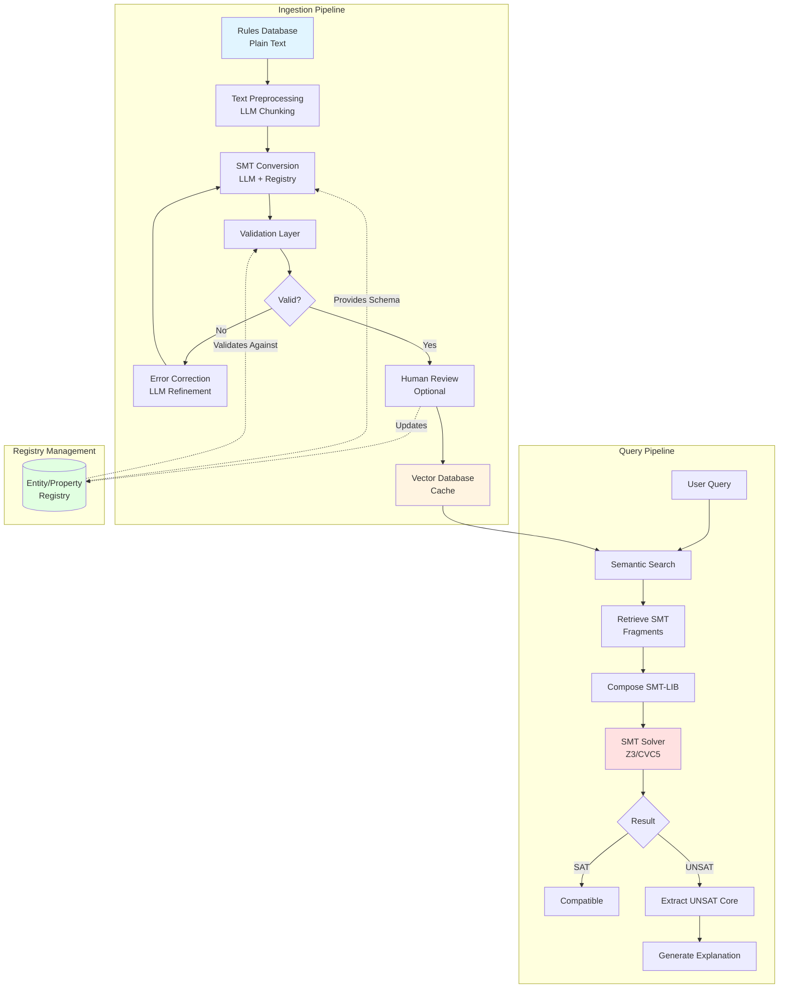

-----

## 2. Component Specifications

### 2.1 Rules Database Schema (Domain-Scoped)

> **Cross-Reference:** See `docs/DOMAIN_INDEPENDENCE_ANALYSIS.md` (Section 1.4, 2.4) for domain isolation requirements and multi-domain storage architecture.

All tables include `domain_id` foreign keys to ensure complete isolation between domains. This prevents cross-domain data leakage and enables per-domain analytics, backup, and migration.

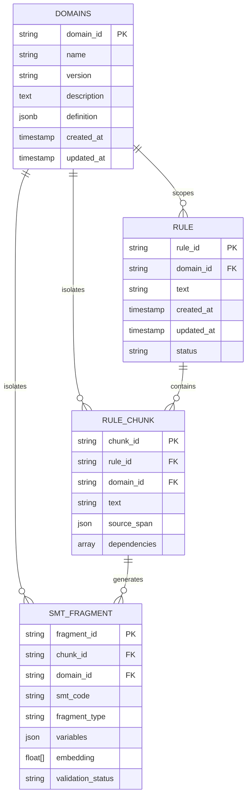

**Key Schema Changes:**
1. **DOMAINS table** stores domain configurations (entity types, properties, validation rules)
2. **domain_id foreign keys** in all tables ensure domain isolation
3. **Entity/Property registries** are now stored in `DOMAINS.definition` (JSONB), not separate tables
4. **Cascade delete** from DOMAINS removes all associated rules, chunks, and fragments

#### 2.1.1 Table Specifications

**DOMAINS Table:**
```sql
CREATE TABLE domains (
    domain_id VARCHAR(100) PRIMARY KEY,
    name VARCHAR(200) NOT NULL,
    version VARCHAR(20) NOT NULL,
    description TEXT,
    definition JSONB NOT NULL,  -- Complete domain configuration
    created_at TIMESTAMP DEFAULT CURRENT_TIMESTAMP,
    updated_at TIMESTAMP DEFAULT CURRENT_TIMESTAMP
);

CREATE INDEX idx_domains_name ON domains(name);
CREATE INDEX idx_domains_created ON domains(created_at DESC);
```

**RULE Table (Updated):**
```sql
CREATE TABLE rules (
    rule_id VARCHAR(100) PRIMARY KEY,
    domain_id VARCHAR(100) NOT NULL,
    text TEXT NOT NULL,
    created_at TIMESTAMP DEFAULT CURRENT_TIMESTAMP,
    updated_at TIMESTAMP DEFAULT CURRENT_TIMESTAMP,
    status VARCHAR(50) DEFAULT 'pending',

    CONSTRAINT fk_rules_domain
        FOREIGN KEY (domain_id)
        REFERENCES domains(domain_id)
        ON DELETE CASCADE
);

CREATE INDEX idx_rules_domain ON rules(domain_id);
CREATE INDEX idx_rules_status_domain ON rules(status, domain_id);
```

**RULE_CHUNK Table (Updated):**
```sql
CREATE TABLE rule_chunks (
    chunk_id VARCHAR(100) PRIMARY KEY,
    rule_id VARCHAR(100) NOT NULL,
    domain_id VARCHAR(100) NOT NULL,
    text TEXT NOT NULL,
    source_span JSONB,
    dependencies TEXT[],

    CONSTRAINT fk_chunks_rule
        FOREIGN KEY (rule_id)
        REFERENCES rules(rule_id)
        ON DELETE CASCADE,

    CONSTRAINT fk_chunks_domain
        FOREIGN KEY (domain_id)
        REFERENCES domains(domain_id)
        ON DELETE CASCADE
);

CREATE INDEX idx_chunks_rule ON rule_chunks(rule_id);
CREATE INDEX idx_chunks_domain ON rule_chunks(domain_id);
```

**SMT_FRAGMENT Table (Updated):**
```sql
CREATE TABLE smt_fragments (
    fragment_id VARCHAR(100) PRIMARY KEY,
    chunk_id VARCHAR(100) NOT NULL,
    domain_id VARCHAR(100) NOT NULL,
    smt_code TEXT NOT NULL,
    fragment_type VARCHAR(50),
    variables JSONB,
    embedding VECTOR(1536),  -- OpenAI ada-002 dimension
    validation_status VARCHAR(50) DEFAULT 'pending',

    CONSTRAINT fk_fragments_chunk
        FOREIGN KEY (chunk_id)
        REFERENCES rule_chunks(chunk_id)
        ON DELETE CASCADE,

    CONSTRAINT fk_fragments_domain
        FOREIGN KEY (domain_id)
        REFERENCES domains(domain_id)
        ON DELETE CASCADE
);

CREATE INDEX idx_fragments_chunk ON smt_fragments(chunk_id);
CREATE INDEX idx_fragments_domain ON smt_fragments(domain_id);
CREATE INDEX idx_fragments_type_domain ON smt_fragments(fragment_type, domain_id);
```

#### 2.1.2 Domain Isolation Guarantees

**Database-Level Isolation:**
- All queries filter by `domain_id` in WHERE clauses
- Foreign key constraints prevent orphaned data
- Indexes on `domain_id` ensure fast domain-scoped queries
- Cascade deletes maintain referential integrity

**Query Examples:**
```sql
-- Get all rules in a domain
SELECT * FROM rules WHERE domain_id = 'mechanical_engineering_v1';

-- Get fragments for a domain-scoped rule
SELECT f.*
FROM smt_fragments f
JOIN rule_chunks c ON f.chunk_id = c.chunk_id
WHERE f.domain_id = 'healthcare_drug_interactions_v1'
  AND c.rule_id = 'drug_rule_001';

-- Domain-specific analytics
SELECT domain_id, COUNT(*) as rule_count, AVG(LENGTH(text)) as avg_length
FROM rules
GROUP BY domain_id;
```

#### 2.1.3 Vector Database Metadata

Vector embeddings include domain_id for namespace isolation:

```json
{
  "fragment_id": "frag_uuid",
  "domain_id": "mechanical_engineering_v1",
  "rule_id": "rule_001",
  "text": "Steel expands at 11 μm/m/°C",
  "embedding": [0.123, 0.456, ...]
}
```

**Vector Search with Domain Filtering:**
```python
# Pinecone example
results = index.query(
    vector=query_embedding,
    filter={"domain_id": {"$eq": "mechanical_engineering_v1"}},
    top_k=20
)

# Weaviate example
results = client.query.get("Fragment", ["text", "fragment_id"]) \
    .with_near_vector({"vector": query_embedding}) \
    .with_where({"path": ["domain_id"], "operator": "Equal",
                 "valueString": "mechanical_engineering_v1"}) \
    .with_limit(20) \
    .do()
```

#### 2.1.4 Migration Notes

**Backward Compatibility:**
Existing data is migrated to default domain:
```sql
-- Step 1: Create domains table and add mechanical_engineering_v1
INSERT INTO domains (domain_id, name, version, description, definition)
VALUES ('mechanical_engineering_v1', 'Mechanical Engineering', '1.0.0',
        'Legacy data from v1.0', '{ ... existing config ... }');

-- Step 2: Add domain_id column with default
ALTER TABLE rules ADD COLUMN domain_id VARCHAR(100)
    DEFAULT 'mechanical_engineering_v1' NOT NULL;

-- Step 3: Add foreign key constraint
ALTER TABLE rules ADD CONSTRAINT fk_rules_domain
    FOREIGN KEY (domain_id) REFERENCES domains(domain_id);

-- Repeat for rule_chunks and smt_fragments
```

**Zero-Downtime Strategy:**
1. Add `domain_id` columns with defaults (non-breaking)
2. Backfill existing rows with default domain
3. Add foreign key constraints
4. Create indexes
5. Update application code to use domain-scoped queries
6. Remove old `domain` string column (if exists)

**Rollback Plan:**
```sql
-- Remove foreign key constraints
ALTER TABLE rules DROP CONSTRAINT fk_rules_domain;

-- Remove domain_id columns
ALTER TABLE rules DROP COLUMN domain_id;

-- Restore original schema
```

### 2.2 SMT Fragment Storage Schema

Fragment storage includes domain_id for proper isolation:

```json
{
  "fragment_id": "uuid-v4",
  "domain_id": "mechanical_engineering_v1",
  "rule_id": "thermal_expansion_001",
  "chunk_id": "chunk_001_001",

  "text": {
    "original": "Steel expands at 11 μm/m/°C",
    "normalized": "Steel has thermal expansion coefficient of 11 μm/m/°C",
    "source_span": [0, 28]
  },

  "embedding": [0.123, 0.456, ...],

  "smt": {
    "declarations": [
      "(declare-const steel_thermal_expansion_coef Real)"
    ],
    "assertions": [
      "(assert (= steel_thermal_expansion_coef 11.0))"
    ],
    "constraints": [
      "(assert (>= steel_thermal_expansion_coef 0))"
    ]
  },

  "variables": {
    "steel_thermal_expansion_coef": {
      "entity": "steel",
      "property": "thermal_expansion_coef",
      "type": "Real",
      "unit": "μm/m/°C",
      "value": 11.0,
      "domain": [0, 100]
    }
  },

  "metadata": {
    "domain_id": "mechanical_engineering_v1",
    "entities": ["steel"],
    "properties": ["thermal_expansion"],
    "dependencies": [],
    "confidence": 0.95
  },

  "validation": {
    "status": "approved",
    "syntax_valid": true,
    "semantically_valid": true,
    "satisfiable": true,
    "reviewed_by": "user_123",
    "reviewed_at": "2025-11-05T10:30:00Z"
  },

  "version": "1.0",
  "created_at": "2025-11-05T10:00:00Z",
  "updated_at": "2025-11-05T10:30:00Z"
}
```

**Note:** `domain_id` appears at both the top level (for database queries) and in metadata (for semantic context). This redundancy ensures fast filtering and comprehensive audit trails.

-----

## 3. Ingestion Pipeline (Domain-Aware)

> **Cross-Reference:** See `docs/DOMAIN_INDEPENDENCE_ANALYSIS.md` (Section 1.3, 1.5, 1.8, 2.5, 3.2) for domain-aware ingestion requirements.

The ingestion pipeline processes natural language rules into validated SMT-LIB constraints. **All operations are domain-scoped**: the pipeline loads the target domain's configuration and uses domain-specific entity types, properties, validation rules, and prompt templates throughout processing.

**Key Input:** Every ingestion request includes a `domain_id` parameter that determines:
- Which entity/property registry to use
- Which prompt templates to render
- Which validation rules to apply
- Which namespace to store embeddings in

### 3.1 Pipeline Flow (Domain-Scoped)

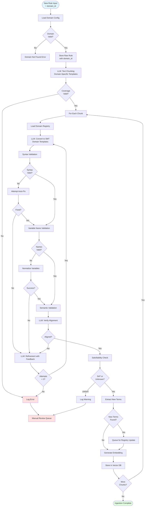

### 3.2 Text Chunking Prompt Template (Domain-Agnostic)

Prompts are **rendered from templates** using domain-specific context:

```python
CHUNKING_PROMPT_TEMPLATE = """
You are preprocessing {domain_description} rules for constraint solving.

Domain Context:
- Entity Types: {entity_types_list}
- Key Properties: {key_properties_list}
- Typical Relationships: {relationships_list}

Task: Break the input text into independent, self-contained constraint statements.

Requirements:
1. Each chunk must be processable in isolation
2. Resolve ALL pronouns and implicit references
3. Keep logical operators (OR, IF-THEN) within single chunks
4. Preserve exact numbers, units, and technical terms
5. EVERY word from source must appear in exactly one chunk

Example (from {domain_name}):
Input: "{domain_example_rule}"
Output: ["{domain_example_chunk_1}", "{domain_example_chunk_2}"]

Input text:
```

{input_text}

```
Output as JSON:
{{
  "chunks": [
    {{
      "id": 1,
      "text": "resolved constraint statement",
      "source_span": [start_char, end_char],
      "added_context": "explanation of what was resolved",
      "dependencies": [list of chunk IDs this depends on]
    }}
  ],
  "original_word_count": N,
  "chunk_word_count": M,
  "verification": "all source words accounted for"
}}
"""

# Template rendering example
chunking_prompt = CHUNKING_PROMPT_TEMPLATE.format(
    domain_description=domain.description,  # "material compatibility"
    entity_types_list=", ".join(domain.entity_types.keys()),  # "materials, parts, environment"
    key_properties_list=", ".join(domain.key_properties[:5]),  # "thermal_expansion_coef, tensile_strength, ..."
    relationships_list=", ".join(domain.relationships.keys()),  # "compatible_with, requires"
    domain_name=domain.name,  # "Mechanical Engineering"
    domain_example_rule=domain.examples[0].rule_text,  # Domain-specific example
    domain_example_chunk_1=domain.examples[0].chunks[0],
    domain_example_chunk_2=domain.examples[0].chunks[1],
    input_text=user_input
)
```

**Key Advantage:** Same template works for all domains (healthcare, finance, etc.) by injecting domain-specific vocabulary and examples.

### 3.3 SMT Conversion Prompt Template (Domain-Aware)

Conversion prompts use domain-specific registries and naming conventions:

```python
SMT_CONVERSION_PROMPT_TEMPLATE = """
Convert this {domain_description} constraint to SMT-LIB format.

DOMAIN: {domain_id}
VERSION: {domain_version}

MANDATORY VARIABLE REGISTRY (Domain-Specific):
{registry_json}

STRICT NAMING RULES FOR THIS DOMAIN:
1. Use ONLY canonical names from registry (no aliases)
2. Naming Pattern: {naming_convention_pattern}
3. Entity-Property Format: {naming_example_entity_property}
4. Relationship Format: {naming_example_relationship}
5. Unit System: {unit_system_description}

DOMAIN-SPECIFIC EXAMPLES:
Input: "{domain_example_input}"
Output SMT-LIB:
{domain_example_smt}

CONSTRAINT TO CONVERT:
```

{chunk_text}

```
OUTPUT FORMAT (JSON):
{{
  "declarations": [
    "(declare-const var_name Type)"
  ],
  "assertions": [
    "(assert (= ...))"
  ],
  "constraints": [
    "(assert (>= ...))"  // Domain constraints
  ],
  "variables_used": {{
    "var_name": {{
      "entity": "{entity_example}",
      "property": "{property_example}",
      "type": "Real|Int|Bool",
      "unit": "{unit_example}",
      "value": numeric_value
    }}
  }},
  "reasoning": "brief explanation of conversion"
}}

VALIDATION CHECKLIST (verify before responding):
☐ All variable names match domain registry exactly
☐ All units converted to domain's standard units
☐ No undefined variables (all in registry)
☐ Proper SMT-LIB syntax
☐ Types match domain schema (Real, Int, Bool, String)
☐ Naming convention follows domain pattern: {naming_convention_pattern}
"""

# Template rendering with domain context
smt_conversion_prompt = SMT_CONVERSION_PROMPT_TEMPLATE.format(
    domain_description=domain.description,
    domain_id=domain.domain_id,
    domain_version=domain.version,
    registry_json=json.dumps(domain.to_registry_dict(), indent=2),
    naming_convention_pattern=domain.naming_conventions["entity_property"],
    naming_example_entity_property=domain.naming_conventions["examples"][0],
    naming_example_relationship=domain.naming_conventions.get("relationship_example", "N/A"),
    unit_system_description=domain.unit_system.description,
    domain_example_input=domain.examples[0].rule_text,
    domain_example_smt=domain.examples[0].expected_smt,
    chunk_text=chunk_to_convert,
    entity_example=list(domain.entity_types.keys())[0] if domain.entity_types else "entity",
    property_example=list(domain.properties.keys())[0] if domain.properties else "property",
    unit_example=domain.properties[list(domain.properties.keys())[0]]["unit"] if domain.properties else "unit"
)
```

**Domain Adaptation:**
- **Mechanical Engineering:** Uses "materials", "parts", pattern "material_property"
- **Healthcare:** Uses "medications", "patients", pattern "drug_property"
- **Finance:** Uses "transactions", "securities", pattern "txn_property"

Same template, different vocabulary and rules per domain.

-----

## 4. Entity/Property Registry (Domain-Independent)

> **Cross-Reference:** See `docs/DOMAIN_INDEPENDENCE_ANALYSIS.md` (Section 1.1, 1.2, 2.1, 2.2) for detailed analysis of domain independence requirements.

The Entity/Property Registry is a **domain-configurable** system that defines the vocabulary, types, and constraints for a specific problem domain. Unlike version 1.0 which hardcoded mechanical engineering entities, version 2.0 treats domains as first-class, pluggable configurations.

**Key Principle:** The registry structure is generic and works for any domain (mechanical engineering, healthcare, finance, temporal logic, etc.). Entity types, properties, and relationships are loaded from domain-specific configuration files.

### 4.1 Generic Registry Structure

Each domain defines its own registry following this template:

```json
{
  "domain_id": "{unique_domain_identifier}",
  "name": "{Human-readable domain name}",
  "version": "major.minor.patch",
  "description": "{Domain purpose and scope}",
  "last_updated": "ISO-8601 timestamp",

  "entity_types": {
    "{entity_type_name}": {
      "canonical_var": "{variable_prefix}",
      "aliases": ["{alternative_names}"],
      "smt_type": "Enum|String",
      "instances": {
        "{instance_name}": {
          "aliases": ["{alternative_instance_names}"],
          "properties_required": ["{property_list}"]
        }
      }
    }
  },

  "properties": {
    "{property_name}": {
      "canonical_var": "{smt_variable_name}",
      "aliases": ["{alternative_property_names}"],
      "unit": "{unit_string}",
      "smt_type": "Real|Int|Bool|String",
      "domain": [min_value, max_value],
      "description": "{Property meaning and constraints}"
    }
  },

  "relationships": {
    "{relationship_name}": {
      "canonical_var": "{relation_variable}",
      "smt_type": "Bool",
      "arity": 2,
      "description": "{Relationship semantics}"
    }
  },

  "naming_conventions": {
    "entity_property": "{template_pattern}",
    "examples": ["{example_variable_names}"]
  }
}
```

**Supported SMT Types:**
- `Real`: Continuous numeric values (IEEE floating point)
- `Int`: Discrete integer values
- `Bool`: Boolean predicates
- `Enum`: Enumerated type (mapped to Int with constraints)
- `String`: String literals (solver-dependent)

### 4.2 Domain Loading and Validation

Domains are loaded at system startup and validated against the domain schema:

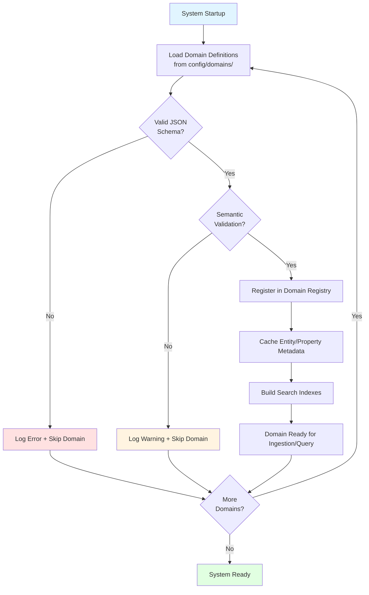

**Domain Registry Singleton:**
```python
class DomainRegistry:
    """Thread-safe singleton for managing domain configurations"""

    @classmethod
    def get(cls, domain_id: str) -> Domain:
        """Retrieve domain configuration by ID"""

    @classmethod
    def list_domains(cls) -> List[DomainSummary]:
        """List all registered domains"""

    @classmethod
    def register(cls, domain: Domain) -> None:
        """Register new domain (validation required)"""
```

**Domain Validation Rules:**
1. `domain_id` must be unique and immutable
2. All `smt_type` values must be valid SMT-LIB types
3. Property `domain` ranges must be valid (min <= max)
4. Entity `instances` must reference defined properties
5. Circular dependencies between entities are detected and rejected
6. Naming conventions must produce valid SMT-LIB identifiers

### 4.3 Registry Management Flow

The registry remains stable during operation but can be updated through controlled processes:

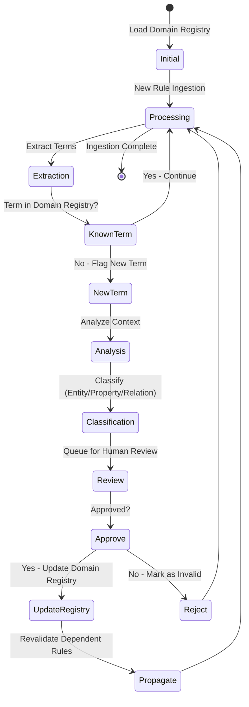

**Note:** Domain registry updates trigger revalidation of all rules using that domain to maintain consistency.

### 4.4 Multi-Domain Examples

The same registry structure serves diverse domains:

#### Example 1: Mechanical Engineering (Reference Implementation)

```json
{
  "domain_id": "mechanical_engineering_v1",
  "name": "Mechanical Engineering - Materials Compatibility",
  "version": "1.0.0",

  "entity_types": {
    "materials": {
      "canonical_var": "material",
      "aliases": ["metal", "substance", "alloy"],
      "smt_type": "Enum",
      "instances": {
        "steel": {
          "aliases": ["carbon_steel", "stainless"],
          "properties_required": ["thermal_expansion_coef", "tensile_strength"]
        },
        "aluminum": {
          "aliases": ["aluminium", "al"],
          "properties_required": ["thermal_expansion_coef", "yield_strength"]
        }
      }
    },
    "parts": {
      "canonical_var": "part",
      "aliases": ["component", "piece"],
      "smt_type": "Enum",
      "instances": {
        "bolt": {
          "aliases": ["screw", "fastener"],
          "properties_required": ["material", "diameter", "torque"]
        },
        "plate": {
          "aliases": ["sheet", "panel"],
          "properties_required": ["material", "thickness"]
        }
      }
    }
  },

  "properties": {
    "thermal_expansion_coef": {
      "canonical_var": "thermal_expansion_coef",
      "unit": "μm/m/°C",
      "smt_type": "Real",
      "domain": [0, 100],
      "description": "Linear thermal expansion coefficient"
    },
    "tensile_strength": {
      "canonical_var": "tensile_strength",
      "unit": "MPa",
      "smt_type": "Real",
      "domain": [0, 5000],
      "description": "Maximum tensile stress"
    }
  },

  "relationships": {
    "compatible_with": {
      "canonical_var": "compatible",
      "smt_type": "Bool",
      "arity": 2
    }
  },

  "naming_conventions": {
    "entity_property": "{entity}_{property}",
    "examples": ["steel_thermal_expansion_coef", "bolt_material"]
  }
}
```

#### Example 2: Healthcare - Drug Interactions

```json
{
  "domain_id": "healthcare_drug_interactions_v1",
  "name": "Healthcare - Drug Interaction Safety",
  "version": "1.0.0",

  "entity_types": {
    "medications": {
      "canonical_var": "drug",
      "aliases": ["medicine", "pharmaceutical", "medication"],
      "smt_type": "Enum",
      "instances": {
        "warfarin": {
          "aliases": ["coumadin"],
          "properties_required": ["dosage_mg", "half_life_hours"]
        },
        "aspirin": {
          "aliases": ["acetylsalicylic_acid"],
          "properties_required": ["dosage_mg"]
        }
      }
    },
    "patients": {
      "canonical_var": "patient",
      "aliases": ["individual"],
      "smt_type": "String",
      "instances": {}
    }
  },

  "properties": {
    "dosage_mg": {
      "canonical_var": "dosage",
      "unit": "mg",
      "smt_type": "Real",
      "domain": [0, 1000],
      "description": "Medication dosage"
    },
    "age_years": {
      "canonical_var": "age",
      "unit": "years",
      "smt_type": "Int",
      "domain": [0, 120],
      "description": "Patient age"
    },
    "kidney_function_gfr": {
      "canonical_var": "kidney_gfr",
      "unit": "mL/min/1.73m²",
      "smt_type": "Real",
      "domain": [0, 150],
      "description": "Glomerular filtration rate"
    }
  },

  "relationships": {
    "contraindicated_with": {
      "canonical_var": "contraindicated",
      "smt_type": "Bool",
      "arity": 2,
      "description": "Drugs should not be combined"
    },
    "safe_with": {
      "canonical_var": "safe_combination",
      "smt_type": "Bool",
      "arity": 2
    }
  },

  "naming_conventions": {
    "entity_property": "{entity}_{property}",
    "examples": ["warfarin_dosage", "patient_age", "warfarin_aspirin_contraindicated"]
  }
}
```

#### Example 3: Finance - Regulatory Compliance

```json
{
  "domain_id": "finance_compliance_v1",
  "name": "Financial Regulatory Compliance",
  "version": "1.0.0",

  "entity_types": {
    "transactions": {
      "canonical_var": "txn",
      "aliases": ["trade", "transaction"],
      "smt_type": "String",
      "instances": {}
    },
    "securities": {
      "canonical_var": "security",
      "aliases": ["instrument", "asset"],
      "smt_type": "Enum",
      "instances": {
        "stock": {"aliases": ["equity"], "properties_required": ["price", "volume"]},
        "bond": {"aliases": ["fixed_income"], "properties_required": ["yield", "maturity"]}
      }
    },
    "entities": {
      "canonical_var": "entity",
      "aliases": ["institution", "counterparty"],
      "smt_type": "String",
      "instances": {}
    }
  },

  "properties": {
    "notional_amount": {
      "canonical_var": "notional",
      "unit": "USD",
      "smt_type": "Real",
      "domain": [0, 1000000000],
      "description": "Transaction notional value"
    },
    "leverage_ratio": {
      "canonical_var": "leverage",
      "unit": "ratio",
      "smt_type": "Real",
      "domain": [0, 100],
      "description": "Financial leverage"
    },
    "capital_ratio": {
      "canonical_var": "capital",
      "unit": "percentage",
      "smt_type": "Real",
      "domain": [0, 100],
      "description": "Capital adequacy ratio"
    }
  },

  "relationships": {
    "complies_with_dodd_frank": {
      "canonical_var": "dodd_frank_compliant",
      "smt_type": "Bool",
      "arity": 1,
      "description": "Transaction complies with Dodd-Frank"
    },
    "complies_with_basel_iii": {
      "canonical_var": "basel_iii_compliant",
      "smt_type": "Bool",
      "arity": 1,
      "description": "Entity complies with Basel III"
    }
  },

  "naming_conventions": {
    "entity_property": "{entity}_{property}",
    "examples": ["txn_notional_amount", "entity_capital_ratio"]
  }
}
```

**Key Insight:** The same ingestion and query pipelines work identically for all three domains. The only difference is which domain configuration is loaded.

-----

## 5. Validation Layer

### 5.1 Validation Pipeline

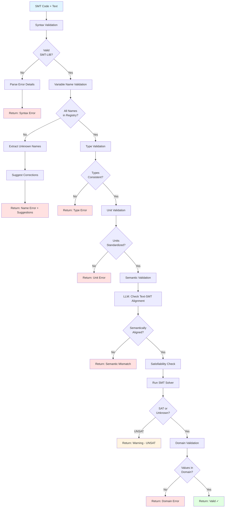

### 5.2 Validation Functions

```python
class SMTValidator:
    def __init__(self, registry):
        self.registry = registry
        self.solver = Z3Solver()
    
    def validate(self, smt_code: str, source_text: str) -> ValidationResult:
        """
        Comprehensive validation pipeline
        
        Returns:
            ValidationResult with status and detailed feedback
        """
        results = ValidationResult()
        
        # 1. Syntax validation
        syntax_result = self._validate_syntax(smt_code)
        if not syntax_result.valid:
            return syntax_result
        
        # 2. Variable name validation
        name_result = self._validate_variable_names(smt_code)
        if not name_result.valid:
            return name_result
        
        # 3. Type validation
        type_result = self._validate_types(smt_code)
        if not type_result.valid:
            return type_result
        
        # 4. Unit validation
        unit_result = self._validate_units(smt_code)
        if not unit_result.valid:
            return unit_result
        
        # 5. Semantic validation (LLM)
        semantic_result = self._validate_semantics(smt_code, source_text)
        if not semantic_result.valid:
            return semantic_result
        
        # 6. Satisfiability check
        sat_result = self._check_satisfiability(smt_code)
        if sat_result.status == "unsat":
            results.add_warning("Constraint is unsatisfiable in isolation")
        
        # 7. Domain validation
        domain_result = self._validate_domains(smt_code)
        if not domain_result.valid:
            return domain_result
        
        results.status = "valid"
        return results
    
    def _validate_syntax(self, smt_code: str) -> ValidationResult:
        """Parse SMT-LIB and check syntax"""
        try:
            ast = parse_smt_lib(smt_code)
            return ValidationResult(valid=True)
        except ParseError as e:
            return ValidationResult(
                valid=False,
                error_type="syntax",
                message=str(e),
                line=e.line,
                column=e.column
            )
    
    def _validate_variable_names(self, smt_code: str) -> ValidationResult:
        """Check all variables against registry"""
        variables = extract_variables(smt_code)
        invalid_vars = []
        suggestions = {}
        
        for var in variables:
            if not self._is_valid_name(var):
                invalid_vars.append(var)
                suggestions[var] = self._suggest_correction(var)
        
        if invalid_vars:
            return ValidationResult(
                valid=False,
                error_type="variable_names",
                message=f"Invalid variable names: {invalid_vars}",
                details={"suggestions": suggestions}
            )
        
        return ValidationResult(valid=True)
    
    def _is_valid_name(self, var_name: str) -> bool:
        """Check if variable name follows registry conventions"""
        # Check against registry patterns
        for entity_type, entity_def in self.registry['entities'].items():
            for instance in entity_def['instances']:
                for prop in self.registry['properties']:
                    canonical = f"{instance}_{prop}"
                    if var_name == canonical:
                        return True
        return False
    
    def _suggest_correction(self, var_name: str) -> List[str]:
        """Fuzzy match to suggest correct variable names"""
        from difflib import get_close_matches
        
        all_valid_names = self._get_all_valid_names()
        suggestions = get_close_matches(var_name, all_valid_names, n=3, cutoff=0.6)
        return suggestions
    
    def _validate_semantics(self, smt_code: str, source_text: str) -> ValidationResult:
        """Use LLM to verify semantic alignment"""
        prompt = f"""
        Verify if this SMT code accurately represents the constraint.
        
        Original text: {source_text}
        SMT code: {smt_code}
        
        Answer with JSON:
        {{
          "aligned": true/false,
          "confidence": 0.0-1.0,
          "issues": ["list of mismatches if any"],
          "explanation": "brief reasoning"
        }}
        """
        
        response = call_llm(prompt)
        result = json.loads(response)
        
        if not result['aligned'] or result['confidence'] < 0.8:
            return ValidationResult(
                valid=False,
                error_type="semantic",
                message="SMT does not align with source text",
                details=result
            )
        
        return ValidationResult(valid=True)
    
    def _check_satisfiability(self, smt_code: str) -> SatResult:
        """Check if constraint is satisfiable"""
        result = self.solver.check(smt_code)
        return result
    
    def _validate_domains(self, smt_code: str) -> ValidationResult:
        """Verify values are within defined domains"""
        variables = extract_variables_with_values(smt_code)
        
        for var, value in variables.items():
            domain = self._get_domain(var)
            if domain and not self._in_domain(value, domain):
                return ValidationResult(
                    valid=False,
                    error_type="domain",
                    message=f"{var}={value} outside domain {domain}"
                )
        
        return ValidationResult(valid=True)
```

-----

## 6. Query Pipeline (Domain-Scoped)

> **Cross-Reference:** See `docs/DOMAIN_INDEPENDENCE_ANALYSIS.md` (Section 1.6, 1.9, 3.2) for domain-scoped query requirements.

Query execution is **domain-scoped**: all queries specify a `domain_id` which determines the entity/property vocabulary, semantic search namespace, and explanation generation strategy.

**Key Principle:** The same query pipeline works for any domain (mechanical engineering, healthcare, finance), adapting behavior based on the loaded domain configuration.

### 6.1 Query Processing Flow (Domain-Aware)

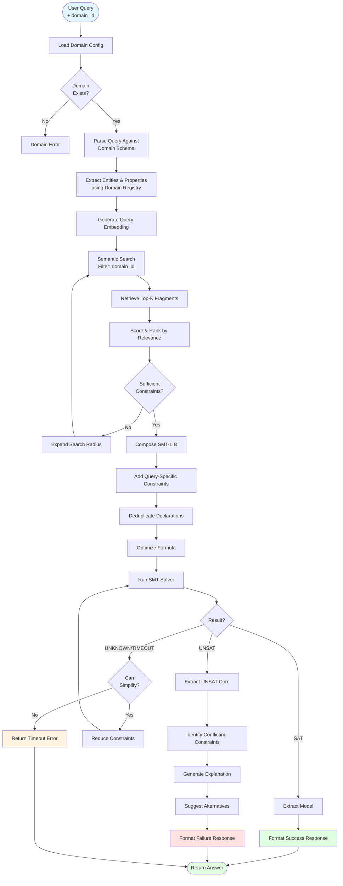

### 6.2 Query Structure (Generic)

Queries follow a domain-independent structure:

```python
# Generic query template
query = {
    "domain_id": "{domain_identifier}",
    "entities": {
        "{entity_instance_name}": {
            "{property_name}": "{property_value}"
        }
    },
    "context": {
        "{contextual_property}": "{contextual_value}"
    },
    "question": "{question_type}"
}
```

**Note:** Replaced `environment` with `context` for generality. `context` holds situational properties that aren't entity-specific.

#### Example 1: Mechanical Engineering

```python
# Query: "Can I use steel bolts with aluminum plates at 200°C?"

query_mechanical = {
    "domain_id": "mechanical_engineering_v1",
    "entities": {
        "bolt": {"material": "steel"},
        "plate": {"material": "aluminum"}
    },
    "context": {
        "temperature": 200
    },
    "question": "compatible?"
}

# Semantic search retrieves (filtered by domain_id="mechanical_engineering_v1"):
retrieved_fragments = [
    {
        "domain_id": "mechanical_engineering_v1",
        "text": "Steel expands at 11 μm/m/°C",
        "smt": "(assert (= steel_thermal_expansion_coef 11.0))",
        "relevance": 0.92
    },
    {
        "domain_id": "mechanical_engineering_v1",
        "text": "Aluminum expands at 23 μm/m/°C",
        "smt": "(assert (= aluminum_thermal_expansion_coef 23.0))",
        "relevance": 0.91
    },
    {
        "domain_id": "mechanical_engineering_v1",
        "text": "Differential expansion > 15 μm/m/°C causes stress fractures",
        "smt": "(assert (=> (> (abs (- mat1_expansion mat2_expansion)) 15) (= stress_fracture_risk true)))",
        "relevance": 0.88
    }
]
```

#### Example 2: Healthcare - Drug Interactions

```python
# Query: "Is warfarin safe with aspirin for a 65-year-old patient?"

query_healthcare = {
    "domain_id": "healthcare_drug_interactions_v1",
    "entities": {
        "patient": {"age": 65},
        "medication_1": {"drug": "warfarin", "dosage_mg": 5},
        "medication_2": {"drug": "aspirin", "dosage_mg": 81}
    },
    "context": {
        "kidney_function": "normal"
    },
    "question": "safe?"
}

# Semantic search retrieves (filtered by domain_id="healthcare_drug_interactions_v1"):
retrieved_fragments = [
    {
        "domain_id": "healthcare_drug_interactions_v1",
        "text": "Warfarin and aspirin increase bleeding risk",
        "smt": "(assert (=> (and (= med1 warfarin) (= med2 aspirin)) (= bleeding_risk high)))",
        "relevance": 0.94
    },
    {
        "domain_id": "healthcare_drug_interactions_v1",
        "text": "For patients age > 60, bleeding risk increases by 40%",
        "smt": "(assert (=> (> patient_age 60) (= risk_multiplier 1.4)))",
        "relevance": 0.89
    }
]
```

#### Example 3: Finance - Regulatory Compliance

```python
# Query: "Does this $50M leveraged transaction comply with Basel III?"

query_finance = {
    "domain_id": "finance_compliance_v1",
    "entities": {
        "transaction": {
            "type": "leveraged_loan",
            "notional_amount": 50000000
        },
        "institution": {
            "capital_ratio": 12.5,
            "tier1_capital": 8.5
        }
    },
    "context": {
        "regulation": "basel_iii"
    },
    "question": "compliant?"
}

# Semantic search retrieves (filtered by domain_id="finance_compliance_v1"):
retrieved_fragments = [
    {
        "domain_id": "finance_compliance_v1",
        "text": "Basel III requires minimum 10.5% capital ratio for leveraged transactions",
        "smt": "(assert (=> (and (= regulation basel_iii) (= txn_type leveraged)) (>= capital_ratio 10.5)))",
        "relevance": 0.93
    }
]

# Compose final SMT-LIB:
smt_program = """
(declare-const bolt_material String)
(declare-const plate_material String)
(declare-const temp Real)
(declare-const steel_thermal_expansion_coef Real)
(declare-const aluminum_thermal_expansion_coef Real)
(declare-const expansion_diff Real)
(declare-const stress_fracture_risk Bool)

; Retrieved constraints
(assert (= steel_thermal_expansion_coef 11.0))
(assert (= aluminum_thermal_expansion_coef 23.0))
(assert (= expansion_diff (abs (- steel_thermal_expansion_coef aluminum_thermal_expansion_coef))))
(assert (=> (> expansion_diff 15) (= stress_fracture_risk true)))

; Query-specific constraints
(assert (= bolt_material "steel"))
(assert (= plate_material "aluminum"))
(assert (= temp 200))

; Compatibility check
(assert (not stress_fracture_risk))

(check-sat)
(get-model)
"""

# Solver returns: UNSAT
# Extract UNSAT core: expansion_diff constraint conflicts
# Generate response:
response = {
    "compatible": False,
    "reason": "Thermal expansion mismatch",
    "details": {
        "steel_expansion": 11,
        "aluminum_expansion": 23,
        "differential": 12,
        "threshold": 15,
        "risk": "stress_fractures"
    },
    "suggestions": [
        "Use thermal expansion compensators",
        "Replace aluminum with steel plates",
        "Limit operating temperature to < 100°C"
    ]
}
```

### 6.3 SMT Composition Algorithm (Domain-Aware)

**Key Domain Integration:** The SMT composer loads the domain registry to:
- Validate variable names against domain naming conventions
- Apply domain-specific type constraints
- Use domain property ranges for bounds checking

```python
class SMTComposer:
    def __init__(self, domain_registry: DomainRegistry):
        self.domain_registry = domain_registry

    def compose(self, query: Query, fragments: List[SMTFragment]) -> str:
        """
        Compose final SMT-LIB program from fragments and query.
        Uses domain schema for variable validation and type constraints.
        """
        # Load domain configuration
        domain = self.domain_registry.get(query.domain_id)

        # 1. Collect all declarations (deduplicate)
        declarations = self._collect_declarations(fragments)

        # 2. Collect all assertions
        assertions = self._collect_assertions(fragments)

        # 3. Add query-specific constraints (domain-aware)
        query_constraints = self._query_to_smt(query, domain)

        # 4. Add domain constraints (type bounds, enums)
        domain_constraints = self._add_domain_constraints(declarations, domain)

        # 5. Optimize formula (simplify, remove redundancies)
        optimized = self._optimize(assertions + query_constraints)

        # 6. Compose final program
        smt_program = self._format_smt_lib(
            declarations,
            domain_constraints,
            optimized
        )

        return smt_program

    def _collect_declarations(self, fragments: List[SMTFragment]) -> List[str]:
        """Deduplicate variable declarations"""
        decls = {}
        for fragment in fragments:
            for decl in fragment.smt['declarations']:
                var_name = extract_var_name(decl)
                if var_name not in decls:
                    decls[var_name] = decl
        return list(decls.values())

    def _collect_assertions(self, fragments: List[SMTFragment]) -> List[str]:
        """Collect all assertions, checking for contradictions"""
        assertions = []
        seen = set()

        for fragment in fragments:
            for assertion in fragment.smt['assertions']:
                # Normalize to detect duplicates
                normalized = normalize_smt(assertion)
                if normalized not in seen:
                    assertions.append(assertion)
                    seen.add(normalized)

        return assertions

    def _query_to_smt(self, query: Query, domain: Domain) -> List[str]:
        """Convert query to SMT constraints using domain naming conventions"""
        constraints = []

        # Entity constraints - use domain naming patterns
        for entity, properties in query.entities.items():
            for prop, value in properties.items():
                # Use domain naming convention
                var_name = domain.format_variable_name(entity, prop)
                constraints.append(f"(assert (= {var_name} {self._format_value(value)}))")

        # Context constraints (generic replacement for "environment")
        for prop, value in query.context.items():
            # Context properties may not follow entity_property pattern
            var_name = domain.resolve_context_property(prop)
            constraints.append(f"(assert (= {var_name} {value}))")

        # Goal constraint - domain-specific question types
        goal_constraint = domain.get_goal_constraint(query.question)
        if goal_constraint:
            constraints.append(goal_constraint)

        return constraints
    
    def _optimize(self, assertions: List[str]) -> List[str]:
        """Simplify and optimize assertions"""
        # Remove redundant assertions
        # Combine similar assertions
        # Reorder for solver efficiency
        # (Implementation depends on SMT solver)
        return assertions
```

-----

### 6.4 Result Interpretation (Domain-Aware)

**Domain-Aware Explanations:** The system uses domain-specific terminology and concepts when explaining results:
- UNSAT explanations reference domain entities and properties
- Suggestions use domain vocabulary (e.g., "materials" for mechanical, "drugs" for healthcare)
- Domain plugins can provide custom explanation strategies

#### 6.4.1 Conflict Resolution Flow

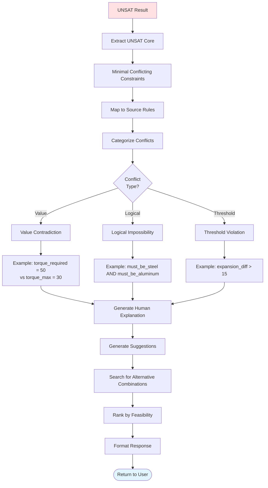

#### 6.4.2 UNSAT Analysis Implementation (Domain-Aware)

```python
class UNSATAnalyzer:
    def __init__(self, domain_registry: DomainRegistry, fragment_db):
        self.domain_registry = domain_registry
        self.fragment_db = fragment_db
        self.solver = Z3Solver()

    def analyze(self, smt_program: str, query: Query) -> UNSATReport:
        """
        Analyze UNSAT result and generate domain-aware explanation.
        Uses domain vocabulary and concepts.
        """
        # Load domain for terminology
        domain = self.domain_registry.get(query.domain_id)

        # 1. Extract UNSAT core
        core = self.solver.get_unsat_core(smt_program)

        # 2. Map assertions back to source rules
        conflicting_rules = self._map_to_rules(core)

        # 3. Categorize conflict type
        conflict_type = self._categorize_conflict(core)

        # 4. Generate human explanation using domain terminology
        explanation = self._generate_explanation(
            conflict_type,
            conflicting_rules,
            query,
            domain  # Domain context added
        )

        # 5. Suggest alternatives using domain concepts
        suggestions = self._generate_suggestions(
            conflict_type,
            conflicting_rules,
            query,
            domain  # Domain context added
        )

        return UNSATReport(
            compatible=False,
            conflict_type=conflict_type,
            explanation=explanation,
            conflicting_rules=conflicting_rules,
            suggestions=suggestions
        )
    
    def _map_to_rules(self, core: List[str]) -> List[Rule]:
        """Map SMT assertions back to original rules"""
        rules = []
        for assertion in core:
            # Extract variable names from assertion
            variables = extract_variables(assertion)
            
            # Find fragments that declare these variables
            fragments = self.fragment_db.find_by_variables(variables)
            
            for fragment in fragments:
                rule = self.fragment_db.get_rule(fragment.rule_id)
                if rule not in rules:
                    rules.append(rule)
        
        return rules
    
    def _categorize_conflict(self, core: List[str]) -> str:
        """Determine type of conflict"""
        # Analyze the structure of conflicting assertions
        
        # Value contradiction: (= x 5) and (= x 10)
        if self._has_value_contradiction(core):
            return "value_contradiction"
        
        # Logical impossibility: (and p (not p))
        if self._has_logical_contradiction(core):
            return "logical_impossibility"
        
        # Threshold violation: (> x 100) and (< x 50)
        if self._has_threshold_violation(core):
            return "threshold_violation"
        
        # Range conflict: (and (> x 10) (< x 5))
        if self._has_range_conflict(core):
            return "range_conflict"
        
        return "complex_conflict"
    
    def _generate_explanation(
        self,
        conflict_type: str,
        rules: List[Rule],
        query: Query,
        domain: Domain
    ) -> str:
        """Generate human-readable explanation using domain-specific terminology"""

        # Build domain-specific context for LLM
        domain_context = {
            "domain_name": domain.name,
            "entity_types": list(domain.entity_types.keys()),
            "key_properties": [p for p in domain.properties.keys()][:5],
            "description": domain.description
        }

        prompt = f"""
        Generate a clear explanation for why this combination is incompatible.

        DOMAIN: {domain_context['domain_name']}
        Domain Context: {domain_context['description']}
        Entity Types: {', '.join(domain_context['entity_types'])}

        Query: {query.to_natural_language()}

        Conflicting rules:
        {chr(10).join(f"- {r.text}" for r in rules)}

        Conflict type: {conflict_type}

        Provide a concise explanation (2-3 sentences) that:
        1. States what's incompatible using domain terminology
        2. Explains why (which constraints conflict)
        3. Quantifies the problem if applicable

        Use natural language appropriate for {domain.name} domain experts.
        """

        return call_llm(prompt)
    
    def _generate_suggestions(
        self,
        conflict_type: str,
        rules: List[Rule],
        query: Query,
        domain: Domain
    ) -> List[Suggestion]:
        """Generate alternative solutions using domain-specific strategies"""

        suggestions = []

        # Strategy 1: Relax context constraints
        if conflict_type == "threshold_violation":
            suggestions.extend(self._suggest_parameter_changes(rules, query, domain))

        # Strategy 2: Substitute entities (domain-aware)
        if conflict_type in ["value_contradiction", "logical_impossibility"]:
            suggestions.extend(self._suggest_substitutions(rules, query, domain))

        # Strategy 3: Domain-specific alternatives (use plugin if available)
        if domain.has_plugin():
            plugin_suggestions = domain.plugin.generate_suggestions(
                conflict_type, rules, query
            )
            suggestions.extend(plugin_suggestions)

        # Rank by feasibility
        ranked = self._rank_suggestions(suggestions)

        return ranked[:5]  # Return top 5

    def _suggest_parameter_changes(
        self,
        rules: List[Rule],
        query: Query,
        domain: Domain
    ) -> List[Suggestion]:
        """Suggest changing context parameters using domain vocabulary"""
        suggestions = []

        # Extract context properties from domain that could be modified
        for context_prop in query.context.keys():
            if context_prop in domain.properties:
                prop_def = domain.properties[context_prop]
                current_value = query.context[context_prop]

                # Suggest value within domain's valid range
                if prop_def.smt_type == "Real" and prop_def.domain:
                    min_val, max_val = prop_def.domain
                    suggestions.append(Suggestion(
                        type="parameter_change",
                        description=f"Adjust {context_prop}",
                        specifics=f"Try values between {min_val} and {max_val} {prop_def.unit}",
                        feasibility=0.7
                    ))

        return suggestions

    def _suggest_substitutions(
        self,
        rules: List[Rule],
        query: Query,
        domain: Domain
    ) -> List[Suggestion]:
        """Suggest alternative entities using domain entity registry"""
        suggestions = []

        # For each entity in query, find compatible alternatives from domain
        for entity_name, properties in query.entities.items():
            # Determine entity type from domain
            entity_type = domain.find_entity_type(entity_name)

            if entity_type and entity_type in domain.entity_types:
                # Get all instances of this entity type
                available_instances = domain.entity_types[entity_type].instances

                for instance_name, instance_def in available_instances.items():
                    if instance_name != properties.get(entity_type):
                        suggestions.append(Suggestion(
                            type="substitution",
                            description=f"Replace {entity_name} with {instance_name}",
                            specifics=f"Alternative {domain.entity_types[entity_type].canonical_var}",
                            feasibility=0.6
                        ))

        return suggestions
```

-----

### 6.5 Domain Plugin Integration

**Plugin Architecture:** Domains can provide custom plugins to extend query processing with domain-specific logic. This allows specialized explanation strategies, suggestion engines, and result formatting.

#### 6.5.1 Plugin Interface

Domains register plugins that implement the `DomainPlugin` interface:

```python
from abc import ABC, abstractmethod
from typing import List, Optional

class DomainPlugin(ABC):
    """
    Base interface for domain-specific query processing extensions
    """

    @abstractmethod
    def name(self) -> str:
        """Plugin identifier"""
        pass

    @abstractmethod
    def version(self) -> str:
        """Plugin version (semver)"""
        pass

    def preprocess_query(self, query: Query, domain: Domain) -> Query:
        """
        Optional: Transform query before processing.
        Default: no transformation
        """
        return query

    def validate_query(self, query: Query, domain: Domain) -> List[str]:
        """
        Optional: Domain-specific validation.
        Returns list of validation errors (empty if valid).
        """
        return []

    def generate_explanation(
        self,
        conflict_type: str,
        rules: List[Rule],
        query: Query,
        domain: Domain
    ) -> Optional[str]:
        """
        Optional: Generate custom explanation for UNSAT results.
        Return None to use default explanation.
        """
        return None

    def generate_suggestions(
        self,
        conflict_type: str,
        rules: List[Rule],
        query: Query,
        domain: Domain
    ) -> List[Suggestion]:
        """
        Optional: Generate domain-specific suggestions.
        Augments default suggestion engine.
        """
        return []

    def format_result(
        self,
        result: QueryResult,
        query: Query,
        domain: Domain
    ) -> dict:
        """
        Optional: Custom result formatting for domain.
        Return None to use default formatting.
        """
        return None
```

#### 6.5.2 Example Plugin: Mechanical Engineering

```python
class MechanicalEngineeringPlugin(DomainPlugin):
    def name(self) -> str:
        return "mechanical_engineering_plugin"

    def version(self) -> str:
        return "1.0.0"

    def validate_query(self, query: Query, domain: Domain) -> List[str]:
        """Validate mechanical engineering queries"""
        errors = []

        # Ensure temperature is in valid range
        if "temperature" in query.context:
            temp = query.context["temperature"]
            if temp < -273.15:  # Below absolute zero
                errors.append("Temperature cannot be below absolute zero (-273.15°C)")
            if temp > 3000:  # Unrealistic for materials
                errors.append("Temperature above material limits (max 3000°C)")

        # Ensure materials exist in registry
        for entity_name, props in query.entities.items():
            if "material" in props:
                material = props["material"]
                if material not in domain.entity_types["materials"].instances:
                    errors.append(f"Unknown material: {material}")

        return errors

    def generate_explanation(
        self,
        conflict_type: str,
        rules: List[Rule],
        query: Query,
        domain: Domain
    ) -> Optional[str]:
        """Generate mechanical engineering-specific explanations"""

        if conflict_type == "threshold_violation":
            # Extract thermal expansion conflicts
            if any("thermal_expansion" in r.text.lower() for r in rules):
                # Custom explanation with engineering context
                return """
                The selected materials have incompatible thermal expansion coefficients
                for the operating temperature. When subjected to the specified temperature,
                differential expansion will exceed the safe threshold, leading to stress
                fractures at the interface. Consider using materials with similar expansion
                rates or implementing thermal expansion compensators.
                """

        return None  # Use default explanation

    def generate_suggestions(
        self,
        conflict_type: str,
        rules: List[Rule],
        query: Query,
        domain: Domain
    ) -> List[Suggestion]:
        """Generate mechanical engineering-specific suggestions"""

        suggestions = []

        # Thermal expansion mismatch suggestions
        if any("thermal_expansion" in r.text.lower() for r in rules):
            suggestions.extend([
                Suggestion(
                    type="design_change",
                    description="Add thermal expansion compensator",
                    specifics="Use bellows joint or expansion sleeve at interface",
                    feasibility=0.85
                ),
                Suggestion(
                    type="material_pair",
                    description="Use materials with matched expansion coefficients",
                    specifics="Steel-steel or aluminum-aluminum combination",
                    feasibility=0.9
                )
            ])

        return suggestions
```

#### 6.5.3 Example Plugin: Healthcare Drug Interactions

```python
class HealthcarePlugin(DomainPlugin):
    def name(self) -> str:
        return "healthcare_drug_interaction_plugin"

    def version(self) -> str:
        return "1.0.0"

    def validate_query(self, query: Query, domain: Domain) -> List[str]:
        """Validate healthcare queries"""
        errors = []

        # Check patient age is realistic
        for entity_name, props in query.entities.items():
            if "age" in props:
                age = props["age"]
                if age < 0 or age > 120:
                    errors.append(f"Patient age {age} is out of valid range (0-120)")

        # Check dosages are positive
        for entity_name, props in query.entities.items():
            if "dosage_mg" in props:
                dosage = props["dosage_mg"]
                if dosage <= 0:
                    errors.append(f"Dosage must be positive, got {dosage}")

        return errors

    def generate_explanation(
        self,
        conflict_type: str,
        rules: List[Rule],
        query: Query,
        domain: Domain
    ) -> Optional[str]:
        """Generate healthcare-specific explanations"""

        if conflict_type == "logical_impossibility":
            # Drug interaction contraindication
            return """
            These medications have a documented contraindication. The combination
            significantly increases the risk of adverse events, particularly bleeding
            complications. This drug interaction is flagged in clinical guidelines
            as requiring alternative therapy or intensive monitoring.
            """

        return None

    def generate_suggestions(
        self,
        conflict_type: str,
        rules: List[Rule],
        query: Query,
        domain: Domain
    ) -> List[Suggestion]:
        """Generate healthcare-specific suggestions"""

        suggestions = []

        # Suggest alternative medications
        suggestions.extend([
            Suggestion(
                type="medication_change",
                description="Consider alternative anticoagulant",
                specifics="Consult prescriber about switching to different medication class",
                feasibility=0.8
            ),
            Suggestion(
                type="monitoring",
                description="Intensive INR monitoring protocol",
                specifics="Monitor INR daily for first week, then weekly",
                feasibility=0.6
            )
        ])

        return suggestions
```

#### 6.5.4 Plugin Registration

Domains specify their plugin in the domain definition:

```json
{
  "domain_id": "mechanical_engineering_v1",
  "name": "Mechanical Engineering",
  "version": "1.0.0",
  "plugin": {
    "class_name": "MechanicalEngineeringPlugin",
    "module": "plugins.mechanical_engineering",
    "enabled": true
  },
  "entity_types": { ... },
  "properties": { ... }
}
```

The query pipeline loads and invokes plugins at designated hook points:

```python
class QueryPipeline:
    def execute(self, query: Query) -> QueryResult:
        # Load domain and plugin
        domain = self.domain_registry.get(query.domain_id)
        plugin = domain.get_plugin() if domain.has_plugin() else None

        # Hook: Preprocess query
        if plugin:
            query = plugin.preprocess_query(query, domain)

        # Hook: Validate query
        if plugin:
            validation_errors = plugin.validate_query(query, domain)
            if validation_errors:
                return QueryResult(error=validation_errors)

        # ... normal query processing ...

        # Hook: Custom explanation (if UNSAT)
        if result.is_unsat():
            if plugin:
                custom_explanation = plugin.generate_explanation(
                    result.conflict_type, result.rules, query, domain
                )
                if custom_explanation:
                    result.explanation = custom_explanation

            # Hook: Custom suggestions
            if plugin:
                plugin_suggestions = plugin.generate_suggestions(
                    result.conflict_type, result.rules, query, domain
                )
                result.suggestions.extend(plugin_suggestions)

        # Hook: Custom formatting
        if plugin:
            formatted = plugin.format_result(result, query, domain)
            if formatted:
                return formatted

        return result
```

**Benefits of Plugin Architecture:**
- Domain experts can customize behavior without modifying core system
- Plugins can leverage domain-specific knowledge (medical guidelines, engineering standards)
- Explanation quality improves with domain-specific context
- Easy to add new domains by implementing plugin interface

-----

## 7. Performance Optimization

### 7.1 Caching Strategy

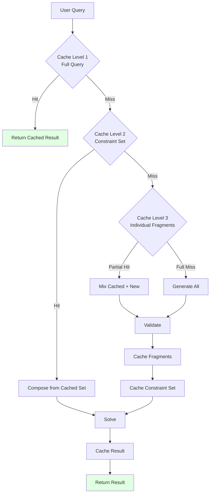

### 7.2 Performance Metrics

```python
class PerformanceMonitor:
    """Track system performance metrics"""
    
    metrics = {
        "ingestion": {
            "rules_processed": 0,
            "chunks_created": 0,
            "smt_fragments_generated": 0,
            "validation_failures": 0,
            "average_processing_time_ms": 0
        },
        
        "query": {
            "total_queries": 0,
            "cache_hit_rate": {
                "level_1_full_query": 0.0,
                "level_2_constraint_set": 0.0,
                "level_3_fragments": 0.0
            },
            "average_response_time_ms": {
                "cache_hit": 0,
                "cache_miss": 0
            },
            "solver_stats": {
                "sat": 0,
                "unsat": 0,
                "unknown": 0,
                "timeout": 0
            }
        },
        
        "quality": {
            "validation_accuracy": 0.0,
            "semantic_alignment_score": 0.0,
            "user_corrections": 0,
            "false_positive_rate": 0.0,
            "false_negative_rate": 0.0
        }
    }
```

-----

## 8. API Specifications (Domain-Scoped)

> **Cross-Reference:** See `docs/DOMAIN_INDEPENDENCE_ANALYSIS.md` (Sections 1.7, 3.4, 6) for domain-scoped API requirements.

All API endpoints are **domain-scoped**: operations are isolated to specific domains, ensuring multi-tenancy and domain isolation at the API layer.

**Key Architectural Principle:** Use RESTful `/domains/{domain_id}/resources` pattern for all domain-specific operations.

### 8.1 Domain Management API

#### Create Domain

```python
@app.post("/api/v1/domains")
async def create_domain(domain_def: DomainDefinition) -> DomainResponse:
    """
    Register a new domain with its entity/property schema

    Request Body:
    {
        "domain_id": "healthcare_drug_interactions_v1",
        "name": "Healthcare - Drug Interaction Safety",
        "version": "1.0.0",
        "description": "Drug interaction checking for clinical settings",
        "entity_types": {
            "medications": {
                "canonical_var": "drug",
                "smt_type": "Enum",
                "instances": {...}
            },
            "patients": {...}
        },
        "properties": {
            "dosage_mg": {
                "canonical_var": "dosage",
                "unit": "mg",
                "smt_type": "Real",
                "domain": [0, 1000]
            }
        },
        "naming_conventions": {...},
        "plugin": {
            "class_name": "HealthcarePlugin",
            "module": "plugins.healthcare",
            "enabled": true
        }
    }

    Response:
    {
        "domain_id": "healthcare_drug_interactions_v1",
        "status": "active",
        "created_at": "2025-01-05T10:30:00Z",
        "validation": {
            "valid": true,
            "warnings": []
        }
    }
    """
    pass
```

#### List Domains

```python
@app.get("/api/v1/domains")
async def list_domains(
    skip: int = 0,
    limit: int = 100,
    active_only: bool = True
) -> DomainsListResponse:
    """
    List all registered domains

    Response:
    {
        "domains": [
            {
                "domain_id": "mechanical_engineering_v1",
                "name": "Mechanical Engineering",
                "version": "1.0.0",
                "status": "active",
                "rule_count": 1234,
                "created_at": "2025-01-01T00:00:00Z"
            },
            {
                "domain_id": "healthcare_drug_interactions_v1",
                "name": "Healthcare - Drug Interactions",
                "version": "1.0.0",
                "status": "active",
                "rule_count": 567,
                "created_at": "2025-01-03T12:00:00Z"
            }
        ],
        "total": 2,
        "skip": 0,
        "limit": 100
    }
    """
    pass
```

#### Get Domain

```python
@app.get("/api/v1/domains/{domain_id}")
async def get_domain(domain_id: str) -> DomainDetailResponse:
    """
    Retrieve full domain definition

    Response: Complete domain JSON schema (entity_types, properties, etc.)
    """
    pass
```

#### Update Domain

```python
@app.put("/api/v1/domains/{domain_id}")
async def update_domain(
    domain_id: str,
    updates: DomainUpdate
) -> DomainResponse:
    """
    Update domain definition (creates new version)

    Note: Updates create new version to maintain rule compatibility.
    Existing rules remain bound to their original domain version.
    """
    pass
```

#### Delete Domain

```python
@app.delete("/api/v1/domains/{domain_id}")
async def delete_domain(
    domain_id: str,
    force: bool = False
) -> DeleteResponse:
    """
    Delete a domain and all associated rules

    Query Parameters:
        force: If false (default), prevents deletion if rules exist.
               If true, cascades deletion to all rules.

    Response:
    {
        "domain_id": "healthcare_drug_interactions_v1",
        "deleted": true,
        "rules_deleted": 567,
        "fragments_deleted": 2340
    }
    """
    pass
```

### 8.2 Rule Ingestion API (Domain-Scoped)

All rule operations are scoped to a specific domain.

#### Ingest Rule

```python
@app.post("/api/v1/domains/{domain_id}/rules/ingest")
async def ingest_rule(
    domain_id: str,
    rule: RuleInput
) -> IngestionResponse:
    """
    Ingest a new rule into the specified domain

    Path Parameters:
        domain_id: Target domain identifier

    Request Body:
    {
        "text": "Warfarin and aspirin increase bleeding risk",
        "priority": "high",
        "metadata": {
            "source": "FDA guidelines",
            "severity": "major",
            "evidence_level": "A"
        }
    }

    Response:
    {
        "rule_id": "uuid",
        "domain_id": "healthcare_drug_interactions_v1",
        "status": "success|pending_review|failed",
        "chunks_created": 1,
        "fragments_generated": 2,
        "new_terms": ["warfarin", "aspirin", "bleeding_risk"],
        "validation_issues": [],
        "processing_time_ms": 1234
    }
    """
    pass
```

#### List Domain Rules

```python
@app.get("/api/v1/domains/{domain_id}/rules")
async def list_rules(
    domain_id: str,
    skip: int = 0,
    limit: int = 100,
    status: Optional[str] = None
) -> RulesListResponse:
    """
    List all rules for a domain

    Response:
    {
        "rules": [
            {
                "rule_id": "uuid",
                "text": "Warfarin and aspirin increase bleeding risk",
                "status": "active",
                "created_at": "2025-01-05T10:30:00Z",
                "fragments_count": 2
            }
        ],
        "total": 567,
        "domain_id": "healthcare_drug_interactions_v1"
    }
    """
    pass
```

#### Get Rule

```python
@app.get("/api/v1/domains/{domain_id}/rules/{rule_id}")
async def get_rule(domain_id: str, rule_id: str) -> RuleDetailResponse:
    """
    Retrieve specific rule with all fragments

    Response includes rule text, SMT fragments, metadata, validation status
    """
    pass
```

#### Update Rule

```python
@app.put("/api/v1/domains/{domain_id}/rules/{rule_id}")
async def update_rule(
    domain_id: str,
    rule_id: str,
    updates: RuleUpdate
) -> UpdateResponse:
    """
    Update rule text (triggers re-processing through ingestion pipeline)
    """
    pass
```

#### Delete Rule

```python
@app.delete("/api/v1/domains/{domain_id}/rules/{rule_id}")
async def delete_rule(domain_id: str, rule_id: str) -> DeleteResponse:
    """Delete rule and all associated fragments from domain"""
    pass
```

### 8.3 Query API (Domain-Scoped)

All queries are scoped to a specific domain. Generic "verify" endpoint replaces domain-specific "check_compatibility".

#### Verify Query

```python
@app.post("/api/v1/domains/{domain_id}/query/verify")
async def verify_query(
    domain_id: str,
    query: GenericQuery
) -> VerificationResponse:
    """
    Verify if entities/constraints are satisfiable within domain rules

    Path Parameters:
        domain_id: Domain to query against

    Request Body (Mechanical Engineering Example):
    {
        "entities": {
            "bolt": {"material": "steel", "diameter": 10},
            "plate": {"material": "aluminum", "thickness": 5}
        },
        "context": {
            "temperature": 200,
            "humidity": 0.5
        },
        "question": "compatible?"
    }

    Request Body (Healthcare Example):
    {
        "entities": {
            "patient": {"age": 65, "weight_kg": 70},
            "medication_1": {"drug": "warfarin", "dosage_mg": 5},
            "medication_2": {"drug": "aspirin", "dosage_mg": 81}
        },
        "context": {
            "kidney_function": "normal"
        },
        "question": "safe?"
    }

    Response:
    {
        "satisfiable": true|false,
        "confidence": 0.95,
        "domain_id": "healthcare_drug_interactions_v1",
        "explanation": "These medications have a documented contraindication...",
        "details": {
            "constraints_checked": 15,
            "sat_result": "SAT|UNSAT",
            "model": {...},  // If SAT
            "conflicts": [   // If UNSAT
                {
                    "rule_id": "uuid",
                    "rule_text": "Warfarin and aspirin increase bleeding risk",
                    "conflict_type": "logical_impossibility"
                }
            ]
        },
        "suggestions": [
            {
                "type": "medication_change|parameter_change|monitoring",
                "description": "Consider alternative anticoagulant",
                "specifics": "Consult prescriber about switching...",
                "feasibility": 0.8
            }
        ],
        "processing_time_ms": 234
    }
    """
    pass
```

#### Find Satisfying Solutions

```python
@app.post("/api/v1/domains/{domain_id}/query/find_satisfying")
async def find_satisfying(
    domain_id: str,
    query: FindSolutionsQuery
) -> SolutionsResponse:
    """
    Find all solutions satisfying partial specification

    Path Parameters:
        domain_id: Domain to search within

    Request Body:
    {
        "fixed_entities": {
            "bolt": {"material": "steel"}
        },
        "variable_entities": [
            "plate_material",
            "washer_material"
        ],
        "context": {
            "temperature": 200
        },
        "optimize": "cost|strength|weight",
        "max_results": 10
    }

    Response:
    {
        "domain_id": "mechanical_engineering_v1",
        "solutions": [
            {
                "entities": {
                    "bolt": {"material": "steel"},
                    "plate": {"material": "steel"},
                    "washer": {"material": "brass"}
                },
                "score": 0.95,
                "properties": {
                    "total_cost": 50,
                    "strength": 600
                },
                "satisfiable": true
            }
        ],
        "total_found": 5,
        "processing_time_ms": 567
    }
    """
    pass
```

### 8.4 Domain Registry Introspection API

Clients can discover domain schemas dynamically, enabling generic UI and validation.

#### Get Domain Entities

```python
@app.get("/api/v1/domains/{domain_id}/registry/entities")
async def get_domain_entities(domain_id: str) -> EntitiesResponse:
    """
    Get all entity types defined in domain

    Response:
    {
        "domain_id": "mechanical_engineering_v1",
        "entity_types": {
            "materials": {
                "canonical_var": "material",
                "aliases": ["metal", "substance"],
                "instances": ["steel", "aluminum", "brass"]
            },
            "parts": {
                "canonical_var": "part",
                "instances": ["bolt", "plate", "washer"]
            }
        }
    }
    """
    pass
```

#### Get Domain Properties

```python
@app.get("/api/v1/domains/{domain_id}/registry/properties")
async def get_domain_properties(domain_id: str) -> PropertiesResponse:
    """
    Get all properties defined in domain

    Response:
    {
        "domain_id": "mechanical_engineering_v1",
        "properties": {
            "thermal_expansion_coef": {
                "canonical_var": "thermal_expansion_coef",
                "unit": "μm/m/°C",
                "smt_type": "Real",
                "domain": [0, 100]
            },
            "tensile_strength": {
                "canonical_var": "tensile_strength",
                "unit": "MPa",
                "smt_type": "Real",
                "domain": [0, 5000]
            }
        }
    }
    """
    pass
```

#### Validate Entity Name

```python
@app.get("/api/v1/domains/{domain_id}/registry/validate_name")
async def validate_name(
    domain_id: str,
    name: str,
    type: str = "entity|property"
) -> ValidationResponse:
    """
    Check if a name is valid according to domain naming conventions

    Query Parameters:
        domain_id: Target domain
        name: Variable name to validate
        type: What kind of name (entity, property)

    Response:
    {
        "valid": true|false,
        "canonical_form": "bolt_material",
        "suggestions": ["material", "mat"],
        "errors": []
    }
    """
    pass
```

#### Get Domain Schema

```python
@app.get("/api/v1/domains/{domain_id}/registry/schema")
async def get_domain_schema(domain_id: str) -> DomainSchemaResponse:
    """
    Get complete JSON schema for domain (entities + properties + naming conventions)

    Useful for code generation, IDE autocomplete, and validation
    """
    pass
```

### 8.5 Legacy Endpoints (Deprecated)

For backward compatibility with v1.0 single-domain architecture. **These endpoints will be removed in v3.0.**

All legacy endpoints redirect to the default `mechanical_engineering_v1` domain.

```python
@app.post("/api/v1/rules/ingest")
async def legacy_ingest_rule(rule: RuleInput) -> IngestionResponse:
    """
    DEPRECATED: Use /api/v1/domains/{domain_id}/rules/ingest

    Redirects to mechanical_engineering_v1 domain for backward compatibility.
    Will be removed in v3.0 (2026-01-01).

    Response includes deprecation warning:
    {
        "rule_id": "uuid",
        "domain_id": "mechanical_engineering_v1",
        "warnings": ["This endpoint is deprecated. Use domain-scoped API."],
        ...
    }
    """
    return await ingest_rule("mechanical_engineering_v1", rule)

@app.post("/api/v1/query/check_compatibility")
async def legacy_check_compatibility(query: CompatibilityQuery) -> CompatibilityResponse:
    """
    DEPRECATED: Use /api/v1/domains/{domain_id}/query/verify

    Redirects to mechanical_engineering_v1 domain.
    Converts old "environment" field to "context".
    Will be removed in v3.0 (2026-01-01).
    """
    # Convert old format to new
    generic_query = GenericQuery(
        entities=query.entities,
        context=query.environment,  # Renamed field
        question="compatible?"
    )
    return await verify_query("mechanical_engineering_v1", generic_query)

@app.get("/api/v1/registry/entities")
async def legacy_get_entities() -> EntitiesResponse:
    """
    DEPRECATED: Use /api/v1/domains/{domain_id}/registry/entities

    Returns entities for mechanical_engineering_v1 domain.
    Will be removed in v3.0.
    """
    return await get_domain_entities("mechanical_engineering_v1")
```

**Migration Guide:**

| v1.0 Endpoint (Deprecated) | v2.0 Endpoint (Use This) |
|----------------------------|--------------------------|
| `POST /api/v1/rules/ingest` | `POST /api/v1/domains/{domain_id}/rules/ingest` |
| `POST /api/v1/query/check_compatibility` | `POST /api/v1/domains/{domain_id}/query/verify` |
| `GET /api/v1/registry/entities` | `GET /api/v1/domains/{domain_id}/registry/entities` |
| `GET /api/v1/registry/properties` | `GET /api/v1/domains/{domain_id}/registry/properties` |

**Breaking Changes in v2.0:**
- All endpoints require `domain_id` path parameter
- `environment` renamed to `context` in query structure
- `check_compatibility` renamed to `verify` (more generic)
- `CompatibilityQuery` → `GenericQuery` model
- `CompatibilityResponse` → `VerificationResponse` model

### 8.6 Authentication & Authorization

Domain-level access control enforces isolation:

```python
class DomainPermission:
    """
    Users can have different permissions per domain
    """
    user_id: str
    domain_id: str
    permissions: List[str]  # ["read", "write", "admin"]

# Example: User can read mechanical_engineering but write to healthcare
{
    "user_id": "user_123",
    "permissions": [
        {
            "domain_id": "mechanical_engineering_v1",
            "role": "reader"
        },
        {
            "domain_id": "healthcare_drug_interactions_v1",
            "role": "editor"
        }
    ]
}
```

**API Key Scoping:**
```python
# API keys can be scoped to specific domains
{
    "api_key": "sk_...",
    "scopes": ["mechanical_engineering_v1", "finance_compliance_v1"],
    "rate_limit_per_domain": 1000  # requests/hour per domain
}
```

**Rate Limiting:**
- Per-domain rate limits prevent one domain from impacting others
- Separate quotas for ingestion, queries, and registry operations
- Fair usage across multi-tenant environment

### 8.7 OpenAPI Specification

The complete API is documented using OpenAPI 3.0:

```yaml
openapi: 3.0.0
info:
  title: Multi-Domain Constraint Solver API
  version: 2.0.0
  description: Domain-independent SMT-based constraint solving

servers:
  - url: https://api.example.com/api/v1

paths:
  /domains:
    post:
      summary: Create new domain
      requestBody:
        $ref: '#/components/schemas/DomainDefinition'
      responses:
        '201':
          description: Domain created
          content:
            application/json:
              schema:
                $ref: '#/components/schemas/DomainResponse'

  /domains/{domain_id}/query/verify:
    post:
      summary: Verify query against domain rules
      parameters:
        - name: domain_id
          in: path
          required: true
          schema:
            type: string
      requestBody:
        $ref: '#/components/schemas/GenericQuery'
      responses:
        '200':
          description: Verification result
          content:
            application/json:
              schema:
                $ref: '#/components/schemas/VerificationResponse'

components:
  schemas:
    GenericQuery:
      type: object
      required: [entities, question]
      properties:
        entities:
          type: object
          additionalProperties:
            type: object
        context:
          type: object
        question:
          type: string
```

**Generation:** OpenAPI spec is auto-generated from FastAPI route definitions using:
```bash
python -m app.main generate-openapi > openapi.yaml
```

-----

## 9. Deployment Architecture

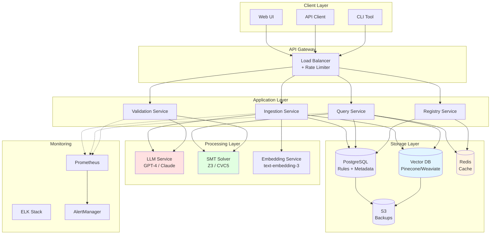

-----

## 10. Error Handling

### 10.1 Error Categories

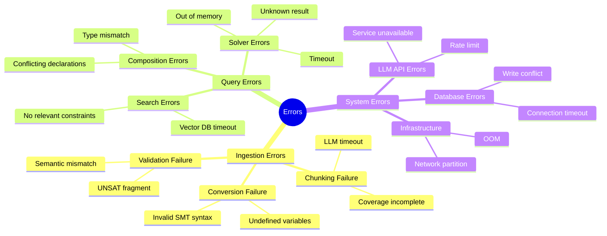

### 10.2 Error Response Format

```json
{
  "success": false,
  "error": {
    "code": "VALIDATION_SEMANTIC_MISMATCH",
    "message": "SMT code does not align with source text",
    "category": "validation",
    "severity": "error|warning|info",
    "details": {
      "source_text": "Steel expands at 11 μm/m/°C",
      "smt_code": "(assert (= aluminum_expansion 11.0))",
      "mismatches": ["Entity mismatch: steel vs aluminum"],
      "confidence": 0.3
    },
    "suggestions": [
      "Verify entity names match source text",
      "Check variable registry for correct names"
    ],
    "timestamp": "2025-11-05T10:30:00Z",
    "request_id": "req_abc123"
  },
  "partial_results": null
}
```

-----

## 11. Testing Strategy

### 11.1 Test Pyramid

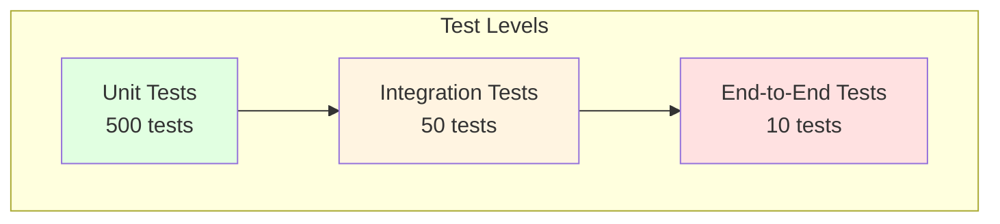

### 11.2 Test Cases

```python
# Unit Tests
class TestValidation:
    def test_syntax_validation_valid_smt():
        """Test that valid SMT-LIB passes syntax check"""
        pass
    
    def test_syntax_validation_invalid_smt():
        """Test that invalid SMT-LIB is rejected"""
        pass
    
    def test_variable_name_validation():
        """Test variable name checking against registry"""
        pass
    
    def test_semantic_validation():
        """Test LLM-based semantic alignment"""
        pass

# Integration Tests
class TestIngestionPipeline:
    def test_full_ingestion_flow():
        """Test complete ingestion from text to cached SMT"""
        pass
    
    def test_ingestion_with_new_terms():
        """Test that new terms are flagged and queued"""
        pass
    
    def test_ingestion_failure_recovery():
        """Test graceful handling of conversion failures"""
        pass

# End-to-End Tests
class TestSystemE2E:
    def test_ingest_and_query():
        """Test: ingest rule → query compatibility → get result"""
        pass
    
    def test_complex_query_with_unsat():
        """Test: query incompatible combination → get UNSAT analysis"""
        pass
    
    def test_performance_under_load():
        """Test: 1000 concurrent queries → response time < 500ms"""
        pass
```

-----

## 12. Future Enhancements

### 12.1 Roadmap

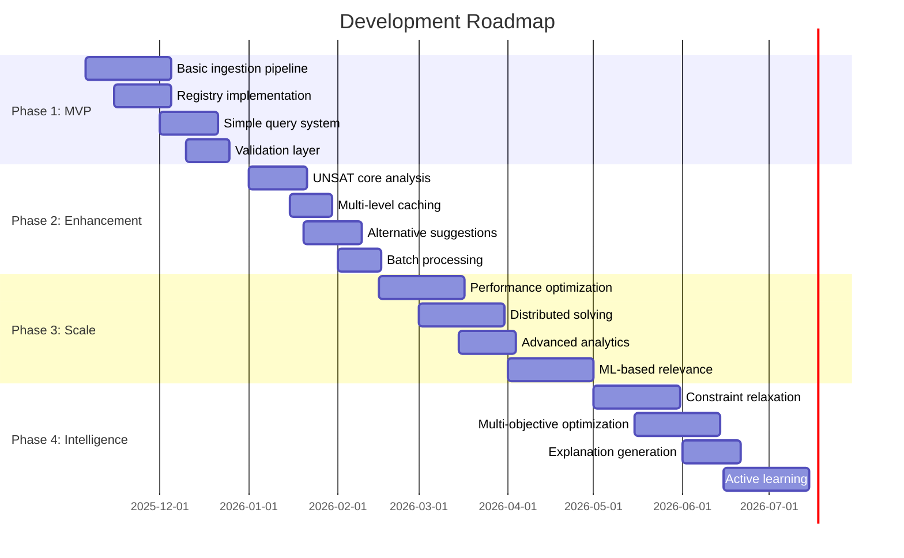

### 12.2 Potential Features

1. **Constraint Relaxation**: When UNSAT, automatically relax constraints to find nearest compatible solution
1. **Multi-Objective Optimization**: Find combinations that optimize multiple goals (cost + strength + weight)
1. **Probabilistic Reasoning**: Handle uncertain constraints with probability distributions
1. **Incremental Solving**: Add constraints incrementally to improve performance
1. **Explanation Quality**: Use LLMs to generate better natural language explanations
1. **Visual Explorer**: Interactive UI to explore constraint relationships and conflicts
1. **Version Control**: Track changes to rules and constraints over time
1. **A/B Testing**: Test different SMT formulations for the same constraint
1. **Active Learning**: Flag ambiguous rules for human clarification
1. **Federation**: Query across multiple constraint databases
