# Technical Specification: SMT-Based Material Compatibility System

## 1. System Overview

### 1.1 Purpose

A system that converts natural language material compatibility rules into SMT-LIB constraints, caches them for reuse, and provides mathematically precise compatibility verification for material/part combinations.

### 1.2 High-Level Architecture

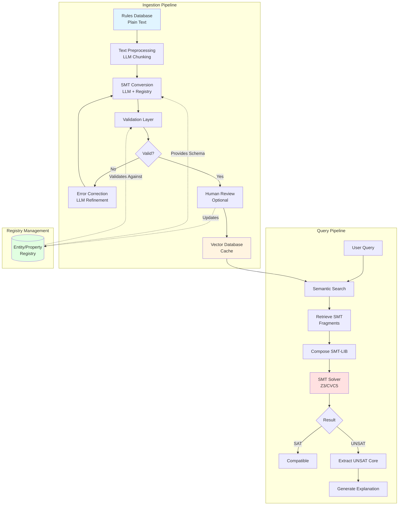

-----

## 2. Component Specifications

### 2.1 Rules Database Schema

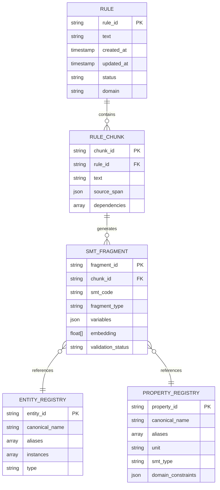

### 2.2 SMT Fragment Storage Schema

```json
{
  "fragment_id": "uuid-v4",
  "rule_id": "thermal_expansion_001",
  "chunk_id": "chunk_001_001",
  
  "text": {
    "original": "Steel expands at 11 μm/m/°C",
    "normalized": "Steel has thermal expansion coefficient of 11 μm/m/°C",
    "source_span": [0, 28]
  },
  
  "embedding": [0.123, 0.456, ...],
  
  "smt": {
    "declarations": [
      "(declare-const steel_thermal_expansion_coef Real)"
    ],
    "assertions": [
      "(assert (= steel_thermal_expansion_coef 11.0))"
    ],
    "constraints": [
      "(assert (>= steel_thermal_expansion_coef 0))"
    ]
  },
  
  "variables": {
    "steel_thermal_expansion_coef": {
      "entity": "steel",
      "property": "thermal_expansion_coef",
      "type": "Real",
      "unit": "μm/m/°C",
      "value": 11.0,
      "domain": [0, 100]
    }
  },
  
  "metadata": {
    "entities": ["steel"],
    "properties": ["thermal_expansion"],
    "dependencies": [],
    "domain": "mechanical_engineering",
    "confidence": 0.95
  },
  
  "validation": {
    "status": "approved",
    "syntax_valid": true,
    "semantically_valid": true,
    "satisfiable": true,
    "reviewed_by": "user_123",
    "reviewed_at": "2025-11-05T10:30:00Z"
  },
  
  "version": "1.0",
  "created_at": "2025-11-05T10:00:00Z",
  "updated_at": "2025-11-05T10:30:00Z"
}
```

-----

## 3. Ingestion Pipeline

### 3.1 Pipeline Flow

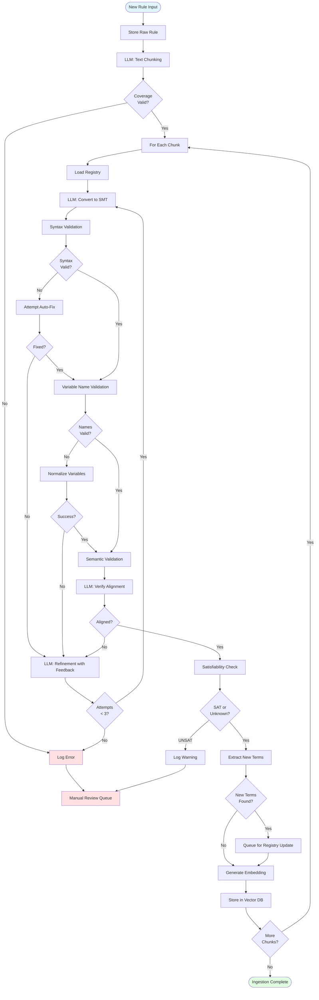

### 3.2 Text Chunking Prompt Template

```python
CHUNKING_PROMPT = """
You are preprocessing material compatibility rules for constraint solving.

Task: Break the input text into independent, self-contained constraint statements.

Requirements:
1. Each chunk must be processable in isolation
2. Resolve ALL pronouns and implicit references
3. Keep logical operators (OR, IF-THEN) within single chunks
4. Preserve exact numbers, units, and technical terms
5. EVERY word from source must appear in exactly one chunk

Input text:
```

{input_text}

```
Output as JSON:
{{
  "chunks": [
    {{
      "id": 1,
      "text": "resolved constraint statement",
      "source_span": [start_char, end_char],
      "added_context": "explanation of what was resolved",
      "dependencies": [list of chunk IDs this depends on]
    }}
  ],
  "original_word_count": N,
  "chunk_word_count": M,
  "verification": "all source words accounted for"
}}
"""
```

### 3.3 SMT Conversion Prompt Template

```python
SMT_CONVERSION_PROMPT = """
Convert this material compatibility constraint to SMT-LIB format.

MANDATORY VARIABLE REGISTRY:
{registry_json}

STRICT NAMING RULES:
1. Use ONLY canonical names from registry (no aliases)
2. Pattern: {{entity}}_{{property}}
   Example: steel_thermal_expansion_coef
3. For part-material relationships: {{part}}_material
   Example: bolt_material
4. Convert all units to standard (μm/m/°C, MPa, etc.)

CONSTRAINT:
```

{chunk_text}

```
OUTPUT FORMAT (JSON):
{{
  "declarations": [
    "(declare-const var_name Type)"
  ],
  "assertions": [
    "(assert (= ...))"
  ],
  "constraints": [
    "(assert (>= ...))"  // Domain constraints
  ],
  "variables_used": {{
    "var_name": {{
      "entity": "steel",
      "property": "thermal_expansion_coef",
      "type": "Real",
      "unit": "μm/m/°C",
      "value": 11.0
    }}
  }},
  "reasoning": "brief explanation of conversion"
}}

VALIDATION CHECKLIST (verify before responding):
☐ All variable names match registry exactly
☐ All units converted to standard
☐ No undefined variables
☐ Proper SMT-LIB syntax
☐ Types match (Real, Int, Bool)
"""
```

-----

## 4. Entity/Property Registry

### 4.1 Registry Structure

```json
{
  "version": "1.0",
  "last_updated": "2025-11-05T10:00:00Z",
  
  "entities": {
    "materials": {
      "canonical_var": "material",
      "aliases": ["metal", "substance", "alloy", "composition"],
      "smt_type": "Enum",
      "instances": {
        "steel": {
          "aliases": ["carbon_steel", "stainless"],
          "properties_required": ["thermal_expansion_coef", "tensile_strength"]
        },
        "aluminum": {
          "aliases": ["aluminium", "al"],
          "properties_required": ["thermal_expansion_coef", "yield_strength"]
        },
        "copper": {
          "aliases": ["cu"],
          "properties_required": ["thermal_expansion_coef", "conductivity"]
        }
      }
    },
    
    "parts": {
      "canonical_var": "part",
      "aliases": ["component", "piece", "element"],
      "smt_type": "Enum",
      "instances": {
        "bolt": {
          "aliases": ["screw", "fastener"],
          "properties_required": ["material", "diameter", "length", "torque"]
        },
        "plate": {
          "aliases": ["sheet", "panel"],
          "properties_required": ["material", "thickness"]
        },
        "washer": {
          "aliases": ["spacer"],
          "properties_required": ["material", "inner_diameter", "outer_diameter"]
        }
      }
    },
    
    "environment": {
      "canonical_var": "env",
      "properties": ["temperature", "pressure", "humidity", "atmosphere"]
    }
  },
  
  "properties": {
    "thermal_expansion_coef": {
      "canonical_var": "thermal_expansion_coef",
      "aliases": ["expansion_rate", "thermal_growth", "expansion_coefficient"],
      "unit": "μm/m/°C",
      "smt_type": "Real",
      "domain": [0, 100],
      "description": "Linear thermal expansion coefficient"
    },
    
    "tensile_strength": {
      "canonical_var": "tensile_strength",
      "aliases": ["strength", "breaking_strength"],
      "unit": "MPa",
      "smt_type": "Real",
      "domain": [0, 5000],
      "description": "Maximum tensile stress material can withstand"
    },
    
    "temperature": {
      "canonical_var": "temp",
      "aliases": ["temperature", "heat", "thermal_condition"],
      "unit": "°C",
      "smt_type": "Real",
      "domain": [-273.15, 3000],
      "description": "Operating temperature"
    },
    
    "torque": {
      "canonical_var": "torque",
      "aliases": ["tightening_torque", "fastening_torque"],
      "unit": "Nm",
      "smt_type": "Real",
      "domain": [0, 1000],
      "description": "Applied rotational force"
    }
  },
  
  "relationships": {
    "compatible_with": {
      "canonical_var": "compatible",
      "smt_type": "Bool",
      "arity": 2,
      "description": "Two entities can be used together"
    },
    
    "requires": {
      "canonical_var": "requires",
      "smt_type": "Bool",
      "arity": 2,
      "description": "Entity A requires entity B"
    }
  },
  
  "naming_conventions": {
    "entity_property": "{entity}_{property}",
    "part_entity": "{part}_{entity}",
    "comparison": "{entity1}_{entity2}_{relationship}",
    "examples": [
      "steel_thermal_expansion_coef",
      "bolt_material",
      "steel_aluminum_compatible"
    ]
  }
}
```

### 4.2 Registry Management Flow

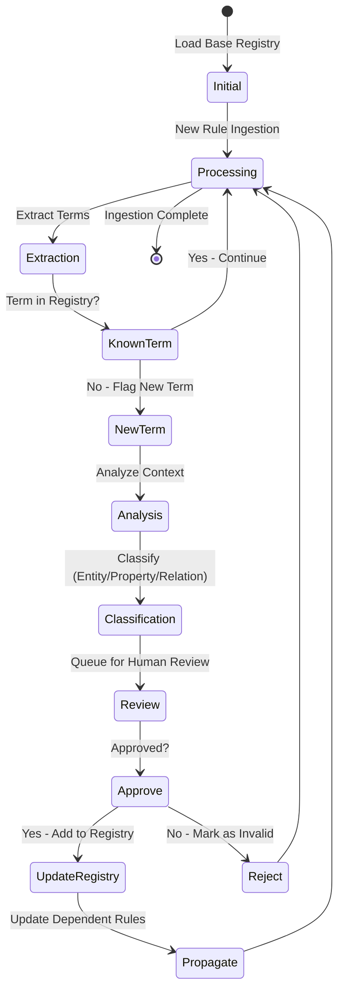

-----

## 5. Validation Layer

### 5.1 Validation Pipeline

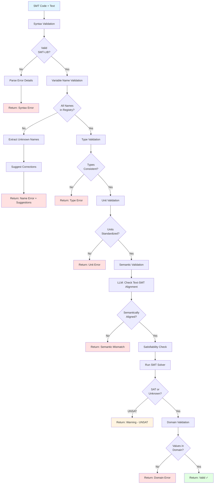

### 5.2 Validation Functions

```python
class SMTValidator:
    def __init__(self, registry):
        self.registry = registry
        self.solver = Z3Solver()
    
    def validate(self, smt_code: str, source_text: str) -> ValidationResult:
        """
        Comprehensive validation pipeline
        
        Returns:
            ValidationResult with status and detailed feedback
        """
        results = ValidationResult()
        
        # 1. Syntax validation
        syntax_result = self._validate_syntax(smt_code)
        if not syntax_result.valid:
            return syntax_result
        
        # 2. Variable name validation
        name_result = self._validate_variable_names(smt_code)
        if not name_result.valid:
            return name_result
        
        # 3. Type validation
        type_result = self._validate_types(smt_code)
        if not type_result.valid:
            return type_result
        
        # 4. Unit validation
        unit_result = self._validate_units(smt_code)
        if not unit_result.valid:
            return unit_result
        
        # 5. Semantic validation (LLM)
        semantic_result = self._validate_semantics(smt_code, source_text)
        if not semantic_result.valid:
            return semantic_result
        
        # 6. Satisfiability check
        sat_result = self._check_satisfiability(smt_code)
        if sat_result.status == "unsat":
            results.add_warning("Constraint is unsatisfiable in isolation")
        
        # 7. Domain validation
        domain_result = self._validate_domains(smt_code)
        if not domain_result.valid:
            return domain_result
        
        results.status = "valid"
        return results
    
    def _validate_syntax(self, smt_code: str) -> ValidationResult:
        """Parse SMT-LIB and check syntax"""
        try:
            ast = parse_smt_lib(smt_code)
            return ValidationResult(valid=True)
        except ParseError as e:
            return ValidationResult(
                valid=False,
                error_type="syntax",
                message=str(e),
                line=e.line,
                column=e.column
            )
    
    def _validate_variable_names(self, smt_code: str) -> ValidationResult:
        """Check all variables against registry"""
        variables = extract_variables(smt_code)
        invalid_vars = []
        suggestions = {}
        
        for var in variables:
            if not self._is_valid_name(var):
                invalid_vars.append(var)
                suggestions[var] = self._suggest_correction(var)
        
        if invalid_vars:
            return ValidationResult(
                valid=False,
                error_type="variable_names",
                message=f"Invalid variable names: {invalid_vars}",
                details={"suggestions": suggestions}
            )
        
        return ValidationResult(valid=True)
    
    def _is_valid_name(self, var_name: str) -> bool:
        """Check if variable name follows registry conventions"""
        # Check against registry patterns
        for entity_type, entity_def in self.registry['entities'].items():
            for instance in entity_def['instances']:
                for prop in self.registry['properties']:
                    canonical = f"{instance}_{prop}"
                    if var_name == canonical:
                        return True
        return False
    
    def _suggest_correction(self, var_name: str) -> List[str]:
        """Fuzzy match to suggest correct variable names"""
        from difflib import get_close_matches
        
        all_valid_names = self._get_all_valid_names()
        suggestions = get_close_matches(var_name, all_valid_names, n=3, cutoff=0.6)
        return suggestions
    
    def _validate_semantics(self, smt_code: str, source_text: str) -> ValidationResult:
        """Use LLM to verify semantic alignment"""
        prompt = f"""
        Verify if this SMT code accurately represents the constraint.
        
        Original text: {source_text}
        SMT code: {smt_code}
        
        Answer with JSON:
        {{
          "aligned": true/false,
          "confidence": 0.0-1.0,
          "issues": ["list of mismatches if any"],
          "explanation": "brief reasoning"
        }}
        """
        
        response = call_llm(prompt)
        result = json.loads(response)
        
        if not result['aligned'] or result['confidence'] < 0.8:
            return ValidationResult(
                valid=False,
                error_type="semantic",
                message="SMT does not align with source text",
                details=result
            )
        
        return ValidationResult(valid=True)
    
    def _check_satisfiability(self, smt_code: str) -> SatResult:
        """Check if constraint is satisfiable"""
        result = self.solver.check(smt_code)
        return result
    
    def _validate_domains(self, smt_code: str) -> ValidationResult:
        """Verify values are within defined domains"""
        variables = extract_variables_with_values(smt_code)
        
        for var, value in variables.items():
            domain = self._get_domain(var)
            if domain and not self._in_domain(value, domain):
                return ValidationResult(
                    valid=False,
                    error_type="domain",
                    message=f"{var}={value} outside domain {domain}"
                )
        
        return ValidationResult(valid=True)
```

-----

## 6. Query Pipeline

### 6.1 Query Processing Flow

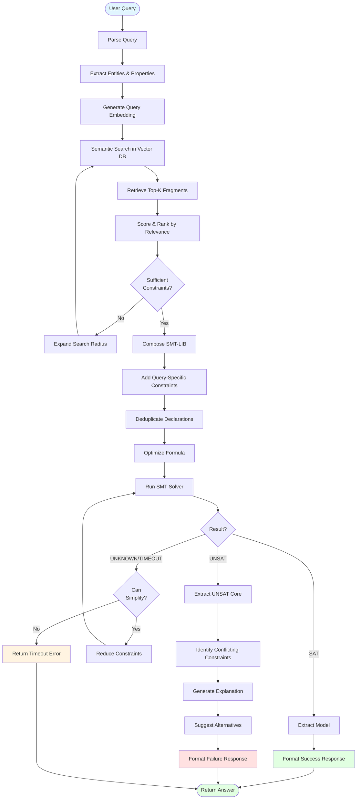

### 6.2 Query Example

```python
# Query: "Can I use steel bolts with aluminum plates at 200°C?"

query = {
    "entities": {
        "bolt": {"material": "steel"},
        "plate": {"material": "aluminum"}
    },
    "environment": {
        "temperature": 200
    },
    "question": "compatible?"
}

# Semantic search retrieves:
retrieved_fragments = [
    {
        "text": "Steel expands at 11 μm/m/°C",
        "smt": "(assert (= steel_thermal_expansion_coef 11.0))",
        "relevance": 0.92
    },
    {
        "text": "Aluminum expands at 23 μm/m/°C",
        "smt": "(assert (= aluminum_thermal_expansion_coef 23.0))",
        "relevance": 0.91
    },
    {
        "text": "Differential expansion > 15 μm/m/°C causes stress fractures",
        "smt": "(assert (=> (> (abs (- mat1_expansion mat2_expansion)) 15) (= stress_fracture_risk true)))",
        "relevance": 0.88
    }
]

# Compose final SMT-LIB:
smt_program = """
(declare-const bolt_material String)
(declare-const plate_material String)
(declare-const temp Real)
(declare-const steel_thermal_expansion_coef Real)
(declare-const aluminum_thermal_expansion_coef Real)
(declare-const expansion_diff Real)
(declare-const stress_fracture_risk Bool)

; Retrieved constraints
(assert (= steel_thermal_expansion_coef 11.0))
(assert (= aluminum_thermal_expansion_coef 23.0))
(assert (= expansion_diff (abs (- steel_thermal_expansion_coef aluminum_thermal_expansion_coef))))
(assert (=> (> expansion_diff 15) (= stress_fracture_risk true)))

; Query-specific constraints
(assert (= bolt_material "steel"))
(assert (= plate_material "aluminum"))
(assert (= temp 200))

; Compatibility check
(assert (not stress_fracture_risk))

(check-sat)
(get-model)
"""

# Solver returns: UNSAT
# Extract UNSAT core: expansion_diff constraint conflicts
# Generate response:
response = {
    "compatible": False,
    "reason": "Thermal expansion mismatch",
    "details": {
        "steel_expansion": 11,
        "aluminum_expansion": 23,
        "differential": 12,
        "threshold": 15,
        "risk": "stress_fractures"
    },
    "suggestions": [
        "Use thermal expansion compensators",
        "Replace aluminum with steel plates",
        "Limit operating temperature to < 100°C"
    ]
}
```

### 6.3 SMT Composition Algorithm

```python
class SMTComposer:
    def compose(self, query: Query, fragments: List[SMTFragment]) -> str:
        """
        Compose final SMT-LIB program from fragments and query
        """
        # 1. Collect all declarations (deduplicate)
        declarations = self._collect_declarations(fragments)
        
        # 2. Collect all assertions
        assertions = self._collect_assertions(fragments)
        
        # 3. Add query-specific constraints
        query_constraints = self._query_to_smt(query)
        
        # 4. Add domain constraints
        domain_constraints = self._add_domain_constraints(declarations)
        
        # 5. Optimize formula (simplify, remove redundancies)
        optimized = self._optimize(assertions + query_constraints)
        
        # 6. Compose final program
        smt_program = self._format_smt_lib(
            declarations,
            domain_constraints,
            optimized
        )
        
        return smt_program
    
    def _collect_declarations(self, fragments: List[SMTFragment]) -> List[str]:
        """Deduplicate variable declarations"""
        decls = {}
        for fragment in fragments:
            for decl in fragment.smt['declarations']:
                var_name = extract_var_name(decl)
                if var_name not in decls:
                    decls[var_name] = decl
        return list(decls.values())
    
    def _collect_assertions(self, fragments: List[SMTFragment]) -> List[str]:
        """Collect all assertions, checking for contradictions"""
        assertions = []
        seen = set()
        
        for fragment in fragments:
            for assertion in fragment.smt['assertions']:
                # Normalize to detect duplicates
                normalized = normalize_smt(assertion)
                if normalized not in seen:
                    assertions.append(assertion)
                    seen.add(normalized)
        
        return assertions
    
    def _query_to_smt(self, query: Query) -> List[str]:
        """Convert query to SMT constraints"""
        constraints = []
        
        # Entity constraints
        for entity, properties in query.entities.items():
            for prop, value in properties.items():
                var_name = f"{entity}_{prop}"
                constraints.append(f"(assert (= {var_name} {self._format_value(value)}))")
        
        # Environment constraints
        for prop, value in query.environment.items():
            constraints.append(f"(assert (= {prop} {value}))")
        
        # Goal constraint
        if query.question == "compatible?":
            constraints.append("(assert (not incompatible))")
        
        return constraints
    
    def _optimize(self, assertions: List[str]) -> List[str]:
        """Simplify and optimize assertions"""
        # Remove redundant assertions
        # Combine similar assertions
        # Reorder for solver efficiency
        # (Implementation depends on SMT solver)
        return assertions
```

-----

## 7. UNSAT Core Analysis

### 7.1 Conflict Resolution Flow


### 7.2 UNSAT Analysis Implementation

```python
class UNSATAnalyzer:
    def __init__(self, registry, fragment_db):
        self.registry = registry
        self.fragment_db = fragment_db
        self.solver = Z3Solver()
    
    def analyze(self, smt_program: str, query: Query) -> UNSATReport:
        """
        Analyze UNSAT result and generate explanation
        """
        # 1. Extract UNSAT core
        core = self.solver.get_unsat_core(smt_program)
        
        # 2. Map assertions back to source rules
        conflicting_rules = self._map_to_rules(core)
        
        # 3. Categorize conflict type
        conflict_type = self._categorize_conflict(core)
        
        # 4. Generate human explanation
        explanation = self._generate_explanation(
            conflict_type,
            conflicting_rules,
            query
        )
        
        # 5. Suggest alternatives
        suggestions = self._generate_suggestions(
            conflict_type,
            conflicting_rules,
            query
        )
        
        return UNSATReport(
            compatible=False,
            conflict_type=conflict_type,
            explanation=explanation,
            conflicting_rules=conflicting_rules,
            suggestions=suggestions
        )
    
    def _map_to_rules(self, core: List[str]) -> List[Rule]:
        """Map SMT assertions back to original rules"""
        rules = []
        for assertion in core:
            # Extract variable names from assertion
            variables = extract_variables(assertion)
            
            # Find fragments that declare these variables
            fragments = self.fragment_db.find_by_variables(variables)
            
            for fragment in fragments:
                rule = self.fragment_db.get_rule(fragment.rule_id)
                if rule not in rules:
                    rules.append(rule)
        
        return rules
    
    def _categorize_conflict(self, core: List[str]) -> str:
        """Determine type of conflict"""
        # Analyze the structure of conflicting assertions
        
        # Value contradiction: (= x 5) and (= x 10)
        if self._has_value_contradiction(core):
            return "value_contradiction"
        
        # Logical impossibility: (and p (not p))
        if self._has_logical_contradiction(core):
            return "logical_impossibility"
        
        # Threshold violation: (> x 100) and (< x 50)
        if self._has_threshold_violation(core):
            return "threshold_violation"
        
        # Range conflict: (and (> x 10) (< x 5))
        if self._has_range_conflict(core):
            return "range_conflict"
        
        return "complex_conflict"
    
    def _generate_explanation(
        self,
        conflict_type: str,
        rules: List[Rule],
        query: Query
    ) -> str:
        """Generate human-readable explanation"""
        
        prompt = f"""
        Generate a clear explanation for why this combination is incompatible.
        
        Query: {query.to_natural_language()}
        
        Conflicting rules:
        {chr(10).join(f"- {r.text}" for r in rules)}
        
        Conflict type: {conflict_type}
        
        Provide a concise explanation (2-3 sentences) that:
        1. States what's incompatible
        2. Explains why (which constraints conflict)
        3. Quantifies the problem if applicable
        
        Use natural language, not technical jargon.
        """
        
        return call_llm(prompt)
    
    def _generate_suggestions(
        self,
        conflict_type: str,
        rules: List[Rule],
        query: Query
    ) -> List[Suggestion]:
        """Generate alternative solutions"""
        
        suggestions = []
        
        # Strategy 1: Relax constraints
        if conflict_type == "threshold_violation":
            suggestions.extend(self._suggest_parameter_changes(rules, query))
        
        # Strategy 2: Substitute materials/parts
        if conflict_type in ["value_contradiction", "logical_impossibility"]:
            suggestions.extend(self._suggest_substitutions(rules, query))
        
        # Strategy 3: Add intermediate components
        suggestions.extend(self._suggest_additions(rules, query))
        
        # Rank by feasibility
        ranked = self._rank_suggestions(suggestions)
        
        return ranked[:5]  # Return top 5
    
    def _suggest_parameter_changes(self, rules: List[Rule], query: Query) -> List[Suggestion]:
        """Suggest changing environmental parameters"""
        suggestions = []
        
        # Extract parameters that could be modified
        for rule in rules:
            if "temperature" in rule.text.lower():
                # Suggest temperature range
                suggestions.append(Suggestion(
                    type="parameter_change",
                    description="Reduce operating temperature",
                    specifics="Operate below 100°C instead of 200°C",
                    feasibility=0.8
                ))
        
        return suggestions
    
    def _suggest_substitutions(self, rules: List[Rule], query: Query) -> List[Suggestion]:
        """Suggest alternative materials/parts"""
        suggestions = []
        
        # For each entity in query, find compatible alternatives
        for entity_name, properties in query.entities.items():
            if "material" in properties:
                current_material = properties["material"]
                
                # Query DB for compatible materials
                alternatives = self._find_compatible_materials(
                    current_material,
                    query
                )
                
                for alt in alternatives:
                    suggestions.append(Suggestion(
                        type="substitution",
                        description=f"Replace {current_material} {entity_name} with {alt.name}",
                        specifics=f"{alt.name} has compatible properties",
                        feasibility=alt.compatibility_score
                    ))
        
        return suggestions
```

-----

## 8. Performance Optimization

### 8.1 Caching Strategy

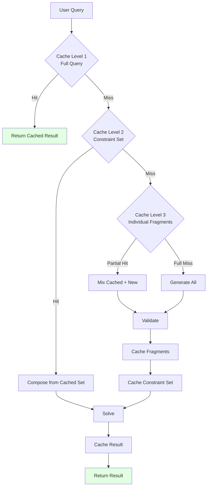

### 8.2 Performance Metrics

```python
class PerformanceMonitor:
    """Track system performance metrics"""
    
    metrics = {
        "ingestion": {
            "rules_processed": 0,
            "chunks_created": 0,
            "smt_fragments_generated": 0,
            "validation_failures": 0,
            "average_processing_time_ms": 0
        },
        
        "query": {
            "total_queries": 0,
            "cache_hit_rate": {
                "level_1_full_query": 0.0,
                "level_2_constraint_set": 0.0,
                "level_3_fragments": 0.0
            },
            "average_response_time_ms": {
                "cache_hit": 0,
                "cache_miss": 0
            },
            "solver_stats": {
                "sat": 0,
                "unsat": 0,
                "unknown": 0,
                "timeout": 0
            }
        },
        
        "quality": {
            "validation_accuracy": 0.0,
            "semantic_alignment_score": 0.0,
            "user_corrections": 0,
            "false_positive_rate": 0.0,
            "false_negative_rate": 0.0
        }
    }
```

-----

## 9. API Specifications

### 9.1 Ingestion API

```python
@app.post("/api/v1/rules/ingest")
async def ingest_rule(rule: RuleInput) -> IngestionResponse:
    """
    Ingest a new rule into the system
    
    Args:
        rule: {
            "text": "Steel expands at 11 μm/m/°C",
            "domain": "mechanical_engineering",
            "priority": "high",
            "metadata": {...}
        }
    
    Returns:
        {
            "rule_id": "uuid",
            "status": "success|pending_review|failed",
            "chunks_created": 1,
            "fragments_generated": 3,
            "new_terms": ["steel", "thermal_expansion"],
            "validation_issues": [],
            "processing_time_ms": 1234
        }
    """
    pass

@app.post("/api/v1/rules/batch_ingest")
async def batch_ingest(rules: List[RuleInput]) -> BatchIngestionResponse:
    """Ingest multiple rules in batch"""
    pass

@app.get("/api/v1/rules/{rule_id}")
async def get_rule(rule_id: str) -> RuleResponse:
    """Retrieve a specific rule and its SMT fragments"""
    pass

@app.put("/api/v1/rules/{rule_id}")
async def update_rule(rule_id: str, updates: RuleUpdate) -> UpdateResponse:
    """Update an existing rule (triggers re-processing)"""
    pass

@app.delete("/api/v1/rules/{rule_id}")
async def delete_rule(rule_id: str) -> DeleteResponse:
    """Delete a rule and its fragments from the system"""
    pass
```

### 9.2 Query API

```python
@app.post("/api/v1/query/check_compatibility")
async def check_compatibility(query: CompatibilityQuery) -> CompatibilityResponse:
    """
    Check if a combination of materials/parts is compatible
    
    Args:
        query: {
            "entities": {
                "bolt": {"material": "steel", "diameter": 10},
                "plate": {"material": "aluminum", "thickness": 5}
            },
            "environment": {
                "temperature": 200,
                "humidity": 0.5
            },
            "constraints": {
                "max_cost": 100,
                "min_strength": 500
            }
        }
    
    Returns:
        {
            "compatible": true|false,
            "confidence": 0.95,
            "explanation": "Steel and aluminum are compatible at 200°C...",
            "details": {
                "constraints_checked": 15,
                "sat_result": "SAT|UNSAT",
                "model": {...}  // If SAT
                "conflicts": [...]  // If UNSAT
            },
            "suggestions": [
                {
                    "type": "substitution|parameter_change|addition",
                    "description": "...",
                    "feasibility": 0.8
                }
            ],
            "processing_time_ms": 234
        }
    """
    pass

@app.post("/api/v1/query/find_compatible")
async def find_compatible(query: FindCompatibleQuery) -> List[Combination]:
    """
    Find all compatible combinations given partial specification
    
    Args:
        query: {
            "fixed": {"bolt_material": "steel"},
            "variable": ["plate_material", "washer_material"],
            "environment": {"temperature": 200},
            "optimize": "cost|strength|weight"
        }
    
    Returns:
        [
            {
                "combination": {"plate": "steel", "washer": "brass"},
                "score": 0.95,
                "properties": {...}
            }
        ]
    """
    pass
```

### 9.3 Registry API

```python
@app.get("/api/v1/registry/entities")
async def get_entities() -> EntitiesResponse:
    """Get all registered entities"""
    pass

@app.get("/api/v1/registry/properties")
async def get_properties() -> PropertiesResponse:
    """Get all registered properties"""
    pass

@app.post("/api/v1/registry/entities")
async def add_entity(entity: EntityDefinition) -> AddEntityResponse:
    """Add a new entity to the registry"""
    pass

@app.post("/api/v1/registry/properties")
async def add_property(prop: PropertyDefinition) -> AddPropertyResponse:
    """Add a new property to the registry"""
    pass

@app.get("/api/v1/registry/validate_name")
async def validate_name(name: str) -> ValidationResponse:
    """Check if a variable name is valid according to registry"""
    pass
```

-----

## 10. Deployment Architecture

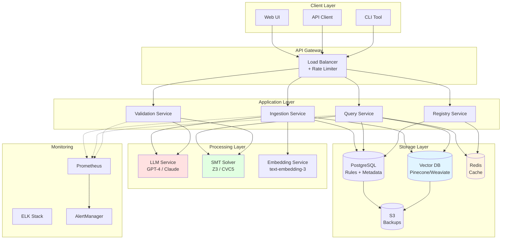

-----

## 11. Error Handling

### 11.1 Error Categories

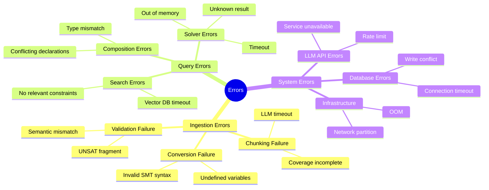

### 11.2 Error Response Format

```json
{
  "success": false,
  "error": {
    "code": "VALIDATION_SEMANTIC_MISMATCH",
    "message": "SMT code does not align with source text",
    "category": "validation",
    "severity": "error|warning|info",
    "details": {
      "source_text": "Steel expands at 11 μm/m/°C",
      "smt_code": "(assert (= aluminum_expansion 11.0))",
      "mismatches": ["Entity mismatch: steel vs aluminum"],
      "confidence": 0.3
    },
    "suggestions": [
      "Verify entity names match source text",
      "Check variable registry for correct names"
    ],
    "timestamp": "2025-11-05T10:30:00Z",
    "request_id": "req_abc123"
  },
  "partial_results": null
}
```

-----

## 12. Testing Strategy

### 12.1 Test Pyramid

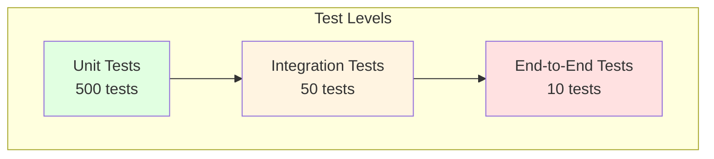

### 12.2 Test Cases

```python
# Unit Tests
class TestValidation:
    def test_syntax_validation_valid_smt():
        """Test that valid SMT-LIB passes syntax check"""
        pass
    
    def test_syntax_validation_invalid_smt():
        """Test that invalid SMT-LIB is rejected"""
        pass
    
    def test_variable_name_validation():
        """Test variable name checking against registry"""
        pass
    
    def test_semantic_validation():
        """Test LLM-based semantic alignment"""
        pass

# Integration Tests
class TestIngestionPipeline:
    def test_full_ingestion_flow():
        """Test complete ingestion from text to cached SMT"""
        pass
    
    def test_ingestion_with_new_terms():
        """Test that new terms are flagged and queued"""
        pass
    
    def test_ingestion_failure_recovery():
        """Test graceful handling of conversion failures"""
        pass

# End-to-End Tests
class TestSystemE2E:
    def test_ingest_and_query():
        """Test: ingest rule → query compatibility → get result"""
        pass
    
    def test_complex_query_with_unsat():
        """Test: query incompatible combination → get UNSAT analysis"""
        pass
    
    def test_performance_under_load():
        """Test: 1000 concurrent queries → response time < 500ms"""
        pass
```

-----

## 13. Future Enhancements

### 13.1 Roadmap

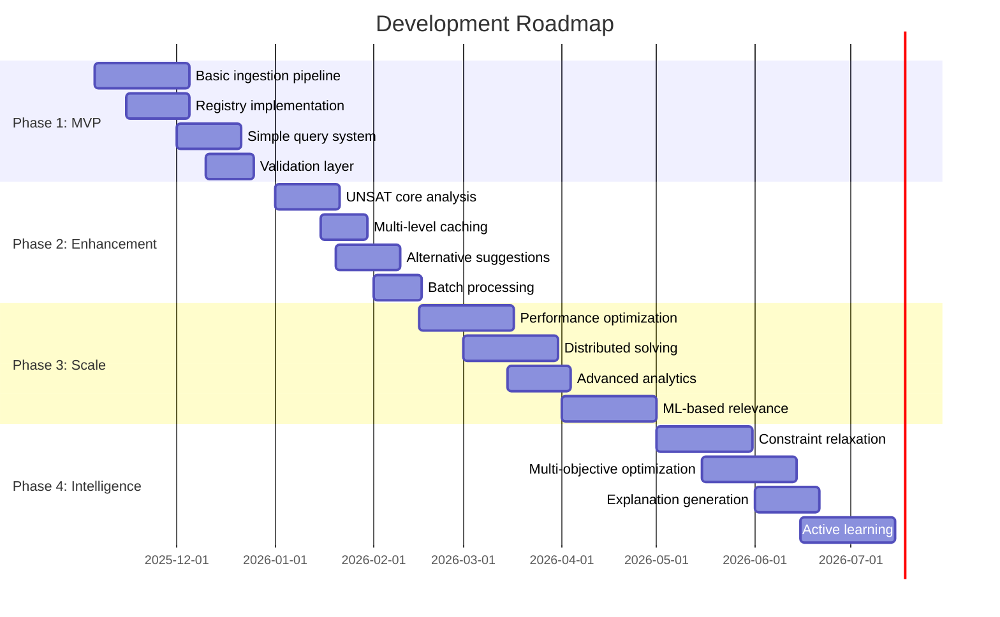

### 13.2 Potential Features

1. **Constraint Relaxation**: When UNSAT, automatically relax constraints to find nearest compatible solution
1. **Multi-Objective Optimization**: Find combinations that optimize multiple goals (cost + strength + weight)
1. **Probabilistic Reasoning**: Handle uncertain constraints with probability distributions
1. **Incremental Solving**: Add constraints incrementally to improve performance
1. **Explanation Quality**: Use LLMs to generate better natural language explanations
1. **Visual Explorer**: Interactive UI to explore constraint relationships and conflicts
1. **Version Control**: Track changes to rules and constraints over time
1. **A/B Testing**: Test different SMT formulations for the same constraint
1. **Active Learning**: Flag ambiguous rules for human clarification
1. **Federation**: Query across multiple constraint databases
