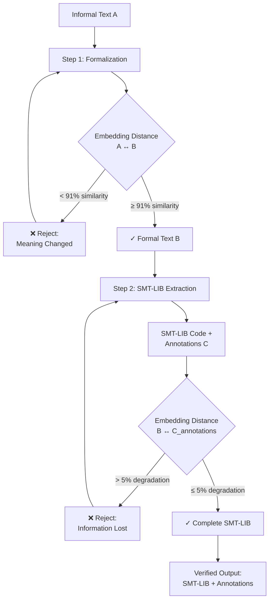
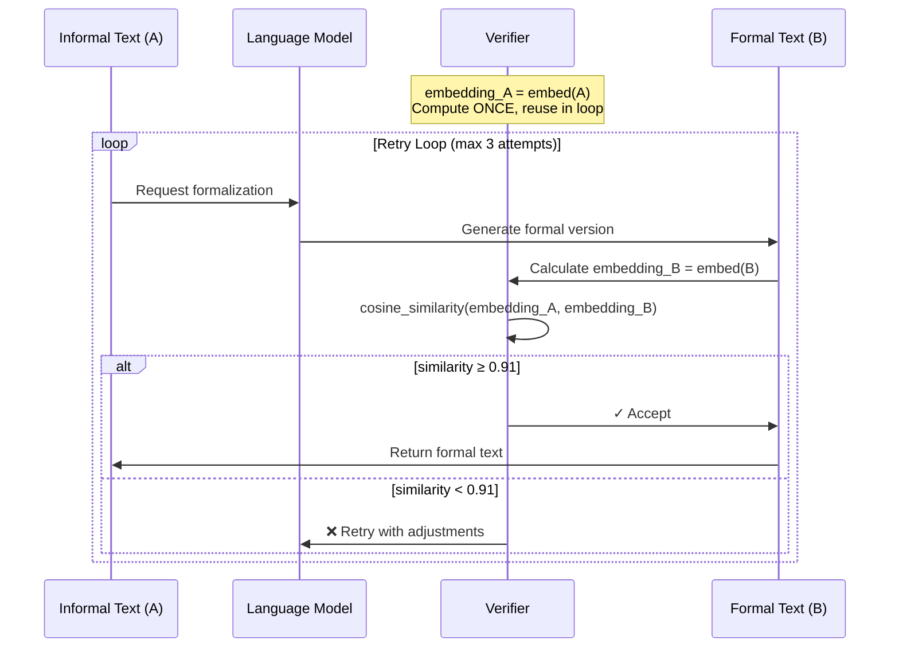
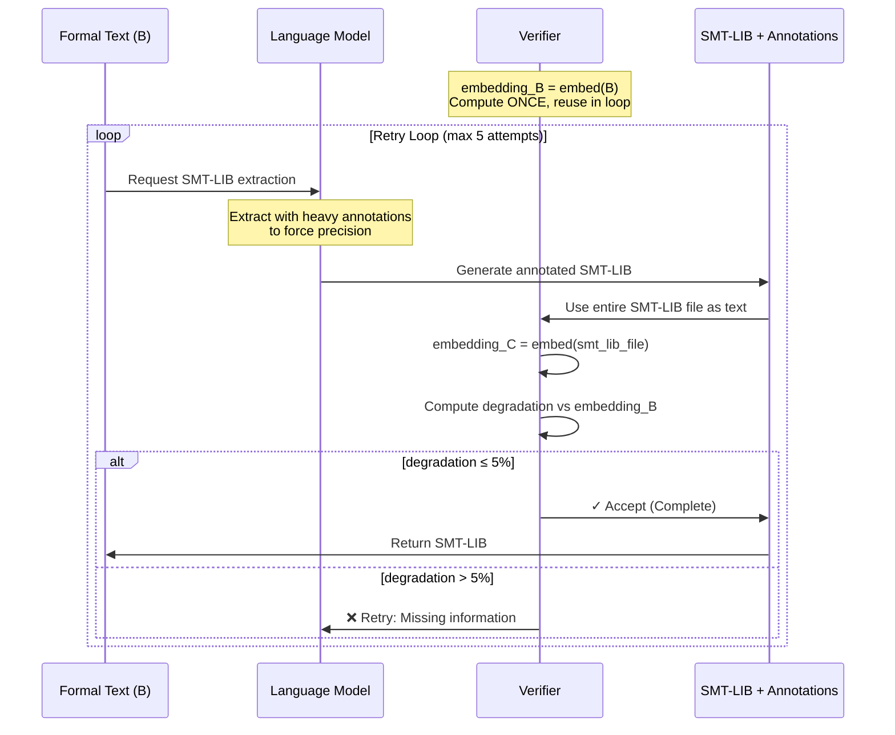
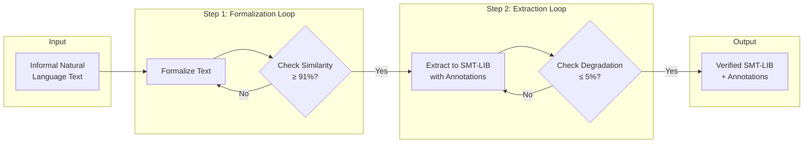
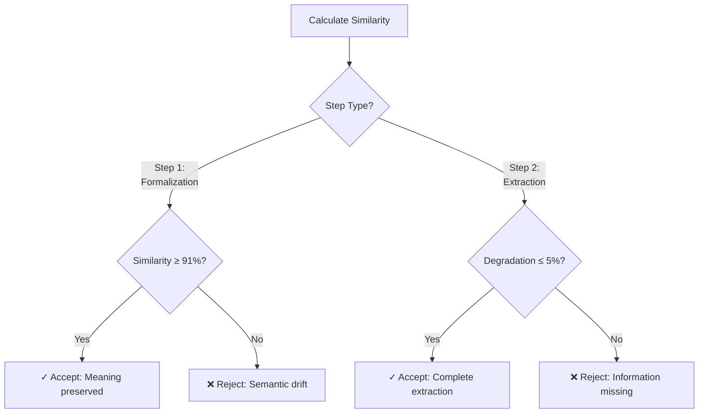
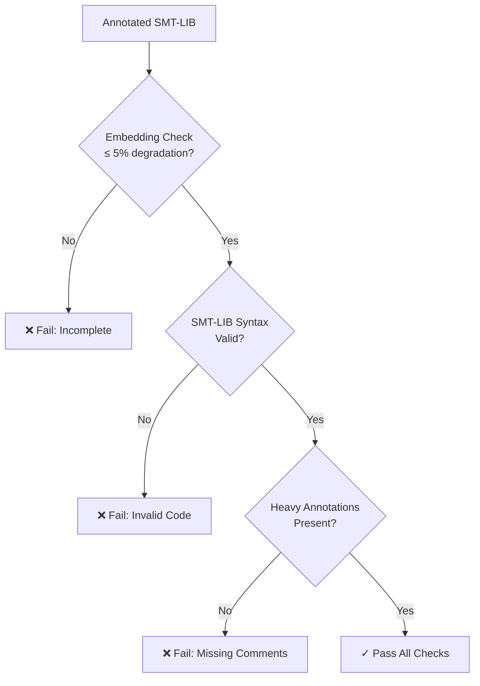

# Semantic-Preserving Text Formalization and SMT-LIB Extraction Pipeline

## Overview

This document describes a two-step pipeline for transforming informal natural language text into formal SMT-LIB symbolic representations while maintaining semantic completeness. The pipeline uses embedding distance metrics as objective verification criteria at each step.

## Architecture



## Pipeline Steps

### Step 1: Iterative Formalization

**Objective:** Transform informal text to formal text while preserving semantic meaning.

**Process:**


**Verification Metric:**
- **Target:** `cosine_similarity(embedding(A), embedding(B)) ≥ 0.91`
- **Baseline:** 91.5% mean from empirical testing
- **Tolerance:** ±1.9% std deviation

**Success Criteria:**
- Formal text emerges naturally
- Facts and rules become explicit
- Semantic meaning preserved
- High embedding similarity maintained

### Step 2: SMT-LIB Extraction with Annotations

**Objective:** Extract facts and constraints into SMT-LIB symbolic representations with completeness verification.

**Process:**


**Verification Metric:**
- **Baseline:** 5% expected degradation from sentence removal
- **Target:** `degradation(B, C_smtlib) ≤ 0.05`
- **Calculation:** `1.0 - cosine_similarity(embedding(B), embedding(C_smtlib)) ≤ 0.05`
- **Note:** C_smtlib is the entire SMT-LIB file (code + annotations), not just comments

**Annotation Requirements:**
1. **Mandatory:** Heavily annotate SMT-LIB code with natural language comments
2. **Purpose:**
   - Forces LLM precision during extraction
   - Makes SMT-LIB file readable and self-documenting
   - Entire file (code + comments) used for embedding comparison
3. **Format:**
   ```smt2
   ;; ========================================
   ;; SECTION 1: GROUND TRUTH (from data)
   ;; ========================================
   ;; These are FACTS extracted from problem statement

   ;; Given dimensions (converted to consistent units - inches)
   (declare-const initial_length Real)
   (assert (= initial_length 1200.0))  ; 100 feet = 1200 inches
   ```

**Critical:** The entire SMT-LIB file (including all comments and code) is used for `embedding_C`, not just extracted comments. This works because:
- Annotated SMT-LIB is highly readable
- Comments provide natural language context
- Symbolic assertions are self-documenting
- Together they represent the complete extraction

## Complete Flow Diagram



## Metrics and Thresholds

### Empirical Baselines (from hypothesis verification)

| Metric | Mean | Std Dev | Min | Max | Threshold |
|--------|------|---------|-----|-----|-----------|
| Slight Formalization (A→B) | 91.5% | 1.9% | 88.4% | 94.6% | ≥ 91% |
| High Formalization (A→B2) | 79.1% | 2.0% | 76.2% | 83.3% | ❌ Too aggressive |
| Information Loss (1-2 sentences) | ~5.0% | 2.2% | - | - | ≤ 5% baseline |
| Iterative Drift (A→B→C) | 2.7% | 2.4% | - | - | Monitor |

### Decision Matrix



## Implementation Considerations

### 1. Performance Optimizations

**Critical: Store Source Embeddings in Variable**

Since source text doesn't change during retry loops, compute embedding once and store in variable:

```python
# Step 1: Store NL embedding in variable
embedding_nl = embed(nl_text)  # Compute ONCE before loop

for attempt in retries:
    fl_text = formalize(nl_text)
    embedding_fl = embed(fl_text)  # Only compute new embedding
    similarity = cosine_similarity(embedding_nl, embedding_fl)

# Step 2: Store FL embedding in variable
embedding_fl = embed(fl_text)  # Compute ONCE before loop

for attempt in retries:
    smt_lib_code = extract_to_smtlib(fl_text)  # Heavily annotated
    embedding_smt = embed(smt_lib_code)  # Embed entire file
    degradation = 1.0 - cosine_similarity(embedding_fl, embedding_smt)
```

**Performance Impact:**
- **Step 1** with 3 retries: Compute 4 embeddings instead of 6 (33% reduction)
- **Step 2** with 5 retries: Compute 6 embeddings instead of 10 (40% reduction)
- Each embedding computation is ~100-200ms, so significant time savings

**Additional Optimizations:**
1. **Batch Processing:** Process multiple texts in parallel
2. **Persistent Cache:** Cache embeddings across pipeline runs for identical texts (requires actual cache structure)
3. **Early Exit:** Stop retries as soon as threshold is met
4. **GPU Acceleration:** Use CUDA for embedding model if available

### 2. Embedding Model

**Recommendation:** `sentence-transformers/all-MiniLM-L6-v2`
- **Pros:** Fast, local, no API needed, consistent results
- **Cons:** Fixed model version required for reproducible thresholds

### 3. Retry Strategy

**Step 1 (Formalization):**
```python
# Store source embedding in variable (compute once, reuse in loop)
embedding_source = embed(informal_text)

max_retries = 3
for attempt in range(max_retries):
    formal_text = llm.formalize(informal_text, temperature=0.3 + attempt*0.1)
    embedding_formal = embed(formal_text)
    similarity = cosine_similarity(embedding_source, embedding_formal)
    if similarity >= 0.91:
        return formal_text
raise FormalizationFailure("Could not preserve semantics")
```

**Step 2 (Extraction):**
```python
# Store formal text embedding in variable (compute once, reuse in loop)
embedding_formal = embed(formal_text)

max_retries = 5
for attempt in range(max_retries):
    smt_lib_code = llm.extract_to_smtlib(
        formal_text,
        annotation_density="heavy",  # Force detailed annotations
        detail_level=min(1.0, 0.6 + attempt*0.1)
    )
    # Use entire SMT-LIB file (code + annotations) for embedding
    embedding_smt = embed(smt_lib_code)
    degradation = 1.0 - cosine_similarity(embedding_formal, embedding_smt)
    if degradation <= 0.05:
        return smt_lib_code
raise ExtractionIncomplete("Missing information in extraction")
```

### 4. SMT-LIB Embedding Preparation

No special processing needed - use the entire SMT-LIB file as-is for embedding:
```python
def prepare_smtlib_for_embedding(smt_lib_code: str) -> str:
    """
    Prepare SMT-LIB code for embedding comparison.

    Since SMT-LIB is heavily annotated with natural language comments,
    we can use the entire file directly for embedding.

    Args:
        smt_lib_code: Complete SMT-LIB file with annotations

    Returns:
        The same SMT-LIB code (no processing needed)
    """
    return smt_lib_code  # Use entire file: comments + code
```

**Why this works:**
- Annotated SMT-LIB is human-readable text
- Comments provide natural language context
- Symbolic assertions (e.g., `(>= num_guards 1)`) are self-documenting
- Embedding models handle mixed format well

### 5. Monitoring and Logging

```python
@dataclass
class PipelineMetrics:
    # Step 1
    formalization_attempts: int
    final_formalization_similarity: float

    # Step 2
    extraction_attempts: int
    final_extraction_degradation: float

    # Overall
    total_time_seconds: float
    success: bool
```

## Failure Modes and Handling

### Failure Mode 1: Formalization Changes Meaning

**Detection:** `similarity(A, B) < 0.91`

**Causes:**
- LLM over-formalizes and changes semantics
- Important context stripped during formalization
- Ambiguity resolved incorrectly

**Mitigation:**
1. Adjust temperature (increase randomness)
2. Provide more context in prompt
3. Request "minimal formalization"
4. Manual review if retries exhausted

### Failure Mode 2: Incomplete Extraction

**Detection:** `degradation(B, C_smtlib) > 0.05`

**Causes:**
- Facts/constraints missed during extraction
- Annotations too brief or vague
- Complex relationships not captured in symbolic form
- SMT-LIB code lacks sufficient natural language context

**Mitigation:**
1. Increase detail level in extraction prompt
2. Request heavier annotation density
3. Cross-reference source text sections
4. Manual review of missing information

### Failure Mode 3: False Positives (Low Degradation, Actually Incomplete)

**Detection:** Requires additional validation beyond embedding distance

**Causes:**
- Annotations paraphrase without capturing actual assertions
- SMT-LIB assertions don't match their comments
- Generic annotations that sound complete but are vague
- Missing symbolic assertions compensated by verbose comments

**Mitigation:**
1. Validate SMT-LIB can execute/parse correctly
2. Cross-check assertion count vs source text complexity
3. Verify each assertion has corresponding annotation
4. Human spot-check on sample extractions

## Quality Assurance

### Automated Validation



### Manual Review Triggers

Require human review when:
1. Formalization required > 3 attempts
2. Extraction required > 5 attempts
3. Final degradation > 4% (close to threshold)
4. Source text > 2000 words
5. SMT-LIB > 100 assertions

## Integration Points

### Input Interface

```python
from typing import Tuple

def process_informal_text(
    informal_text: str,
    embedding_model: SentenceTransformer
) -> Tuple[str, PipelineMetrics]:
    """
    Process informal text through formalization and SMT-LIB extraction.

    Args:
        informal_text: Source natural language text
        embedding_model: Pre-loaded sentence transformer model

    Returns:
        (smt_lib_code, metrics)
        Where smt_lib_code is the complete annotated SMT-LIB file

    Raises:
        FormalizationFailure: If Step 1 fails after retries
        ExtractionIncomplete: If Step 2 fails after retries
    """
    pass
```

### Output Format

```python
@dataclass
class VerifiedOutput:
    """Output from the complete pipeline."""

    # Original
    informal_text: str

    # Step 1 output
    formal_text: str
    formalization_similarity: float

    # Step 2 output
    smt_lib_code: str  # Entire SMT-LIB file with heavy annotations
    extraction_degradation: float

    # Metrics
    metrics: PipelineMetrics

    # Validation
    passed_all_checks: bool
    requires_manual_review: bool
```

## Directory Structure

```
hypotheses/
├── embedding-distance/
│   ├── README.md                    # Hypothesis documentation
│   ├── PIPELINE-DESIGN.md          # This document
│   ├── verify_embedding_distance.py # Hypothesis verification script
│   ├── requirements.txt
│   └── .env
│
└── (future: formalization-pipeline/)
    ├── README.md
    ├── pipeline.py                  # Main pipeline implementation
    ├── formalization.py             # Step 1: Formalization
    ├── extraction.py                # Step 2: SMT-LIB extraction
    ├── verification.py              # Embedding distance checks
    ├── types.py                     # Type definitions
    └── tests/
        ├── test_formalization.py
        ├── test_extraction.py
        └── test_integration.py
```

## References

1. **Hypothesis Verification:** `hypotheses/embedding-distance/README.md`
2. **Empirical Test Results:** Run `python3 verify_embedding_distance.py --runs 20`
3. **Embedding Model:** [sentence-transformers/all-MiniLM-L6-v2](https://huggingface.co/sentence-transformers/all-MiniLM-L6-v2)

## Future Enhancements

1. **Adaptive Thresholds:** Learn thresholds per text domain
2. **Multi-Model Ensemble:** Use multiple embedding models for robustness
3. **Partial Extraction:** Allow incremental extraction with cumulative degradation tracking
4. **Semantic Clustering:** Group related facts for better SMT-LIB organization
5. **Interactive Mode:** Allow human intervention during loops for complex cases
